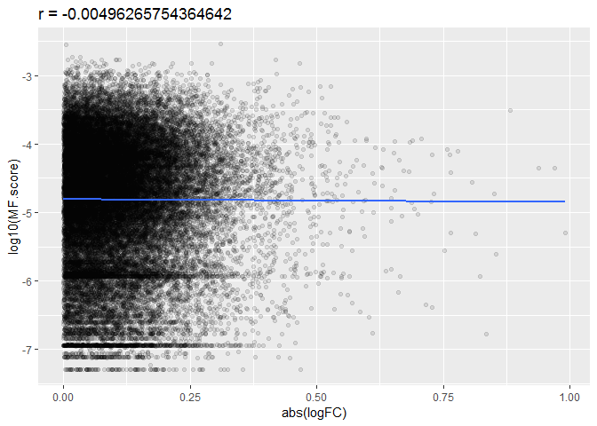
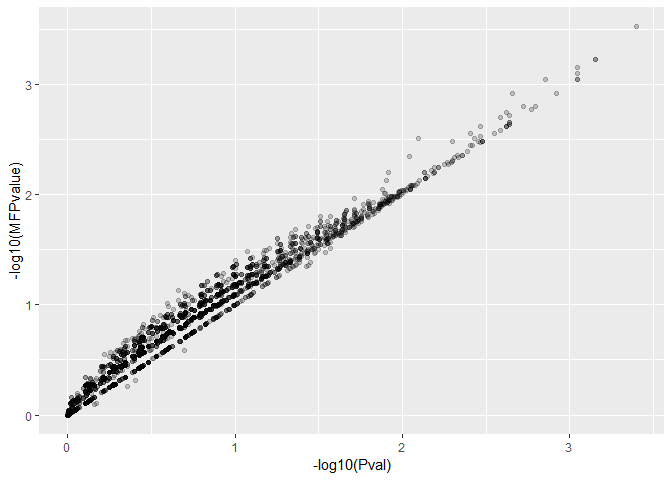

Geneset Enrichment Analysis
================
Virginia Pichler
March 30, 2019

#### Input metadata and expression data cleaned in the [preprocessing data](../preprocessing/Pre_processing.rmd).

### Load and format data

``` r
#load in feature data
geo_GSE25507 <- getGEO("GSE25507", GSEMatrix = TRUE)
```

    ## Found 1 file(s)

    ## GSE25507_series_matrix.txt.gz

    ## Parsed with column specification:
    ## cols(
    ##   .default = col_double(),
    ##   ID_REF = col_character()
    ## )

    ## See spec(...) for full column specifications.

    ## File stored at:

    ## C:\Users\Ginny\AppData\Local\Temp\RtmpCkZ6oc/GPL570.soft

    ## Warning: 62 parsing failures.
    ##   row     col           expected    actual         file
    ## 54614 SPOT_ID 1/0/T/F/TRUE/FALSE --Control literal data
    ## 54615 SPOT_ID 1/0/T/F/TRUE/FALSE --Control literal data
    ## 54616 SPOT_ID 1/0/T/F/TRUE/FALSE --Control literal data
    ## 54617 SPOT_ID 1/0/T/F/TRUE/FALSE --Control literal data
    ## 54618 SPOT_ID 1/0/T/F/TRUE/FALSE --Control literal data
    ## ..... ....... .................. ......... ............
    ## See problems(...) for more details.

``` r
new_geo_GSE25507<- geo_GSE25507[[1]]

# pull gene symbol from feature data
symbol<-fData(new_geo_GSE25507)
symbol<-symbol[, c("ID", "Gene Symbol")]
symbol<-symbol%>%arrange(ID)


# load in expression data and metadata

Meta_data<-readRDS('Meta_data.rds')
combine_norm<-readRDS('combine_norm.rds')

# add column for sample id in metadata
Meta_data$sample_id <- rownames(Meta_data)

# move sample id column to first position in metadata
Meta_data <- Meta_data %>% select(sample_id, everything())
rownames(Meta_data) <- c()
```

### Create linear model

``` r
# check equivalence of samples in metadata and expression data
Meta_data$sample_id==names(combine_norm)
```

    ## logical(0)

``` r
#design matrix
Meta_data_design <-Meta_data[,c("sample_id", "diagnosis" )]
designMatrix <- model.matrix(~diagnosis, Meta_data_design)


# lmfit 
lmfit <- lmFit(combine_norm, designMatrix)

# run ebayes to calculate moderated t-statistics, F-statistic, log-odds
lmfit_ebayes <- eBayes(lmfit)
```

### Select, format and annotate genes for enrichment analysis

``` r
# select all genes and reformat and arrange data frame
allGenes <- topTable(lmfit_ebayes, number = Inf)
```

    ## Removing intercept from test coefficients

``` r
allGenes$ID <- rownames(allGenes)
allGenes<-allGenes%>%arrange(ID)

# annotate with gene symbols
allGenes<-full_join(allGenes, symbol, by = "ID")
colnames(allGenes)[8] <- "gene"
allGenes<-unique(allGenes)
allGenes<-na.omit(allGenes)

# subset data frame to gene and logFC values.
subsettedallGenes<-allGenes[, c("gene", "logFC")]
subsettedallGenes<-unique(subsettedallGenes)
```

### Geneset Enrichment Analysis

``` r
# retrieve gene multifunctionality scores
urlfile<-'https://raw.githubusercontent.com/STAT540-UBC/STAT540-UBC.github.io/master/seminars/seminars_winter_2019/seminar10/data/gene_multifunctionality_scores.csv'

gene_multifunctionality_scores<-read.csv(urlfile)


# check if gene list has multifunctional bias
mergedData <- subsettedallGenes %>% inner_join(gene_multifunctionality_scores, by = "gene")

rankMfCor <- cor(abs(mergedData$logFC), mergedData$MF.score, method = "spearman")
```

``` r
# plot Spearman's correlation 
mergedData %>%
  ggplot(aes(x = abs(logFC), y = log10(MF.score))) + 
  geom_point(alpha = 0.1) +
  geom_smooth(method = "lm", se = FALSE) +
  ggtitle(paste0("r = ", rankMfCor))
```



``` r
### geneset enrichment analysis

#retrieve GO.xml file from ermineR
if (!file.exists("GO.xml")) { goToday("GO.xml") }


# convert scores to absolute values
ermineInputGeneScores <- subsettedallGenes %>% 
  mutate(absolute_logFC = abs(logFC)) %>% 
  select(gene, absolute_logFC) %>% 
  na.omit() %>% 
  as.data.frame() %>% 
  arrange(desc(absolute_logFC))

rownames(ermineInputGeneScores) <- make.names(subsettedallGenes[,1], unique = TRUE)

# enrichment with Precision-Recall method
enrichmentResult <- precRecall(scores = ermineInputGeneScores, 
                               scoreColumn = 2, # scores 
                               bigIsBetter = TRUE, # rank large logFC higher
                               annotation = "Generic_human", # ermineR Generic_human annotation file
                               aspects = "B", # biological processes 
                               iterations = 10000, # 10K sampling iterations so results are stable
                               geneSetDescription = "GO.xml") # GO XML file


# arrange results by MFP value
enrichmentResult$results %>% arrange(MFPvalue)
```

    ## # A tibble: 3,494 x 12
    ##    Name  ID    NumProbes NumGenes RawScore    Pval CorrectedPvalue MFPvalue
    ##    <chr> <chr>     <dbl>    <dbl>    <dbl>   <dbl>           <dbl>    <dbl>
    ##  1 erro~ GO:0~        20       20   0.0517 0.0004            1     0.000300
    ##  2 nucl~ GO:0~        36       36   0.0308 0.0007            1     0.000600
    ##  3 DNA ~ GO:0~       191      191   0.0194 0.0007            0.781 0.000600
    ##  4 regu~ GO:2~       102      102   0.0178 0.0009            0.502 0.0007  
    ##  5 posi~ GO:2~        62       62   0.0225 0.0009            0.431 0.0008  
    ##  6 thyr~ GO:0~        21       21   0.0458 0.0009            0.754 0.0009  
    ##  7 telo~ GO:0~        22       22   0.0473 0.0009            0.603 0.0009  
    ##  8 nucl~ GO:0~       106      106   0.0173 0.0014            0.521 0.0009  
    ##  9 nucl~ GO:0~        24       24   0.0439 0.00120           0.502 0.00120 
    ## 10 DNA-~ GO:0~       110      110   0.0172 0.0022            0.567 0.00120 
    ## # ... with 3,484 more rows, and 4 more variables: CorrectedMFPvalue <dbl>,
    ## #   Multifunctionality <dbl>, `Same as` <chr>, GeneMembers <chr>

``` r
# scatterplot of multifunctionality adjustment to GO terms
enrichmentResult$results %>% 
  ggplot(aes(x = -log10(Pval), y = -log10(MFPvalue))) +
  geom_point(alpha = 0.2)
```



``` r
# top ten GO terms with largest adjustments 
enrichmentResult$results %>% 
  select(Name, ID, Pval, MFPvalue) %>% 
  mutate(neg_log_pvalue = -log10(Pval),
         neg_log_mfpvalue = -log10(MFPvalue)) %>% 
  mutate(log_pvalue_change = neg_log_mfpvalue - neg_log_pvalue) %>% 
  arrange(desc(abs(log_pvalue_change))) %>% 
  head(10) %>% 
  kable()
```

| Name                                                         | ID           |    Pval|  MFPvalue|  neg\_log\_pvalue|  neg\_log\_mfpvalue|  log\_pvalue\_change|
|:-------------------------------------------------------------|:-------------|-------:|---------:|-----------------:|-------------------:|--------------------:|
| positive regulation of immune effector process               | <GO:0002699> |  0.2197|    0.0742|         0.6581699|           1.1295961|            0.4714262|
| regulation of muscle tissue development                      | <GO:1901861> |  0.2546|    0.0977|         0.5941416|           1.0101054|            0.4159638|
| regulation of peptide hormone secretion                      | <GO:0090276> |  0.0080|    0.0031|         2.0969100|           2.5086383|            0.4117283|
| regulation of blood vessel size                              | <GO:0050880> |  0.2010|    0.0790|         0.6968039|           1.1023729|            0.4055690|
| response to ketone                                           | <GO:1901654> |  0.0839|    0.0331|         1.0762380|           1.4801720|            0.4039340|
| response to corticosteroid                                   | <GO:0031960> |  0.1000|    0.0395|         1.0000000|           1.4034029|            0.4034029|
| negative regulation of establishment of protein localization | <GO:1904950> |  0.2491|    0.1036|         0.6036263|           0.9846402|            0.3810140|
| regulation of carbohydrate metabolic process                 | <GO:0006109> |  0.1278|    0.0532|         0.8934691|           1.2740884|            0.3806192|
| regulation of muscle contraction                             | <GO:0006937> |  0.1278|    0.0532|         0.8934691|           1.2740884|            0.3806192|
| cellular response to acid chemical                           | <GO:0071229> |  0.2197|    0.0918|         0.6581699|           1.0371573|            0.3789874|
