Initial analysis
================
Yanchao

``` r
library(RColorBrewer)
library(cluster)
library(pvclust)
library(xtable)
library(limma)
library(plyr)
library(lattice)
library(RCurl)
```

    ## Loading required package: bitops

``` r
options(download.file.method = "curl")
library(GEOquery)
```

    ## Loading required package: Biobase

    ## Loading required package: BiocGenerics

    ## Loading required package: parallel

    ## 
    ## Attaching package: 'BiocGenerics'

    ## The following objects are masked from 'package:parallel':
    ## 
    ##     clusterApply, clusterApplyLB, clusterCall, clusterEvalQ,
    ##     clusterExport, clusterMap, parApply, parCapply, parLapply,
    ##     parLapplyLB, parRapply, parSapply, parSapplyLB

    ## The following object is masked from 'package:limma':
    ## 
    ##     plotMA

    ## The following objects are masked from 'package:stats':
    ## 
    ##     IQR, mad, sd, var, xtabs

    ## The following objects are masked from 'package:base':
    ## 
    ##     anyDuplicated, append, as.data.frame, basename, cbind,
    ##     colMeans, colnames, colSums, dirname, do.call, duplicated,
    ##     eval, evalq, Filter, Find, get, grep, grepl, intersect,
    ##     is.unsorted, lapply, lengths, Map, mapply, match, mget, order,
    ##     paste, pmax, pmax.int, pmin, pmin.int, Position, rank, rbind,
    ##     Reduce, rowMeans, rownames, rowSums, sapply, setdiff, sort,
    ##     table, tapply, union, unique, unsplit, which, which.max,
    ##     which.min

    ## Welcome to Bioconductor
    ## 
    ##     Vignettes contain introductory material; view with
    ##     'browseVignettes()'. To cite Bioconductor, see
    ##     'citation("Biobase")', and for packages 'citation("pkgname")'.

    ## Setting options('download.file.method.GEOquery'='auto')

    ## Setting options('GEOquery.inmemory.gpl'=FALSE)

``` r
library(knitr)
library(pheatmap)
  library(stringr)
library(ggplot2)
library(dplyr)
```

    ## 
    ## Attaching package: 'dplyr'

    ## The following object is masked from 'package:Biobase':
    ## 
    ##     combine

    ## The following objects are masked from 'package:BiocGenerics':
    ## 
    ##     combine, intersect, setdiff, union

    ## The following objects are masked from 'package:plyr':
    ## 
    ##     arrange, count, desc, failwith, id, mutate, rename, summarise,
    ##     summarize

    ## The following objects are masked from 'package:stats':
    ## 
    ##     filter, lag

    ## The following objects are masked from 'package:base':
    ## 
    ##     intersect, setdiff, setequal, union

``` r
library(reshape2)
library(tidyverse)
```

    ## ── Attaching packages ─────────────────────────────────────────────── tidyverse 1.2.1 ──

    ## ✔ tibble  2.0.1     ✔ readr   1.3.1
    ## ✔ tidyr   0.8.3     ✔ purrr   0.3.1
    ## ✔ tibble  2.0.1     ✔ forcats 0.4.0

    ## ── Conflicts ────────────────────────────────────────────────── tidyverse_conflicts() ──
    ## ✖ dplyr::arrange()    masks plyr::arrange()
    ## ✖ dplyr::combine()    masks Biobase::combine(), BiocGenerics::combine()
    ## ✖ purrr::compact()    masks plyr::compact()
    ## ✖ tidyr::complete()   masks RCurl::complete()
    ## ✖ dplyr::count()      masks plyr::count()
    ## ✖ dplyr::failwith()   masks plyr::failwith()
    ## ✖ dplyr::filter()     masks stats::filter()
    ## ✖ dplyr::id()         masks plyr::id()
    ## ✖ dplyr::lag()        masks stats::lag()
    ## ✖ dplyr::mutate()     masks plyr::mutate()
    ## ✖ ggplot2::Position() masks BiocGenerics::Position(), base::Position()
    ## ✖ dplyr::rename()     masks plyr::rename()
    ## ✖ dplyr::summarise()  masks plyr::summarise()
    ## ✖ dplyr::summarize()  masks plyr::summarize()

Load the data
-------------

### geo\_GSE18123 data

``` r
 geo_GSE18123 <- getGEO("GSE18123", GSEMatrix = TRUE)
```

    ## Found 2 file(s)

    ## GSE18123-GPL570_series_matrix.txt.gz

    ## Parsed with column specification:
    ## cols(
    ##   .default = col_double(),
    ##   ID_REF = col_character()
    ## )

    ## See spec(...) for full column specifications.

    ## File stored at:

    ## /var/folders/ym/nv8j72n54cqb51_bvr34n90m0000gn/T//RtmpbHxugk/GPL570.soft

    ## GSE18123-GPL6244_series_matrix.txt.gz

    ## Parsed with column specification:
    ## cols(
    ##   .default = col_double()
    ## )

    ## See spec(...) for full column specifications.

    ## File stored at:

    ## /var/folders/ym/nv8j72n54cqb51_bvr34n90m0000gn/T//RtmpbHxugk/GPL6244.soft

``` r
geo_GSE18123<- geo_GSE18123[[1]]
```

### Get expression data of geo\_GSE18123

``` r
#Get expression data  
data_GSE18123<-exprs(geo_GSE18123)
hist(data_GSE18123, col = "gray", main = "GSE70213 - Histogram")
```


It appears a lot of genes have values &lt;&lt; 500000. We consider taking Log2 transformation.

``` r
hist(log2(data_GSE18123 + 1), col = "gray", main = "GSE70213 log transformed - Histogram")
```

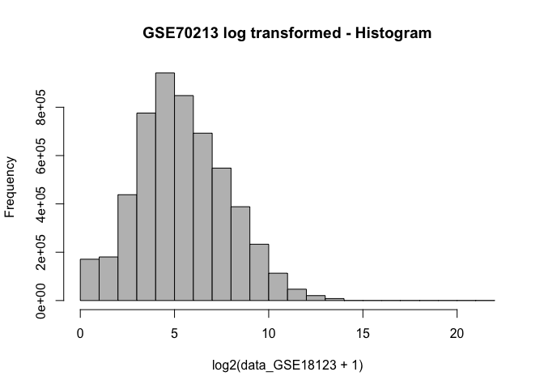

``` r
log_data_GSE18123<-log2(data_GSE18123 + 1)
log_data_GSE18123<-as.data.frame(log_data_GSE18123)
```

### get melta data of GSE18123

``` r
## get melta data of GSE18123
prDes_GSE18123 <- pData(geo_GSE18123)[,c("organism_ch1","title",colnames(pData(geo_GSE18123))[grep("characteristics", colnames(pData(geo_GSE18123)))])]
meta_data_GSE18123<-prDes_GSE18123[,1:5]
colnames(meta_data_GSE18123) = c("organism","sample_name","diagnosis","gender","age")
meta_data_GSE18123$diagnosis = as.factor(gsub("diagnosis: ","", meta_data_GSE18123$diagnosis))

meta_data_GSE18123$age = gsub("age: ","", meta_data_GSE18123$age)

meta_data_GSE18123$age<-as.integer(str_extract(meta_data_GSE18123$age, "[0-9]{2,3}"))
meta_data_GSE18123$diagnosis
```

    ##  [1] PDD-NOS             PDD-NOS             AUTISM             
    ##  [4] AUTISM              AUTISM              PDD-NOS            
    ##  [7] PDD-NOS             AUTISM              ASPERGER'S DISORDER
    ## [10] AUTISM              ASPERGER'S DISORDER PDD-NOS            
    ## [13] ASPERGER'S DISORDER PDD-NOS             PDD-NOS            
    ## [16] AUTISM              AUTISM              AUTISM             
    ## [19] PDD-NOS             AUTISM              AUTISM             
    ## [22] AUTISM              PDD-NOS             ASPERGER'S DISORDER
    ## [25] AUTISM              AUTISM              AUTISM             
    ## [28] PDD-NOS             AUTISM              PDD-NOS            
    ## [31] AUTISM              ASPERGER'S DISORDER PDD-NOS            
    ## [34] AUTISM              AUTISM              PDD-NOS            
    ## [37] PDD-NOS             PDD-NOS             AUTISM             
    ## [40] PDD-NOS             PDD-NOS             PDD-NOS            
    ## [43] AUTISM              PDD-NOS             AUTISM             
    ## [46] AUTISM              AUTISM              PDD-NOS            
    ## [49] AUTISM              AUTISM              AUTISM             
    ## [52] ASPERGER'S DISORDER AUTISM              AUTISM             
    ## [55] AUTISM              AUTISM              ASPERGER'S DISORDER
    ## [58] PDD-NOS             ASPERGER'S DISORDER ASPERGER'S DISORDER
    ## [61] AUTISM              PDD-NOS             PDD-NOS            
    ## [64] PDD-NOS             PDD-NOS             PDD-NOS            
    ## [67] CONTROL             CONTROL             CONTROL            
    ## [70] CONTROL             CONTROL             CONTROL            
    ## [73] CONTROL             CONTROL             CONTROL            
    ## [76] CONTROL             CONTROL             CONTROL            
    ## [79] CONTROL             CONTROL             CONTROL            
    ## [82] CONTROL             CONTROL             CONTROL            
    ## [85] CONTROL             CONTROL             CONTROL            
    ## [88] CONTROL             CONTROL             CONTROL            
    ## [91] CONTROL             CONTROL             CONTROL            
    ## [94] CONTROL             CONTROL             CONTROL            
    ## [97] CONTROL             CONTROL             CONTROL            
    ## Levels: ASPERGER'S DISORDER AUTISM CONTROL PDD-NOS

``` r
meta_data_GSE18123$age <- meta_data_GSE18123$age/12

meta_data_GSE18123$diagnosis<-ifelse(meta_data_GSE18123$diagnosis == "PDD-NOS", "AUTISM", ifelse(meta_data_GSE18123$diagnosis == "ASPERGER'S DISORDER", "AUTISM",  ifelse(meta_data_GSE18123$diagnosis == "CONTROL", "CONTROL", ifelse(meta_data_GSE18123$diagnosis == "AUTISM", "AUTISM", "error"))))
meta_data_GSE18123$batch<-"none"

kable(head(meta_data_GSE18123))
```

|           | organism     | sample\_name | diagnosis | gender       |        age| batch |
|-----------|:-------------|:-------------|:----------|:-------------|----------:|:------|
| GSM650510 | Homo sapiens | A-0001-P1    | AUTISM    | gender: male |   9.833333| none  |
| GSM650512 | Homo sapiens | A-0006-P1    | AUTISM    | gender: male |   6.583333| none  |
| GSM650513 | Homo sapiens | A-0008-P1    | AUTISM    | gender: male |  14.083333| none  |
| GSM650514 | Homo sapiens | A-0010-P1    | AUTISM    | gender: male |   7.666667| none  |
| GSM650515 | Homo sapiens | A-0016-P1    | AUTISM    | gender: male |   6.500000| none  |
| GSM650516 | Homo sapiens | A-0021-P1    | AUTISM    | gender: male |  10.333333| none  |

``` r
dim(meta_data_GSE18123)
```

    ## [1] 99  6

``` r
## convert age to categorial variable
F_meta_data_GSE18123<-meta_data_GSE18123 %>% dplyr::select(organism,sample_name,diagnosis,age,batch)
F_meta_data_GSE18123$age<-ifelse(F_meta_data_GSE18123$age>= 5, "larger or equal to 5", ifelse(F_meta_data_GSE18123$age < 5,"Smaller than 5",  "error"))
F_meta_data_GSE18123$age[is.na(F_meta_data_GSE18123$age)] <- "None"
```

### geo\_GSE25507 data

``` r
# 
geo_GSE25507 <- getGEO("GSE25507", GSEMatrix = TRUE)
```

    ## Found 1 file(s)

    ## GSE25507_series_matrix.txt.gz

    ## Parsed with column specification:
    ## cols(
    ##   .default = col_double(),
    ##   ID_REF = col_character()
    ## )

    ## See spec(...) for full column specifications.

    ## Using locally cached version of GPL570 found here:
    ## /var/folders/ym/nv8j72n54cqb51_bvr34n90m0000gn/T//RtmpbHxugk/GPL570.soft

``` r
geo_GSE25507<- geo_GSE25507[[1]]
```

### Get expression data of GSE25507

``` r
#Get expression data of GSE25507 
data_GSE25507<-exprs(geo_GSE25507)
hist(data_GSE25507, col = "gray", main = "GSE25507 - Histogram")
```

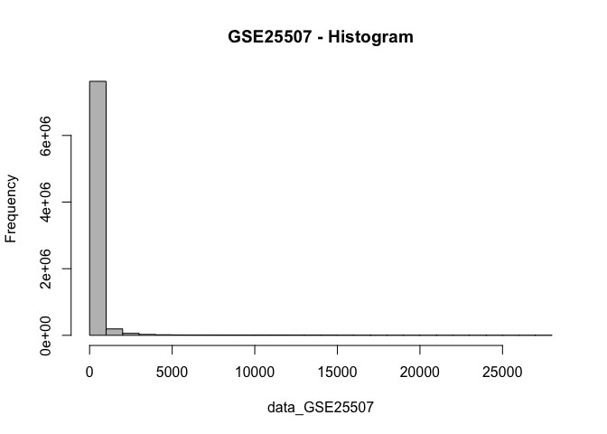

It appears a lot of genes have values &lt; 1000.

``` r
hist(log2(data_GSE25507 + 1), col = "gray", main = "GSE25507 log transformed - Histogram")
```


``` r
log_data_GSE25507<-log2(data_GSE25507 + 1)
log_data_GSE25507<-as.data.frame(log_data_GSE25507)
```

### get meta data of GSE25507

``` r
# get meta data of GSE25507
prDes_GSE25507 <- pData(geo_GSE25507)[,c("organism_ch1","title",colnames(pData(geo_GSE18123))[grep("characteristics", colnames(pData(geo_GSE25507)))])]
meta_data_GSE25507<-prDes_GSE25507[,1:5]
colnames(meta_data_GSE25507) = c("organism","sample_name","batch","diagnosis","age")
meta_data_GSE25507$diagnosis = as.factor(gsub("diagnosis: ","", meta_data_GSE25507$diagnosis))

meta_data_GSE25507$agee = gsub("age: ","", meta_data_GSE25507$age)

meta_data_GSE25507$age<-as.integer(str_extract(meta_data_GSE25507$age, "[0-9]{1}"))
meta_data_GSE25507$diagnosis<-ifelse(meta_data_GSE25507$diagnosis == "group: control", "CONTROL", ifelse(meta_data_GSE25507$diagnosis == "group: autism", "AUTISM", "error"))
meta_data_GSE25507$batch<-ifelse(meta_data_GSE25507$batch == "scan batch: Batch 1", "batch 1", ifelse(meta_data_GSE25507$batch == "scan batch: Batch 2", "batch 2", "error"))
kable(head(meta_data_GSE25507))
```

|           | organism     | sample\_name | batch   | diagnosis |  age| agee      |
|-----------|:-------------|:-------------|:--------|:----------|----:|:----------|
| GSM627071 | Homo sapiens | 0118-01-C    | batch 1 | CONTROL   |    8| subject 8 |
| GSM627072 | Homo sapiens | 0120-01-C    | batch 1 | CONTROL   |    5| subject 5 |
| GSM627073 | Homo sapiens | 0137-01-C    | batch 1 | CONTROL   |    8| subject 8 |
| GSM627074 | Homo sapiens | 0147-01-C    | batch 2 | CONTROL   |    7| subject 7 |
| GSM627075 | Homo sapiens | 0148-01-C    | batch 2 | CONTROL   |    4| subject 4 |
| GSM627076 | Homo sapiens | 0152-01-C    | batch 2 | CONTROL   |    5| subject 5 |

``` r
dim(meta_data_GSE25507)
```

    ## [1] 146   6

``` r
# convert age to categorial variable
F_meta_data_GSE25507<-meta_data_GSE25507 %>% dplyr::select(organism,sample_name,diagnosis,age, batch)
F_meta_data_GSE25507$age<-ifelse(F_meta_data_GSE25507$age >= 5, "larger or equal to 5", ifelse(F_meta_data_GSE25507$age < 5,"Smaller than 5",  "error"))
F_meta_data_GSE25507$age[is.na(F_meta_data_GSE25507$age)] <- "None"
```

### Combine two meta data

``` r
## Combine two meta data
Meta_data = rbind(F_meta_data_GSE18123, F_meta_data_GSE25507)
```

Now, we can do some exploratory analysis of the data, for examples, looking at distribution of log gene expression value in gene. Here is a density plot of average log gene expression value in gene in the two datasets.

density plot
------------

``` r
# density plot

dat.geneMeans <- c(rowMeans(log_data_GSE25507), rowMeans(log_data_GSE18123)) 
plotDat <- data.frame(mean_gene = dat.geneMeans,
                      Dataset = rep(c('log_data_GSE25507', 'log_data_GSE18123'), each = nrow(log_data_GSE25507)))

(probeAvg <- ggplot(data = plotDat, aes(x = mean_gene, col = Dataset)) +
   geom_density() + 
   ggtitle("Average gene expression value density of two experiments") + 
   xlab("mean of gene ") + 
   ylab("Density") + 
   theme_bw()
)
```

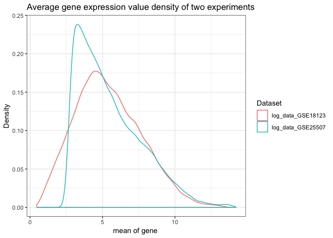

Quantile normalization
----------------------

``` r
# combine data from two experiments into one matrix, each column represents gene expression values of one sample
combine_matrix <- as.matrix(cbind(log_data_GSE18123,log_data_GSE25507))
str(combine_matrix, max.level = 0)
```

    ##  num [1:54613, 1:245] 4.79 5.32 8.21 7.71 6.02 ...
    ##  - attr(*, "dimnames")=List of 2

``` r
# quantile normalization
system.time(combine_norm <- normalizeBetweenArrays(combine_matrix))
```

    ##    user  system elapsed 
    ##   6.489   0.821   7.329

``` r
dat.geneMeans <- c(rowMeans(combine_norm[, 1:ncol(log_data_GSE18123)]), rowMeans(combine_norm[, ncol(log_data_GSE18123):ncol(combine_norm)])) 
plotDat2 <- data.frame(mean_gene = dat.geneMeans,
                      Dataset = rep(c('log_data_GSE25507', 'log_data_GSE18123'), each = nrow(log_data_GSE25507)))

(probeAvg <- ggplot(data = plotDat2, aes(x = mean_gene, col = Dataset)) +
   geom_density() + 
   ggtitle("Average gene expression value density of two experiments") + 
   xlab("mean of gene ") + 
   ylab("Density") + 
   theme_bw()
)
```


Plotting gene expression
------------------------

``` r
# melt into a format ggplot can easily work with
combine_norm2<-as.data.frame(combine_norm) %>% rownames_to_column("gene")
meltedExpressionMatrix <- combine_norm2 %>% melt(id = "gene") 

head_variable<-head(unique(meltedExpressionMatrix$variable),8)
meltedExpressionMatrix %>% filter(variable==head_variable) %>% 
  ggplot(aes(x = variable, y = value)) +
  geom_boxplot() +
  theme(axis.text.x = element_text(angle = 90, hjust = 1))+theme_bw()
```

    ## Warning in `==.default`(variable, head_variable): longer object length is
    ## not a multiple of shorter object length

    ## Warning in is.na(e1) | is.na(e2): longer object length is not a multiple of
    ## shorter object length

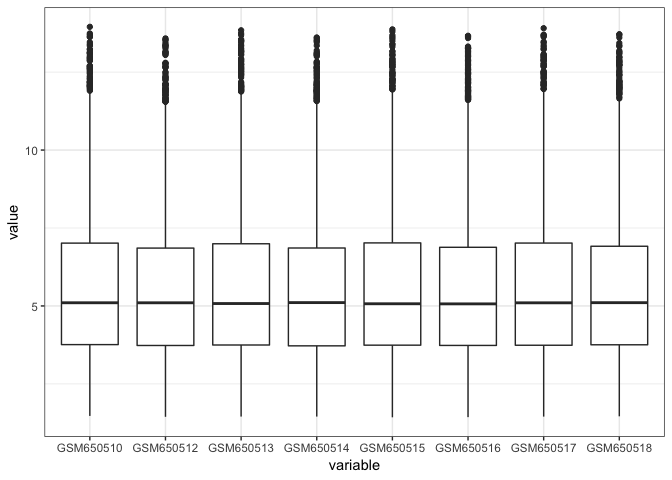

By looking at the first 8 samples, it shows that the distribution of the sample are similar.

``` r
meltedExpressionMatrix %>% filter(variable==head_variable) %>% 
  ggplot(aes(x = value, color = variable)) +
  geom_density() +
  theme_bw()
```

    ## Warning in `==.default`(variable, head_variable): longer object length is
    ## not a multiple of shorter object length

    ## Warning in is.na(e1) | is.na(e2): longer object length is not a multiple of
    ## shorter object length

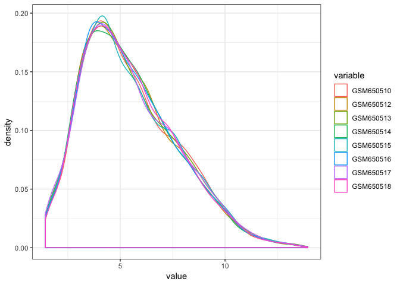

The same result could be shown using the density plot.

PCA
---

``` r
#Scaled data
#scaled_combine_norm = scale(t(combine_norm))
spr_Dat <- t(scale(t(combine_norm)))
```

``` r
#PCA on the Scaled data
PrinComps = prcomp(spr_Dat, center = FALSE, scale = FALSE)

plot(PrinComps)
```

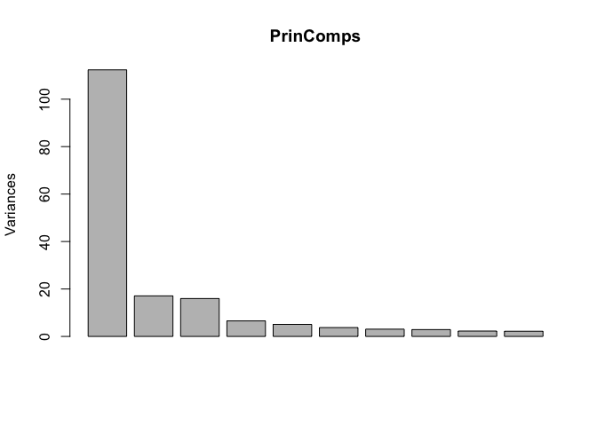

``` r
prop<-PrinComps$sdev^2/sum(PrinComps$sdev^2)
barplot(prop[1:10], xlab = 'Principal Components', ylab = 'Proportion of Variance Explained', main = 'Principal Component Analysis')
```

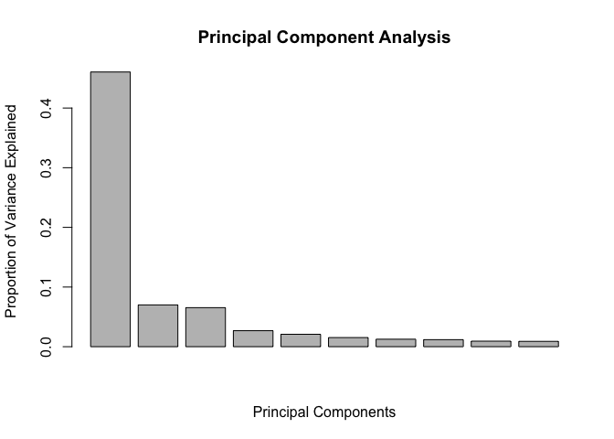

``` r
# Get the subset of PCs that capture the most variance in your predictors
summary(PrinComps)
```

    ## Importance of components:
    ##                            PC1     PC2     PC3     PC4     PC5     PC6
    ## Standard deviation     10.5992 4.13377 3.99645 2.55961 2.25321 1.93301
    ## Proportion of Variance  0.4604 0.07003 0.06546 0.02685 0.02081 0.01531
    ## Cumulative Proportion   0.4604 0.53045 0.59591 0.62276 0.64356 0.65888
    ##                            PC7     PC8     PC9    PC10    PC11    PC12
    ## Standard deviation     1.75063 1.69805 1.50694 1.47909 1.38974 1.28465
    ## Proportion of Variance 0.01256 0.01182 0.00931 0.00897 0.00792 0.00676
    ## Cumulative Proportion  0.67144 0.68325 0.69256 0.70153 0.70944 0.71620
    ##                           PC13    PC14    PC15    PC16   PC17    PC18
    ## Standard deviation     1.25545 1.21756 1.20632 1.13505 1.0931 1.07953
    ## Proportion of Variance 0.00646 0.00608 0.00596 0.00528 0.0049 0.00478
    ## Cumulative Proportion  0.72266 0.72874 0.73470 0.73998 0.7449 0.74966
    ##                           PC19    PC20   PC21    PC22    PC23    PC24
    ## Standard deviation     1.03484 1.01483 0.9750 0.97053 0.93372 0.92760
    ## Proportion of Variance 0.00439 0.00422 0.0039 0.00386 0.00357 0.00353
    ## Cumulative Proportion  0.75404 0.75827 0.7622 0.76602 0.76959 0.77312
    ##                           PC25    PC26    PC27    PC28    PC29    PC30
    ## Standard deviation     0.90470 0.89123 0.87868 0.86816 0.85201 0.84980
    ## Proportion of Variance 0.00335 0.00326 0.00316 0.00309 0.00298 0.00296
    ## Cumulative Proportion  0.77648 0.77973 0.78289 0.78598 0.78896 0.79192
    ##                           PC31    PC32    PC33    PC34    PC35    PC36
    ## Standard deviation     0.82514 0.81759 0.80673 0.79829 0.78643 0.78183
    ## Proportion of Variance 0.00279 0.00274 0.00267 0.00261 0.00253 0.00251
    ## Cumulative Proportion  0.79471 0.79745 0.80012 0.80273 0.80526 0.80777
    ##                           PC37    PC38    PC39   PC40    PC41    PC42
    ## Standard deviation     0.77507 0.77281 0.75344 0.7485 0.74265 0.73798
    ## Proportion of Variance 0.00246 0.00245 0.00233 0.0023 0.00226 0.00223
    ## Cumulative Proportion  0.81023 0.81268 0.81500 0.8173 0.81956 0.82179
    ##                          PC43    PC44    PC45    PC46    PC47    PC48
    ## Standard deviation     0.7324 0.72957 0.72484 0.71722 0.70973 0.70845
    ## Proportion of Variance 0.0022 0.00218 0.00215 0.00211 0.00206 0.00206
    ## Cumulative Proportion  0.8240 0.82617 0.82832 0.83043 0.83250 0.83455
    ##                          PC49    PC50    PC51    PC52   PC53   PC54
    ## Standard deviation     0.6989 0.69412 0.68904 0.68592 0.6816 0.6803
    ## Proportion of Variance 0.0020 0.00197 0.00195 0.00193 0.0019 0.0019
    ## Cumulative Proportion  0.8366 0.83853 0.84048 0.84240 0.8443 0.8462
    ##                           PC55    PC56   PC57    PC58    PC59    PC60
    ## Standard deviation     0.67454 0.66829 0.6636 0.65666 0.65570 0.65101
    ## Proportion of Variance 0.00186 0.00183 0.0018 0.00177 0.00176 0.00174
    ## Cumulative Proportion  0.84807 0.84990 0.8517 0.85347 0.85523 0.85697
    ##                           PC61   PC62    PC63    PC64    PC65    PC66
    ## Standard deviation     0.64918 0.6444 0.64059 0.63593 0.63457 0.63117
    ## Proportion of Variance 0.00173 0.0017 0.00168 0.00166 0.00165 0.00163
    ## Cumulative Proportion  0.85870 0.8604 0.86208 0.86374 0.86539 0.86702
    ##                           PC67    PC68    PC69    PC70    PC71    PC72
    ## Standard deviation     0.62644 0.62289 0.61875 0.61104 0.60935 0.60659
    ## Proportion of Variance 0.00161 0.00159 0.00157 0.00153 0.00152 0.00151
    ## Cumulative Proportion  0.86863 0.87022 0.87179 0.87332 0.87484 0.87635
    ##                           PC73    PC74    PC75    PC76   PC77    PC78
    ## Standard deviation     0.60123 0.59665 0.59492 0.59162 0.5846 0.58221
    ## Proportion of Variance 0.00148 0.00146 0.00145 0.00143 0.0014 0.00139
    ## Cumulative Proportion  0.87783 0.87929 0.88074 0.88218 0.8836 0.88497
    ##                           PC79    PC80    PC81    PC82    PC83    PC84
    ## Standard deviation     0.57942 0.57836 0.57722 0.57548 0.56977 0.56518
    ## Proportion of Variance 0.00138 0.00137 0.00137 0.00136 0.00133 0.00131
    ## Cumulative Proportion  0.88634 0.88771 0.88908 0.89044 0.89177 0.89307
    ##                          PC85    PC86    PC87    PC88    PC89    PC90
    ## Standard deviation     0.5633 0.56123 0.55583 0.55504 0.55205 0.55113
    ## Proportion of Variance 0.0013 0.00129 0.00127 0.00126 0.00125 0.00124
    ## Cumulative Proportion  0.8944 0.89567 0.89693 0.89819 0.89944 0.90069
    ##                           PC91    PC92    PC93    PC94    PC95    PC96
    ## Standard deviation     0.54775 0.53857 0.53663 0.53527 0.53331 0.53094
    ## Proportion of Variance 0.00123 0.00119 0.00118 0.00117 0.00117 0.00116
    ## Cumulative Proportion  0.90192 0.90311 0.90429 0.90546 0.90663 0.90778
    ##                           PC97    PC98    PC99   PC100   PC101  PC102
    ## Standard deviation     0.52713 0.52654 0.52400 0.52055 0.52031 0.5175
    ## Proportion of Variance 0.00114 0.00114 0.00113 0.00111 0.00111 0.0011
    ## Cumulative Proportion  0.90892 0.91006 0.91118 0.91229 0.91340 0.9145
    ##                          PC103   PC104   PC105   PC106   PC107   PC108
    ## Standard deviation     0.51509 0.51181 0.51004 0.50842 0.50558 0.50343
    ## Proportion of Variance 0.00109 0.00107 0.00107 0.00106 0.00105 0.00104
    ## Cumulative Proportion  0.91559 0.91666 0.91773 0.91879 0.91983 0.92087
    ##                          PC109   PC110   PC111  PC112   PC113   PC114
    ## Standard deviation     0.50117 0.49695 0.49563 0.4944 0.48870 0.48575
    ## Proportion of Variance 0.00103 0.00101 0.00101 0.0010 0.00098 0.00097
    ## Cumulative Proportion  0.92190 0.92291 0.92392 0.9249 0.92590 0.92687
    ##                          PC115   PC116   PC117   PC118   PC119   PC120
    ## Standard deviation     0.48352 0.48233 0.48004 0.47660 0.47608 0.47226
    ## Proportion of Variance 0.00096 0.00095 0.00094 0.00093 0.00093 0.00091
    ## Cumulative Proportion  0.92783 0.92878 0.92972 0.93065 0.93158 0.93250
    ##                          PC121   PC122   PC123   PC124   PC125   PC126
    ## Standard deviation     0.47135 0.46566 0.46421 0.46266 0.46138 0.45914
    ## Proportion of Variance 0.00091 0.00089 0.00088 0.00088 0.00087 0.00086
    ## Cumulative Proportion  0.93341 0.93430 0.93518 0.93606 0.93693 0.93779
    ##                          PC127   PC128   PC129   PC130   PC131  PC132
    ## Standard deviation     0.45757 0.45022 0.44733 0.44681 0.44475 0.4419
    ## Proportion of Variance 0.00086 0.00083 0.00082 0.00082 0.00081 0.0008
    ## Cumulative Proportion  0.93865 0.93948 0.94030 0.94112 0.94193 0.9427
    ##                         PC133   PC134   PC135   PC136   PC137   PC138
    ## Standard deviation     0.4412 0.43840 0.43635 0.43264 0.43061 0.42899
    ## Proportion of Variance 0.0008 0.00079 0.00078 0.00077 0.00076 0.00075
    ## Cumulative Proportion  0.9435 0.94432 0.94510 0.94586 0.94662 0.94738
    ##                          PC139   PC140   PC141   PC142   PC143   PC144
    ## Standard deviation     0.42729 0.42454 0.42199 0.42097 0.41729 0.41641
    ## Proportion of Variance 0.00075 0.00074 0.00073 0.00073 0.00071 0.00071
    ## Cumulative Proportion  0.94813 0.94887 0.94960 0.95032 0.95104 0.95175
    ##                          PC145  PC146   PC147   PC148   PC149   PC150
    ## Standard deviation     0.41486 0.4130 0.40869 0.40759 0.40699 0.40399
    ## Proportion of Variance 0.00071 0.0007 0.00068 0.00068 0.00068 0.00067
    ## Cumulative Proportion  0.95245 0.9532 0.95384 0.95452 0.95519 0.95586
    ##                          PC151   PC152   PC153   PC154   PC155   PC156
    ## Standard deviation     0.40243 0.40084 0.39671 0.39542 0.39476 0.39370
    ## Proportion of Variance 0.00066 0.00066 0.00064 0.00064 0.00064 0.00064
    ## Cumulative Proportion  0.95653 0.95719 0.95783 0.95847 0.95911 0.95975
    ##                          PC157   PC158   PC159   PC160   PC161  PC162
    ## Standard deviation     0.38944 0.38869 0.38829 0.38602 0.38515 0.3832
    ## Proportion of Variance 0.00062 0.00062 0.00062 0.00061 0.00061 0.0006
    ## Cumulative Proportion  0.96037 0.96099 0.96160 0.96221 0.96282 0.9634
    ##                         PC163   PC164   PC165   PC166   PC167   PC168
    ## Standard deviation     0.3821 0.37935 0.37749 0.37628 0.37550 0.37370
    ## Proportion of Variance 0.0006 0.00059 0.00058 0.00058 0.00058 0.00057
    ## Cumulative Proportion  0.9640 0.96461 0.96520 0.96578 0.96635 0.96693
    ##                          PC169   PC170   PC171   PC172   PC173   PC174
    ## Standard deviation     0.37300 0.37117 0.37067 0.36969 0.36877 0.36699
    ## Proportion of Variance 0.00057 0.00056 0.00056 0.00056 0.00056 0.00055
    ## Cumulative Proportion  0.96750 0.96806 0.96863 0.96919 0.96974 0.97029
    ##                          PC175   PC176   PC177   PC178   PC179   PC180
    ## Standard deviation     0.36563 0.36508 0.36435 0.36302 0.36207 0.36071
    ## Proportion of Variance 0.00055 0.00055 0.00054 0.00054 0.00054 0.00053
    ## Cumulative Proportion  0.97084 0.97139 0.97193 0.97247 0.97301 0.97354
    ##                          PC181   PC182   PC183   PC184   PC185  PC186
    ## Standard deviation     0.35743 0.35581 0.35442 0.35346 0.35252 0.3506
    ## Proportion of Variance 0.00052 0.00052 0.00051 0.00051 0.00051 0.0005
    ## Cumulative Proportion  0.97407 0.97459 0.97510 0.97561 0.97612 0.9766
    ##                         PC187  PC188  PC189   PC190   PC191   PC192
    ## Standard deviation     0.3504 0.3489 0.3485 0.34668 0.34584 0.34462
    ## Proportion of Variance 0.0005 0.0005 0.0005 0.00049 0.00049 0.00049
    ## Cumulative Proportion  0.9771 0.9776 0.9781 0.97862 0.97911 0.97959
    ##                          PC193   PC194   PC195   PC196   PC197   PC198
    ## Standard deviation     0.34445 0.34315 0.34224 0.34144 0.33999 0.33917
    ## Proportion of Variance 0.00049 0.00048 0.00048 0.00048 0.00047 0.00047
    ## Cumulative Proportion  0.98008 0.98056 0.98104 0.98152 0.98199 0.98247
    ##                          PC199   PC200   PC201   PC202   PC203   PC204
    ## Standard deviation     0.33699 0.33562 0.33559 0.33489 0.33241 0.33185
    ## Proportion of Variance 0.00047 0.00046 0.00046 0.00046 0.00045 0.00045
    ## Cumulative Proportion  0.98293 0.98339 0.98386 0.98431 0.98477 0.98522
    ##                          PC205   PC206   PC207   PC208   PC209   PC210
    ## Standard deviation     0.33012 0.32882 0.32782 0.32631 0.32587 0.32478
    ## Proportion of Variance 0.00045 0.00044 0.00044 0.00044 0.00044 0.00043
    ## Cumulative Proportion  0.98567 0.98611 0.98655 0.98699 0.98742 0.98785
    ##                          PC211   PC212   PC213   PC214   PC215   PC216
    ## Standard deviation     0.32207 0.32141 0.31980 0.31725 0.31534 0.31476
    ## Proportion of Variance 0.00043 0.00042 0.00042 0.00041 0.00041 0.00041
    ## Cumulative Proportion  0.98828 0.98870 0.98912 0.98953 0.98994 0.99035
    ##                         PC217  PC218   PC219   PC220   PC221   PC222
    ## Standard deviation     0.3134 0.3119 0.31009 0.30944 0.30835 0.30737
    ## Proportion of Variance 0.0004 0.0004 0.00039 0.00039 0.00039 0.00039
    ## Cumulative Proportion  0.9908 0.9911 0.99154 0.99193 0.99232 0.99271
    ##                          PC223   PC224   PC225   PC226   PC227   PC228
    ## Standard deviation     0.30574 0.30504 0.30300 0.30232 0.29854 0.29783
    ## Proportion of Variance 0.00038 0.00038 0.00038 0.00037 0.00037 0.00036
    ## Cumulative Proportion  0.99309 0.99348 0.99385 0.99423 0.99459 0.99496
    ##                          PC229   PC230   PC231   PC232   PC233   PC234
    ## Standard deviation     0.29616 0.29445 0.29168 0.29047 0.28782 0.28665
    ## Proportion of Variance 0.00036 0.00036 0.00035 0.00035 0.00034 0.00034
    ## Cumulative Proportion  0.99531 0.99567 0.99602 0.99636 0.99670 0.99704
    ##                          PC235   PC236   PC237   PC238   PC239  PC240
    ## Standard deviation     0.28200 0.28147 0.27842 0.27391 0.27361 0.2696
    ## Proportion of Variance 0.00033 0.00032 0.00032 0.00031 0.00031 0.0003
    ## Cumulative Proportion  0.99737 0.99769 0.99801 0.99832 0.99862 0.9989
    ##                          PC241   PC242   PC243   PC244     PC245
    ## Standard deviation     0.25994 0.25766 0.25673 0.25181 1.036e-14
    ## Proportion of Variance 0.00028 0.00027 0.00027 0.00026 0.000e+00
    ## Cumulative Proportion  0.99920 0.99947 0.99974 1.00000 1.000e+00

``` r
# append the rotations for the first 10 PCs to the metadata
Meta_data_PrinCs = cbind(Meta_data, PrinComps$x[Meta_data$sample_name,1:10])

Meta_data_PrinCs_2 = melt(Meta_data_PrinCs, id=c("organism", "sample_name", "diagnosis", "age","batch"))
```

``` r
#Relationships between age and PCs
ggplot(data=Meta_data_PrinCs_2, aes(x=age, col=age))+
  facet_wrap(~variable)+
  geom_point(aes(y=value))+
  labs(x="age", y="PC Loading", col="age")+
  theme_bw()
```

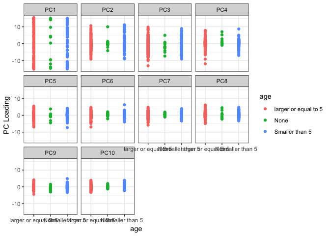

``` r
#Relationships between autism and PCs
ggplot(data=Meta_data_PrinCs_2, aes(x=diagnosis, col=diagnosis))+
  facet_wrap(~variable)+
  theme(axis.text.x = element_text(angle=20))+
  geom_point(aes(y=value))+
  labs(x="diagnosis", y="PC Loading", col="diagnosis")+
  theme_bw()
```

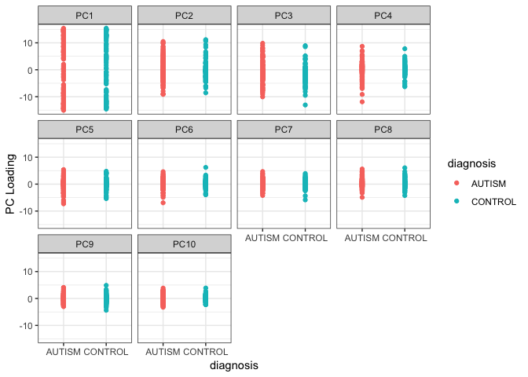

``` r
#Relationships between batch and PCs
ggplot(data=Meta_data_PrinCs_2, aes(x=batch, col=batch))+
  facet_wrap(~variable)+
  theme(axis.text.x = element_text(angle=20))+
  geom_point(aes(y=value))+
  labs(x="batch", y="PC Loading", col="batch")+
  theme_bw()
```

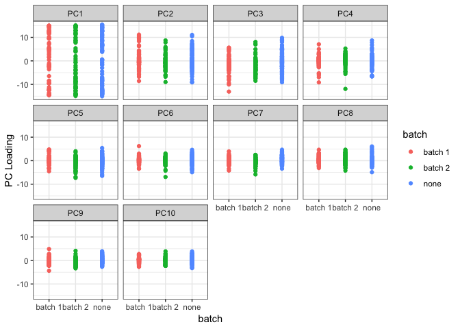

``` r
# top 2 PCs related to age
ggplot(data=Meta_data_PrinCs, aes(x=PC1, y=PC2))+
  geom_point(aes(col=age))+
  labs(x="PC1", y="PC2", col="age")+
  theme_bw()
```

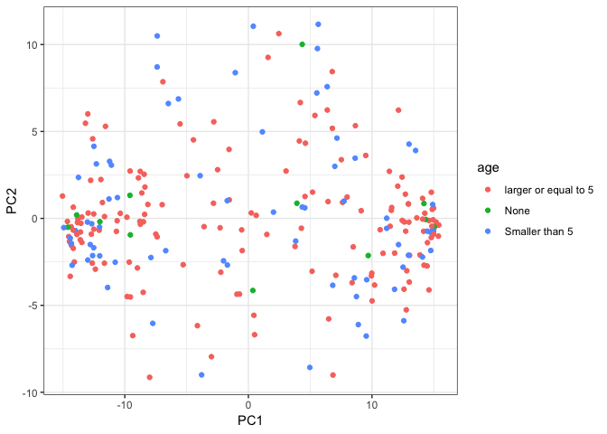

``` r
# top 2 PCs related to autism
ggplot(data=Meta_data_PrinCs, aes(x=PC1, y=PC2))+
  geom_point(aes(col=diagnosis))+
  labs(x="PC1", y="PC2", col="diagnosis")+
  theme_bw()
```

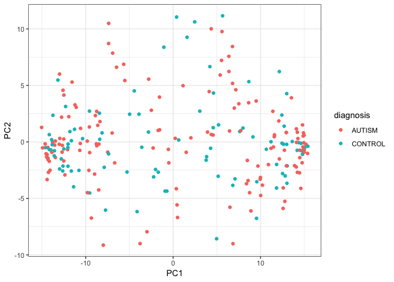

``` r
# top 2 PCs related to batch
ggplot(data=Meta_data_PrinCs, aes(x=PC1, y=PC2))+
  geom_point(aes(col=batch))+
  labs(x="PC1", y="PC2", col="batch")+
  theme_bw()
```

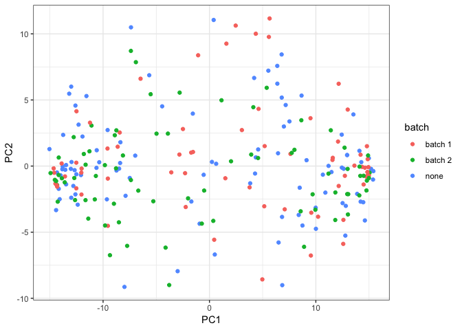

Hierarchical Clustering for sample
----------------------------------

``` r
data_to_plot = spr_Dat

# compute pairwise distances
pr.dis <- dist(t(data_to_plot), method = "euclidean")
```

``` r
pr.hc.a <- hclust(pr.dis, method = "average")

# plot them
plot(pr.hc.a, labels = FALSE, main = "Average", xlab = "")
```

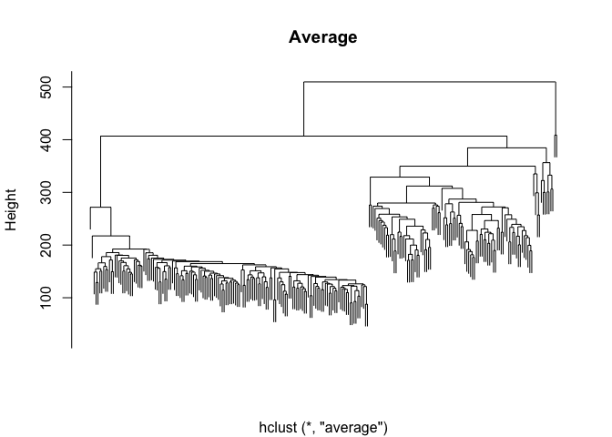

``` r
# set pheatmap clustering parameters
clust_dist_col = "euclidean"  #‘'correlation'’ for Pearson correlation, ‘'euclidean'’, ‘'maximum'’, ‘'manhattan'’, ‘'canberra'’, ‘'binary'’ or ‘'minkowski'’
clust_method = "average"  #‘'ward.D'’, ‘'ward.D2'’,‘'single'’, ‘'complete'’, ‘'average'’ (= UPGMA), ‘'mcquitty'’ (= WPGMA), ‘'median'’ (= WPGMC) or ‘'centroid'’ (= UPGMC)
clust_scale = "none"  #'column', 'none', 'row'

## the annotation option uses the covariate object (prDes) we defined. It should
## have the same rownames, as the colnames in our data object (data_to_plot).

pheatmap(data_to_plot, cluster_rows = FALSE, scale = clust_scale, clustering_method = clust_method, 
    clustering_distance_cols = clust_dist_col, show_colnames =FALSE, show_rownames = FALSE, 
    main = "Clustering heatmap for combine data", annotation = Meta_data[,c("diagnosis", "age","batch")])
```

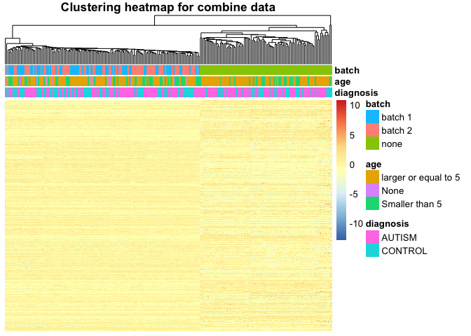

Limma
-----

``` r
head(spr_Dat %>% as_tibble())
```

    ## # A tibble: 6 x 245
    ##   GSM650510 GSM650512 GSM650513 GSM650514 GSM650515 GSM650516 GSM650517
    ##       <dbl>     <dbl>     <dbl>     <dbl>     <dbl>     <dbl>     <dbl>
    ## 1    -2.42     -0.165    -1.57     -0.778    -0.821    -2.19   -2.01   
    ## 2    -1.06      0.435    -1.04      0.180    -0.577    -0.214  -0.481  
    ## 3    -0.396    -0.647    -0.415    -0.110    -1.29     -0.838  -0.00905
    ## 4     2.18      0.588     1.10      0.392     0.596     0.354   0.215  
    ## 5     2.46      1.55      1.99      0.628     1.26      2.18    0.247  
    ## 6    -1.14     -0.885    -1.36     -1.20     -1.03     -0.899  -1.36   
    ## # … with 238 more variables: GSM650518 <dbl>, GSM650519 <dbl>,
    ## #   GSM650520 <dbl>, GSM650521 <dbl>, GSM650522 <dbl>, GSM650523 <dbl>,
    ## #   GSM650525 <dbl>, GSM650526 <dbl>, GSM650527 <dbl>, GSM650528 <dbl>,
    ## #   GSM650529 <dbl>, GSM650530 <dbl>, GSM650531 <dbl>, GSM650532 <dbl>,
    ## #   GSM650533 <dbl>, GSM650534 <dbl>, GSM650536 <dbl>, GSM650537 <dbl>,
    ## #   GSM650538 <dbl>, GSM650540 <dbl>, GSM650541 <dbl>, GSM650542 <dbl>,
    ## #   GSM650543 <dbl>, GSM650544 <dbl>, GSM650545 <dbl>, GSM650546 <dbl>,
    ## #   GSM650547 <dbl>, GSM650548 <dbl>, GSM650549 <dbl>, GSM650550 <dbl>,
    ## #   GSM650551 <dbl>, GSM650552 <dbl>, GSM650553 <dbl>, GSM650554 <dbl>,
    ## #   GSM650555 <dbl>, GSM650556 <dbl>, GSM650557 <dbl>, GSM650558 <dbl>,
    ## #   GSM650560 <dbl>, GSM650561 <dbl>, GSM650562 <dbl>, GSM650563 <dbl>,
    ## #   GSM650564 <dbl>, GSM650565 <dbl>, GSM650566 <dbl>, GSM650567 <dbl>,
    ## #   GSM650568 <dbl>, GSM650569 <dbl>, GSM650570 <dbl>, GSM650571 <dbl>,
    ## #   GSM650572 <dbl>, GSM650573 <dbl>, GSM650574 <dbl>, GSM650575 <dbl>,
    ## #   GSM650577 <dbl>, GSM650578 <dbl>, GSM650579 <dbl>, GSM650580 <dbl>,
    ## #   GSM650581 <dbl>, GSM650600 <dbl>, GSM650603 <dbl>, GSM650604 <dbl>,
    ## #   GSM650606 <dbl>, GSM650607 <dbl>, GSM650614 <dbl>, GSM650615 <dbl>,
    ## #   GSM650617 <dbl>, GSM650618 <dbl>, GSM650619 <dbl>, GSM650620 <dbl>,
    ## #   GSM650621 <dbl>, GSM650622 <dbl>, GSM650632 <dbl>, GSM650633 <dbl>,
    ## #   GSM650636 <dbl>, GSM650637 <dbl>, GSM650638 <dbl>, GSM650639 <dbl>,
    ## #   GSM650640 <dbl>, GSM650641 <dbl>, GSM650642 <dbl>, GSM650643 <dbl>,
    ## #   GSM650644 <dbl>, GSM650645 <dbl>, GSM650646 <dbl>, GSM650647 <dbl>,
    ## #   GSM650648 <dbl>, GSM650649 <dbl>, GSM650651 <dbl>, GSM650652 <dbl>,
    ## #   GSM650653 <dbl>, GSM650654 <dbl>, GSM627071 <dbl>, GSM627072 <dbl>,
    ## #   GSM627073 <dbl>, GSM627074 <dbl>, GSM627075 <dbl>, GSM627076 <dbl>,
    ## #   GSM627077 <dbl>, GSM627078 <dbl>, …

``` r
Meta_data_1 = Meta_data
Design = Meta_data_1[,c("diagnosis", "age","batch")]
#Design Matrix
Des_Mat = model.matrix(~ diagnosis+age+batch, Design)
ds_Fit <- lmFit(spr_Dat, Des_Mat)
```

``` r
ds_EbFit <- eBayes(ds_Fit)
ds_Hits <- topTable(ds_EbFit, coef = grep("diagnosis", colnames(coef(ds_EbFit))), p.value = 0.1, 
    n = Inf)
num_BHhits <- nrow(ds_Hits)

top_Genes <- rownames(ds_Hits)

# Scaled data of topGenes
top_Dat <- spr_Dat[top_Genes, ]
```

``` r
top_10_Genes <- head(top_Genes,10)
transformGeneExpressionMatrix <- function(expressionMatrix) {
  expressionMatrix <- expressionMatrix %>%
    as.data.frame() %>% 
    column_to_rownames("gene") %>%
    t() %>% as.data.frame() %>% 
    rownames_to_column("sample_id") %>% 
    melt(id = "sample_id") %>% 
    as_tibble() %>% 
    select(sample_id,
           gene = variable, 
           expression = value)
  return(expressionMatrix)
}
Meta_data3 <-Meta_data %>% rownames_to_column("sample_id")
topGenes_ExpressionData <- combine_norm2 %>% 
  filter(gene %in% top_10_Genes) %>%
  transformGeneExpressionMatrix() %>% 
  left_join(Meta_data3, id = "sample_id")
```

    ## Joining, by = "sample_id"

``` r
#Examine differences in beta values among top 10 CGIs
ggplot(data=topGenes_ExpressionData, aes(x=diagnosis, y=expression, col=age))+
  geom_point()+
  geom_jitter() +
  stat_summary(aes(y=expression,group=1), fun.y = mean, geom = "line", color = "black")+
  facet_wrap(~gene)+
  labs(x=" diagnosis", y="top 10 gene expression")+
  theme_bw()
```

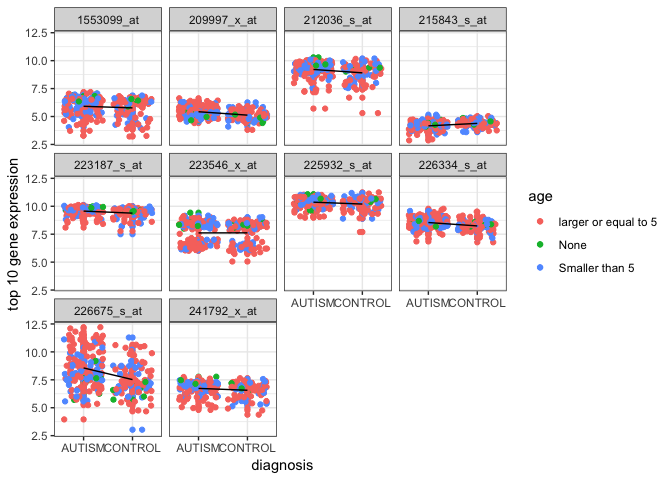

We start by using clustering algorithms to cluster the top 40 genes that showed differential expression across the different diagnosis stage (BH adjusted p value &lt; 0.1).

``` r
pheatmap(top_Dat, cluster_rows = TRUE, scale = "none", clustering_method = "average", 
    clustering_distance_cols = "euclidean", clustering_distance_rows = "euclidean", 
    annotation = Meta_data_1[,c("diagnosis", "age","batch")], show_rownames = FALSE,show_colnames  = FALSE)
```

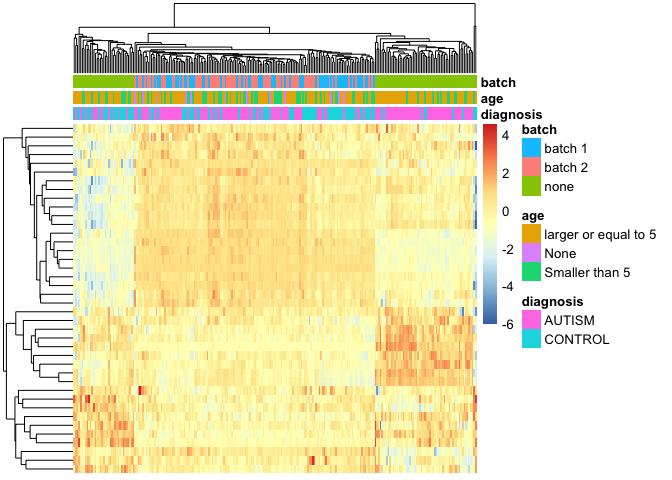

``` r
geneC_dis <- dist(top_Dat, method = "euclidean")

geneC_hc_a <- hclust(geneC_dis, method = "average")

plot(geneC_hc_a, labels = FALSE, main = "Hierarchical with Average Linkage", xlab = "")
```

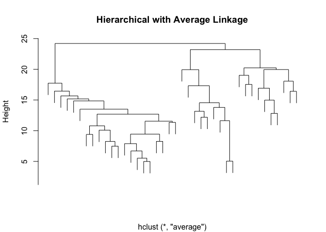
