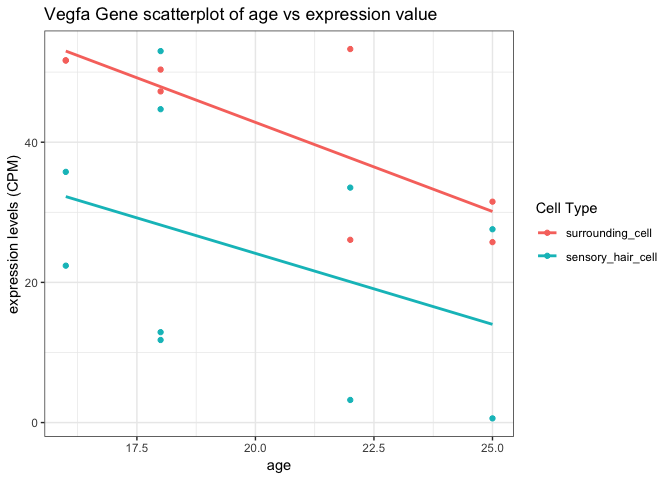
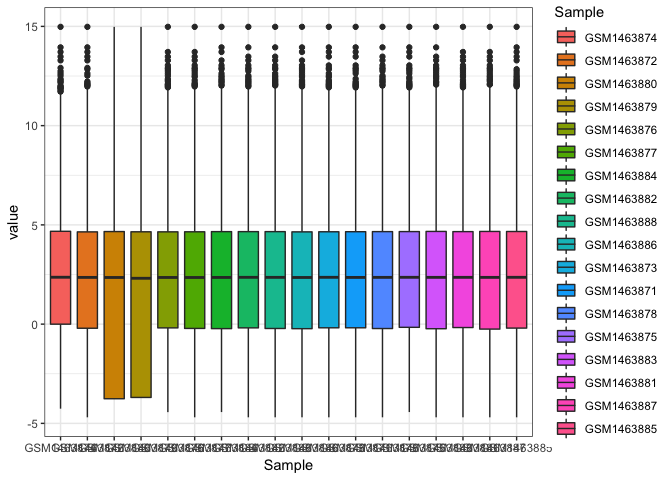
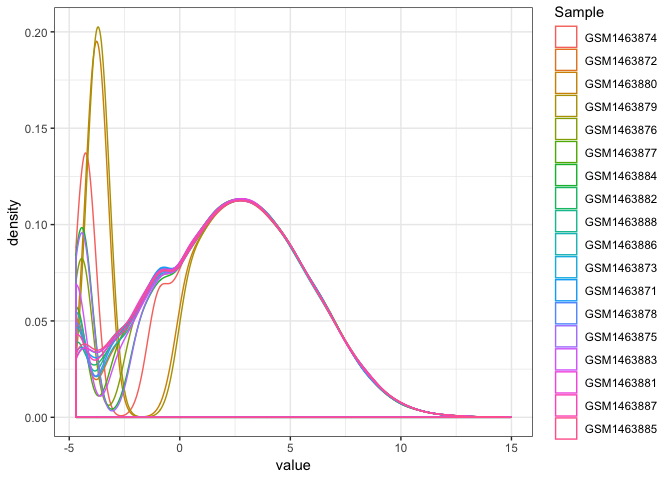
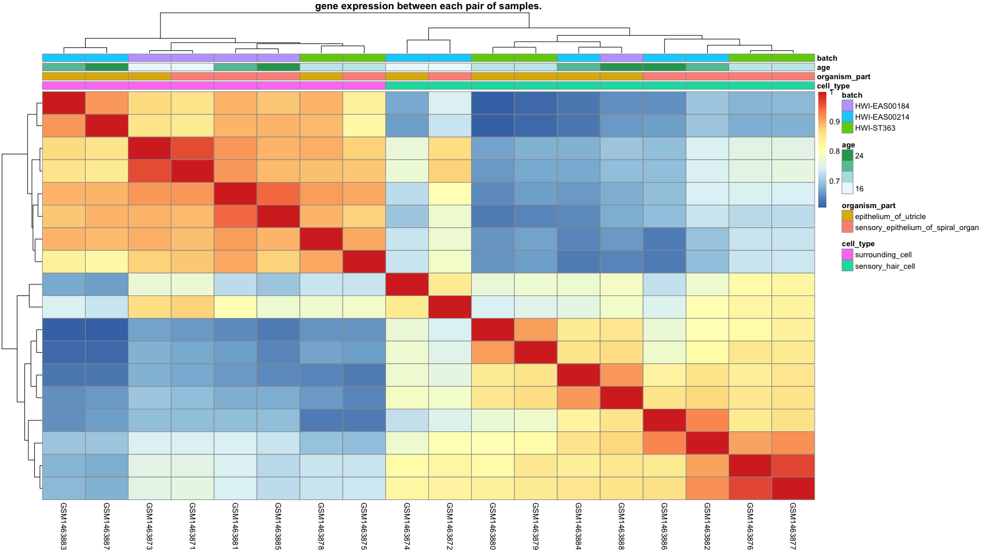
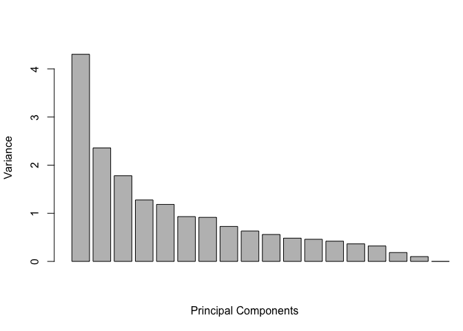
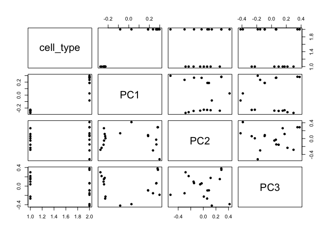
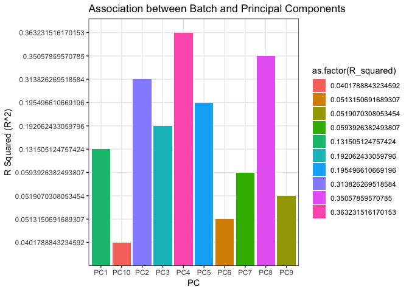

Assignment 1
================
Yanchao
2019-02-26

``` r
suppressPackageStartupMessages(library(tidyverse))
```

    ## Warning: package 'tibble' was built under R version 3.5.2

    ## Warning: package 'dplyr' was built under R version 3.5.2

    ## Warning: package 'stringr' was built under R version 3.5.2

    ## Warning: package 'forcats' was built under R version 3.5.2

``` r
suppressPackageStartupMessages(library(reshape2))
suppressPackageStartupMessages(library(limma))
suppressPackageStartupMessages(library(knitr))
suppressPackageStartupMessages(library(pheatmap))
```

    ## Warning: package 'pheatmap' was built under R version 3.5.2

Question 1: Data Inspection and Basic Manipulation
--------------------------------------------------

### Q1.1 Importing the data and getting familiar with it (1 POINT)

-   **Read the datasets into R-Studio.**

``` r
data <- readRDS(file = 'gse60019_expression_matrix.RDS')

meta_data <- readRDS(file = 'gse60019_experiment_design.RDS')
```

-   **How many genes are there?**

``` r
nrow(data)
```

    ## [1] 14479

There are 14479 genes.

-   **How many samples are there?**

``` r
ncol(data)-1
```

    ## [1] 18

``` r
length(meta_data$sample)
```

    ## [1] 18

There are 18 samples.

-   **How many factors are in our experimental design? How may levels per factor? List out the levels for each factor.**

``` r
str(meta_data)
```

    ## Classes 'tbl_df', 'tbl' and 'data.frame':    18 obs. of  5 variables:
    ##  $ sample       : chr  "GSM1463874" "GSM1463872" "GSM1463880" "GSM1463879" ...
    ##  $ organism_part: Factor w/ 2 levels "epithelium_of_utricle",..: 1 2 1 1 2 2 1 2 1 2 ...
    ##  $ cell_type    : Factor w/ 2 levels "surrounding_cell",..: 2 2 2 2 2 2 2 2 2 2 ...
    ##  $ time_point   : Factor w/ 4 levels "E16","P0","P4",..: 1 1 2 2 2 2 3 3 4 4 ...
    ##  $ batch        : Factor w/ 3 levels "HWI-EAS00184",..: 2 2 3 3 3 3 2 2 1 2 ...

There are 4 factors, which are organism\_part, cell\_type, time\_point and batch. There are 2 levels for organism\_part, 2 levels for cell\_type, 4 levels for time\_points, and 3 levels for batch.

*2 levels for organism\_part:*

``` r
levels(meta_data$organism_part) 
```

    ## [1] "epithelium_of_utricle"             
    ## [2] "sensory_epithelium_of_spiral_organ"

*2 levels for cell\_type*

``` r
levels(meta_data$cell_type) 
```

    ## [1] "surrounding_cell"  "sensory_hair_cell"

*4 levels for time\_points*

``` r
levels(meta_data$time_point) 
```

    ## [1] "E16" "P0"  "P4"  "P7"

*3 levels for batch*

``` r
levels(meta_data$batch) 
```

    ## [1] "HWI-EAS00184" "HWI-EAS00214" "HWI-ST363"

### Q1.2 Data manipulation (2 POINTS)

The levels of the factor `time_point` actually refer to points on a continous axis. In other words, it doesn't have to be interpreted as strictly categorical variable. In order to make graphing easier, it will be helpful to convert this variable to a numeric representation.

-   **Create a new column in the samples metadata tibble. Call it "age" and populate it with the appropriate numeric values. Hint: Assume that the mouse gestation length is 18 days (ie. P0 = 18). **

``` r
meta_data$age <- ifelse(meta_data$time_point == "E16", 16, ifelse(meta_data$time_point == "P0", 18, ifelse(meta_data$time_point == "P4", 22, ifelse(meta_data$time_point == "P7", 25, 0))))
```

### Q1.3 Single gene graphing (2 POINTS)

-   **Find the expression profile for the gene Vegfa. Make a scatterplot with age on the x-axis and expression value in CPM on the y-axis. Color the data points by cell\_type. Add in a regression line for each cell type.**

``` r
geneIds<- "Vegfa"
vegfa <- data %>% filter(gene %in% geneIds)
# transform the data frame into the format that matches the sample metadata
vegfa <- vegfa %>%
  as.data.frame() %>% 
  column_to_rownames("gene") %>%
  t() %>% as.data.frame() %>% 
  rownames_to_column("sample") %>% 
  melt(id = "sample") %>% 
  as_tibble() %>% 
  select(sample,
         gene = variable, 
         expression = value)

head(vegfa)
```

    ## # A tibble: 6 x 3
    ##   sample     gene  expression
    ##   <chr>      <fct>      <dbl>
    ## 1 GSM1463874 Vegfa       35.8
    ## 2 GSM1463872 Vegfa       22.4
    ## 3 GSM1463880 Vegfa       53.0
    ## 4 GSM1463879 Vegfa       44.7
    ## 5 GSM1463876 Vegfa       11.8
    ## 6 GSM1463877 Vegfa       12.9

The left\_join() function ensures that all rows in the first data frame are retained while unmatched rows in the second data frame are dropped.

``` r
vegfa_data<-vegfa %>%  left_join(meta_data, by = "sample")

vegfa_data %>%  ggplot(aes(x= age, y= expression, color= cell_type)) +
    geom_point()+
    geom_smooth(method="lm", se = FALSE) +
    ggtitle("Vegfa Gene scatterplot of age vs expression value") +
    labs(x = 'age', y = 'expression levels (CPM)', color = 'Cell Type') +
    theme(plot.title = element_text(hjust = 0.5))+
  theme_bw()
```



-   **Is there sign of interaction between cell\_type and age for Vegfa? Explain using what you observed in your graph from the previous question.**

There is no interaction between cell\_type and age for Vegfa because both lines of two types have similar slope(the two regression lines are approximately parallel with each other).

Question 2: Assessing overall data quality
------------------------------------------

### Q2.1 Overall distributions (2 POINTS)

-   **The expression values are currently in CPM. Log2 transform them so that the distribution is more evenly spread out and can be examined more easily.**

``` r
log_data <- log2(data[ ,2:19])
log_data$gene <- data$gene
```

-   **Examine the distribution of gene expression across all samples using 1. box plots and 2. overlapping density plots.**
    -   For the box plots, samples should be on the x-axis and expression should be on the y-axis.
    -   For the overlapping density plots, expression should be on the x-axis and density should be on the y-axis. Lines should be colored by sample (i.e. one line per sample).
    -   Hint: There are a number of data manipulation steps required. Look at the melt() function in reshape2.

*box plot*

``` r
melted_data <- melt(log_data, id.vars = "gene", var = "Sample")
head(melted_data)
```

    ##            gene     Sample     value
    ## 1 0610005C13Rik GSM1463874 -4.259304
    ## 2 0610009B22Rik GSM1463874  3.819251
    ## 3 0610009E02Rik GSM1463874  6.743683
    ## 4 0610009L18Rik GSM1463874 -1.008678
    ## 5 0610009O20Rik GSM1463874  0.906382
    ## 6 0610010B08Rik GSM1463874  4.873693

``` r
melted_data %>% ggplot(aes(x=Sample, y= value, fill = Sample) )+
  geom_boxplot()+
  theme_bw()
```



*density plots*

``` r
melted_data %>% ggplot(aes(x=value, color = Sample) )+
 geom_density()+
  theme_bw()
```



-   **Which two samples stand out as different, in terms of the distribution of expression values, compared to the rest?**

GSM1463880 and GSM1463879 stand out as different. They have the largest IQR in the box plots and their densities have the highest peak in the density plot compared to the rest.

Q2.2 How do the samples correlate with one another? (2 POINTS)
--------------------------------------------------------------

-   **Examine the correlation between samples using one or more heatmaps (i.e. samples should be on the x axis and the y axis, and the values in the heatmap should be correlations). Again, use the log2 transformed expression values. Display cell\_type, organism\_part, age, and batch for each sample in the heatmap. Hint: Consider using pheatmap() with annotations and cor to correlate gene expression between each pair of samples.**

``` r
data_log_corr <- cor(log_data[,1:18], method=c("pearson")) #Create correlation matrix of samples
annotation1= as.data.frame(meta_data[, c( "cell_type", "organism_part", "age", "batch")]) #  # Set matrix to annotate clusters
rownames(annotation1) <- colnames(data[,2:19]) 
# set pheatmap clustering parameters
clust_dist_col = "euclidean"  #‘'correlation'’ for Pearson correlation, ‘'euclidean'’, ‘'maximum'’, ‘'manhattan'’, ‘'canberra'’, ‘'binary'’ or ‘'minkowski'’
clust_method = "complete"  #‘'ward.D'’, ‘'ward.D2'’,‘'single'’, ‘'complete'’, ‘'average'’ (= UPGMA), ‘'mcquitty'’ (= WPGMA), ‘'median'’ (= WPGMC) or ‘'centroid'’ (= UPGMC)
clust_scale = "none"  #'column', 'none', 'row'


#Heatmap to see sample correlations
pheatmap(data_log_corr, scale = clust_scale, cluster_rows = TRUE, cluster_cols = TRUE, clustering_method = clust_method, 
    clustering_distance_cols = clust_dist_col, show_colnames = T, show_rownames = FALSE, 
    main = "gene expression between each pair of samples.", annotation = annotation1)
```



-   **Among the factors cell\_type, organism\_part, age, and batch, which one seems to be most strongly correlated with clusters in gene expression data? Hint: Consider using 'cluster\_rows=TRUE' in pheatmap().** Cell type seems to be most strongly correlated with clusters in gene expression data among the factors cell\_type, organism\_part, age. If we set the number of clusters to be 2, then the two clusters are seperated by cell type.

-   **There is a sample whose expression values correlate with the samples of the different cell\_type just as well as with the samples of the same cell\_type. Identify this sample by its ID.**

The sample ID is GSM1463872.

Question 3: Using PCA to dig deeper
-----------------------------------

### Q3.1 Perform PCA to summarize the samples. (2 POINTS)

-   **Perform PCA. Hint: Use svd() or prcomp() and remember to scale and center the expression data for all genes by using scale() and t(). Make sure to turn off scaling and centering in prcomp()!**

``` r
scale_log_data <- t(scale(t(data[,2:19]))) # scale the data 
pcs <- prcomp(scale_log_data, center = FALSE, scale = FALSE)
```

-   **Make a bar graph showing the amount of variance explained by each PC, where variance explained is on the y axis and each PC is on the x axis**

``` r
# scree plot
barplot(pcs$sdev^2,xlab = 'Principal Components', ylab = ' Variance',xlim = c(0, 20))
```

 \#\# Q3.2 Confirm your suspicion. Is cell\_type the biggest contributor to variation? (2 POINTS)

-   **Which PCs seem to be associated with the cell\_type variable? Make scatterplots with celltype on the x axis and a particular PC on the y-axis for PCs 1-3 and take your best guess based on a visual assessment.**

``` r
# append the rotations for the first 10 PCs to the data
prinComp <- cbind(meta_data, pcs$rotation[meta_data$sample, 1:10])

# scatter plot showing us how the first few PCs relate to covariates
plot(prinComp[, c("cell_type", "PC1", "PC2", "PC3")], pch = 19, cex = 0.8)
```



PC1 seem to be associated with the cell\_type variable based on a visual assessment.

Q3.3 Characterizing batch effects. (2 POINTS)
---------------------------------------------

-   **Quantitatively assess the association of the batch variable with each PC up to PC10. Hint: Fit a linear model and look at the coefficient of determination (R-Squared)**

``` r
R_squared <- c()
for (i in 1:10){
  R_squared[i] <- summary(lm(prinComp[,(6+i)]~prinComp$batch))$r.squared
}

PC<-c("PC1","PC2","PC3","PC4","PC5","PC6","PC7","PC8","PC9","PC10")
c_r_squared<-as.data.frame(cbind(PC,R_squared))
c_r_squared
```

    ##      PC          R_squared
    ## 1   PC1  0.131505124757424
    ## 2   PC2  0.313826269518584
    ## 3   PC3  0.192062433059796
    ## 4   PC4  0.363231516170153
    ## 5   PC5  0.195496610669196
    ## 6   PC6 0.0513150691689307
    ## 7   PC7 0.0593926382493807
    ## 8   PC8   0.35057859570785
    ## 9   PC9 0.0519070308053454
    ## 10 PC10 0.0401788843234592

-   **How much of the variation in PC2 is explained by batch effects? How does that compare with PC1? Hint: Remember the definition of R-squared.**

``` r
ggplot(c_r_squared, aes(x = PC, y = R_squared, fill = as.factor(R_squared)))  + geom_bar(stat = 'identity') + 
         labs(y = 'R Squared (R^2)') +
  ggtitle('Association between Batch and Principal Components') + 
  theme_bw()
```



R squared is the proportion of the variance in the PC that is predictable from the batch. Around 31.38% in the PC2 is predictable from the bacth, whilst only 13.15% of variance in PC1 is predictable from batch. PC2 seems to explain approximate 2.39 times variance in the data from the batch effect compared to PC1.
