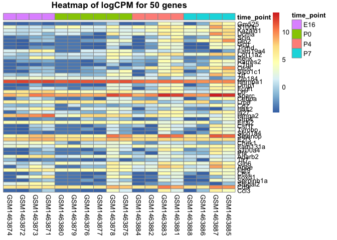
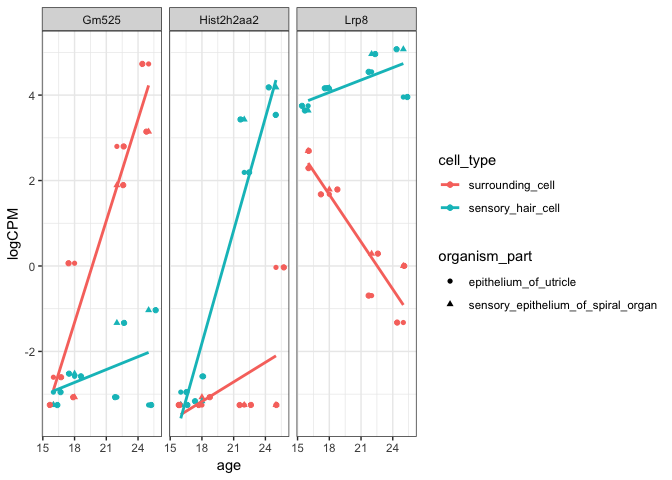

Assignment 2
================
Yanchao
2019-03-18

Load the library
----------------

``` r
library(limma)
library(tidyverse)
library(ggplot2)
library(dplyr)
library(reshape2)
library(pheatmap)
```

Load the data
-------------

``` r
exp_data <- readRDS(file = 'gse60019_expression_matrix.RDS')

meta_data <- readRDS(file = 'gse60019_experiment_design.RDS')

meta_data$age <- ifelse(meta_data$time_point == "E16", 16, ifelse(meta_data$time_point == "P0", 18, ifelse(meta_data$time_point == "P4", 22, ifelse(meta_data$time_point == "P7", 25, 0))))
```

Question 4: Conducting differential expression analysis
-------------------------------------------------------

### 4.1: Remove lowly expressed genes.

-   **Remove lowly expressed genes by retaining genes that have CPM &gt; 1 in at least as many samples as the smallest group size (i.e use table() to identify the number of samples belonging to each treatment group. The smallest group size is the smallest number in that table).**

``` r
smallest_sample_num <- table(meta_data$cell_type, meta_data$organism_part)
smallest_group_size <- min(smallest_sample_num)
smallest_group_size
```

    ## [1] 4

``` r
exp_data_filtered <- exp_data[rowSums(exp_data %>% select(-gene) >1) >= smallest_group_size, ]
```

From the table, the smallest group size is 4.

-   **How many genes are there after filtering?**

``` r
nrow(exp_data_filtered)
```

    ## [1] 12761

Answer: There are 12761 genes after filtering.

### 4.2: Construct linear model

-   **Use limma-voom to fit a linear model with cell type, organism part, age and the interaction between age and cell type as covariates (hint: use lmFit, voom and eBayes). Before you do this, reformat the data frame so that gene IDs are row names, and not a column (limma requires the dataset in this format).**

``` r
exp_data_reformat <- exp_data_filtered %>% 
  as.data.frame() %>% 
  column_to_rownames("gene")
```

``` r
#Create explanatory variables matrix
designMatrix <- model.matrix(~cell_type + organism_part + age + age:cell_type, data = meta_data)

#Use voom to obtain logCPM values
exp_data_voom <- voom(exp_data_reformat, design = designMatrix)

#Fit model using lm fit
fit <- lmFit(exp_data_voom, designMatrix) 

#Fit model using ebayes
fiteb <- eBayes(fit)
```

### 4.3: Interpret model

-   **For the gene Eva1a, what is the numeric value of the coeffcient of the age term? What does it mean?**

``` r
topGenes <- topTable(fiteb, number = Inf)
```

    ## Removing intercept from test coefficients

``` r
topGenes["Eva1a",3]
```

    ## [1] -0.1634874

Answer: the numeric value of the coeffcient of the age term for gene Eva1a is -0.1634874. It means a unit increase in age leads to a reduction in log2 base CPM values of Eva1a gene by 0.1634874.

-   **Write down an equation describing the linear model you specified in 4.2. Hint: your equation should have a term for each column of the design matrix.**

**Y**<sub>gene</sub> = *β*<sub>0</sub> + *β*<sub>1</sub>**c****e****l****l****\_****t****y****p****e** + *β*<sub>2</sub>**o****r****g****a****n****i****s****m****\_****p****a****r****t** + *β*<sub>3</sub>**a****g****e** + *β*<sub>4</sub>**a****g****e** × **c****e****l****l****\_****t****y****p****e** + *ϵ*

where,

**Y**<sub>gene</sub> represents the vector of expression levels for each gene.

*β*<sub>0</sub> is the intercept vector.

**c****e****l****l****\_****t****y****p****e** is a binary variable that indicates cell type of each sample for a certain gene. *β*<sub>1</sub> is the coefficient of the **c****e****l****l****\_****t****y****p****e**.

**o****r****g****a****n****i****s****m****\_****p****a****r****t** is a binary variable indicating organism part of each sample for a certain gene. *β*<sub>2</sub> is the coefficient of the **o****r****g****a****n****i****s****m****\_****p****a****r****t**.

**a****g****e** is a numeric variable which indicates age of the mouse from which the sample was taken for a certain gene. It has 4 values (16, 18, 22, and 25). *β*<sub>3</sub> is the coefficient of the **a****g****e**.

**a****g****e** × **c****e****l****l****\_****t****y****p****e** is a variable that shows the interaction between age and cell type. *β*<sub>4</sub> is the coefficient of the **a****g****e** × **c****e****l****l****\_****t****y****p****e**.

*ϵ* is a variable of residuals for a certain gene.

-   **When you create a linear model, what is the underlying assumptions you are making about the distribution of the data (this question is multiple choice)?**

    *i. All expression values are normally distributed* *ii. The residuals of the fitted model are normally distributed*

Answer: The residuals of the fitted model are normally distributed.

Question 5: Evaluating the results
----------------------------------

### 5.1: Quantifying the number of genes differentially expressed

-   **Using the linear model defined above, determine the number of genes differentially expressed by cell type at an FDR (use adjust.method = "fdr" in topTable()) less than 0.05.**

``` r
top_gene_cell_type <- topTable(fiteb, coef = 'cell_typesensory_hair_cell', number = Inf, adjust.method = "fdr", p.value = 0.05)

nrow(top_gene_cell_type) #number of genes
```

    ## [1] 3

Answer: there are 3 genes differentially expressed by cell type at an FDR (use adjust.method = "fdr" in topTable()) less than 0.05.

-   **Although an FDR cutoff of 0.05 was used, many of the identified genes have smaller FDRs. By taking an average of the FDR across the set of differentially expressed genes, determine the number of genes that we expect to be false discoveries on average.**

``` r
nrow(top_gene_cell_type)*mean(top_gene_cell_type$adj.P.Val)
```

    ## [1] 0.1373196

Answer: There are 0.1373196 genes that we expect to be false discoveries on average.

-   **Use decideTests() to quantify the number of genes that increase, decrease or don't change by cell type, organism part and age. Which variable is associated with the largest number of differentially expressed genes?**

``` r
wtResCont_0.05<-decideTests(fiteb, p.value = 0.05, method = "global")
summary(wtResCont_0.05)
```

    ##        (Intercept) cell_typesensory_hair_cell
    ## Down            62                         83
    ## NotSig        7898                      12585
    ## Up            4801                         93
    ##        organism_partsensory_epithelium_of_spiral_organ   age
    ## Down                                               321   297
    ## NotSig                                           12165 12090
    ## Up                                                 275   374
    ##        cell_typesensory_hair_cell:age
    ## Down                              187
    ## NotSig                          12377
    ## Up                                197

``` r
wtResCont_0.0001<-decideTests(fiteb, p.value = 0.0001, method = "global")
summary(wtResCont_0.0001)
```

    ##        (Intercept) cell_typesensory_hair_cell
    ## Down             2                          0
    ## NotSig       11557                      12761
    ## Up            1202                          0
    ##        organism_partsensory_epithelium_of_spiral_organ   age
    ## Down                                                 9     6
    ## NotSig                                           12740 12737
    ## Up                                                  12    18
    ##        cell_typesensory_hair_cell:age
    ## Down                                1
    ## NotSig                          12758
    ## Up                                  2

Answer: the number of genes that increase, decrease or don't change by cell type, organism part and age could be found in above summary for 0.05 and 0.0001 respectively. Age is associated with the largest number of differentially expressed genes because age has the highest the sum of the rows down and up for two diiferent cutoff p values.

### 5.2: Effect of age - visualize top differentially expressed genes

-   **Take the top 50 genes differentially expressed by age and create a heatmap of their expression levels in logCPM. Sort the genes by p-values and group the samples by time point.**

``` r
top_gene_age <- topTable(fiteb, coef = "age", n = 50)

# log2 transform the expression values

data_gene_log <- log2(exp_data_reformat)
num_rows<-which(row.names(data_gene_log) %in% row.names(top_gene_age)) 
data_gene_log_50 <- data_gene_log[num_rows,]
# sort the genes by p-values
data_gene_log_50 <- data_gene_log_50[rownames(top_gene_age),]
# group samples by time_point
data_group <- meta_data%>%
  arrange(time_point)
data_gene_log_50 <- data_gene_log_50[,data_group$sample,]
# annotations
annotation1= as.data.frame(data_group[, c( "time_point")])
rownames(annotation1) <- colnames(data_gene_log_50)
# heatmap
pheatmap(data_gene_log_50,annotation= annotation1, cluster_rows = FALSE, cluster_cols = FALSE, main = "Heatmap of logCPM for 50 genes")
```



### 5.3: Interpret the interaction term

-   **Explain what you are modeling with this interaction term. For a particular gene, what does a signifcant interaction term mean?**

For a particular gene, the **a****g****e** × **c****e****l****l****\_****t****y****p****e** term have an infulence for both cell type and age on logCPM values expressed. The signifcant interaction term mean that the effect of age on logCPM values is different for different cell types for a certain gene.

-**For how many probes is the interaction effect significant (FDR less than 0.05)?**

``` r
top_table_interaction <- topTable(fiteb, coef ="cell_typesensory_hair_cell:age", number = Inf, adjust.method = "fdr", p.value = 0.05)
nrow(top_table_interaction)
```

    ## [1] 37

There are 37 probes is the interaction effect significant.

### 5.4: Plot three genes where the interaction does matter

-   **Plot the top three genes with the most significant interaction term. Make a scatterplot with log CPM on the y-axis and age on the x-axis. The shape of each point should correspond to the organism part, and the cell type should correspond to the colour. Note: some conditions have multiple samples, so it is best to plot the mean expression of each treatment group.**

``` r
top_three_genes <-topTable(fiteb, coef = 5, number = 3, adjust.method = "fdr", p.value = 0.05)
top_three_data<- exp_data_reformat[rownames(top_three_genes),]

#Convert expression into log CPM values
top_three_data_log <- log(top_three_data)

#Merge with meta data
three_genes_meta_data <- t(top_three_data_log) %>% 
  as.data.frame() %>% 
  rownames_to_column('sample') %>% 
  gather(variable, value, -sample) %>% 
  as_tibble %>% 
  select(sample, gene = variable, logCPM = value) %>% 
  left_join(meta_data, id = "sample")
```

    ## Joining, by = "sample"

``` r
# mean expression of each treatment group
top_three_interaction_mean <- three_genes_meta_data %>% 
  group_by(gene, organism_part, cell_type, age) %>% 
  summarise(logCPM = mean(logCPM))
# scatterplot
top_three_interaction_mean %>% 
  ggplot(aes(x = age, y = logCPM, color = cell_type)) +
  geom_point(aes(shape = organism_part)) +
  geom_jitter() + 
  geom_smooth(method = "lm", se = FALSE) +
  facet_wrap(~gene)+
  theme_bw()
```



Bonus Question
--------------

-   **Compare your results to those obtained by Scheffer et al (2015). Discuss any discrepancies. List at least three explanations for these discrepancies.**

We rank the genes by p-value to identify the significant diffenrent genes. However, they rank the genes by fold.

We worked on CPM data (ie counts per million) and they work on raw data.

We only use limma to identify the diffirent genes. However, they use another method called "DESeq".
