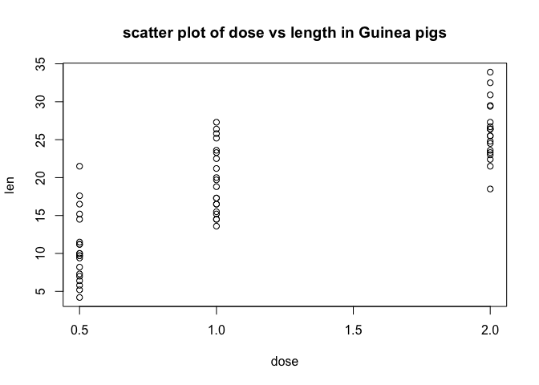
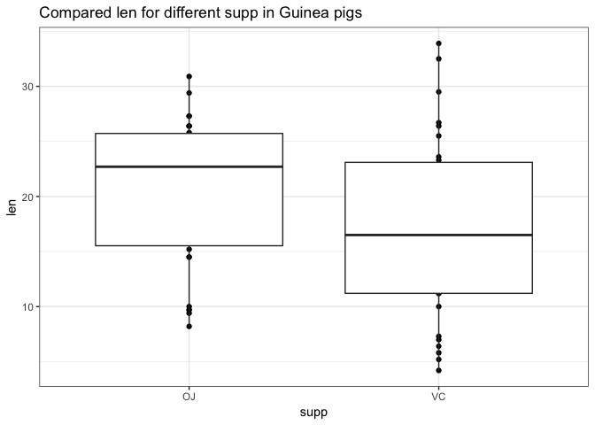

Practice assignment
================
Yanchao Luo
2019-01-15

2 Data inspection with R
------------------------

### 2.1 Passenger breakdown

``` r
# library
suppressPackageStartupMessages(library(ggplot2))
suppressPackageStartupMessages(library(dplyr))
suppressPackageStartupMessages(library(tidyverse))
```

We first load the data.

``` r
data<-data.frame(Titanic) #Convert the array into a data frame by using data.frame() function
str(data) # summary of the data.
```

    ## 'data.frame':    32 obs. of  5 variables:
    ##  $ Class   : Factor w/ 4 levels "1st","2nd","3rd",..: 1 2 3 4 1 2 3 4 1 2 ...
    ##  $ Sex     : Factor w/ 2 levels "Male","Female": 1 1 1 1 2 2 2 2 1 1 ...
    ##  $ Age     : Factor w/ 2 levels "Child","Adult": 1 1 1 1 1 1 1 1 2 2 ...
    ##  $ Survived: Factor w/ 2 levels "No","Yes": 1 1 1 1 1 1 1 1 1 1 ...
    ##  $ Freq    : num  0 0 35 0 0 0 17 0 118 154 ...

-   **Question 1: How many children and adults were on Titanic?**

We want to find how many children and adults were on Titanic.

``` r
Children_data<-data %>% 
  filter(Age=="Child")
number_children<-sum(Children_data$Freq)
number_children # Number of children on Titanic
```

    ## [1] 109

``` r
adult_data<-data %>% 
  filter(Age=="Adult")
number_Adult<-sum(adult_data$Freq)
number_Adult # Number of adults on Titanic
```

    ## [1] 2092

Conclusion: We find that there were 109 Children and 2092 adults on Titanic.

-   **Question 2: Were there more female adult or male adult passengers?**

Then, we want to answer the question that were there more female adult or male adult passengers.

``` r
Male_adult_data<-data %>% 
  filter(Age=="Adult", Sex=="Male") ## Find the male adult passengers in the Titanic data.
number_Male_Adult<-sum(Male_adult_data$Freq)
number_Male_Adult # Number of male adult 
```

    ## [1] 1667

``` r
Female_adult_data<-data %>% 
  filter(Age=="Adult", Sex=="Female") ## Find the female adult passengers in the Titanic data.
number_Female_Adult<-sum(Female_adult_data$Freq)
number_Female_Adult ## Number of female adult 
```

    ## [1] 425

Conclusion: The numbers of the male adults were 1667 and the number of female adults were 425. Therefore, there were more male adult passengers.

### 2.2 Survival

Using the same data frame, we want to examine the survival rates.

-   **Question 1: Did the children have better survival rate than the adults?**

*Survival rate for the Children*

``` r
survived_children_data<-data %>% 
  filter(Age=="Child",Survived == "Yes") 
survival_children_rate<-round(sum(survived_children_data$Freq)/number_children,3)
survival_children_rate # survival rate for children
```

    ## [1] 0.523

The survival rate for children is approximately 0.523.

*Survival rate for the Adult*

``` r
survived_adult_data<-data %>% 
  filter(Age=="Adult",Survived == "Yes") 
survival_adult_rate<-round(sum(survived_adult_data$Freq)/number_Adult,3)
survival_adult_rate # Survival rate for adult
```

    ## [1] 0.313

The survival rate for adults is approximately 0.313.

Conclusion: Yes, the children have better survival rate than the adults. The suvival rate for children is approximately 0.523 and the survival rate for adults is approximately 0.313.

-   **Question 2: Which class of passengers have a better survival rate? (Crew, first class, second class, third class)**

*Survival rate for the Crew*

``` r
Crew_data<-data %>% 
  filter(Class=="Crew") 
Survived_Crew_data<-data %>% 
  filter(Class=="Crew",Survived == "Yes") 
survival_Crew_rate<-round(sum(Survived_Crew_data$Freq)/sum(Crew_data$Freq),3) ## suvival rate for Crew
survival_Crew_rate
```

    ## [1] 0.24

The survival rate for the Crew is 0.24.

*Survival rate for the first class*

``` r
first_class_data<-data %>% 
  filter(Class=="1st") 
Survived_first_class_data<-data %>% 
  filter(Class=="1st",Survived == "Yes") 
survival_first_class_rate<-round(sum(Survived_first_class_data$Freq)/sum(first_class_data$Freq),3) ## suvival rate for first class
survival_first_class_rate
```

    ## [1] 0.625

The survival rate for the first class is 0.625.

*Survival rate for the second class*

``` r
Second_class_data<-data %>% 
  filter(Class=="2nd") 
Survived_Second_class_data<-data %>% 
  filter(Class=="2nd",Survived == "Yes") 
survival_second_class_rate<-round(sum(Survived_Second_class_data$Freq)/sum(Second_class_data$Freq),3) ## suvival rate for second class
survival_second_class_rate
```

    ## [1] 0.414

The survival rate for the second class is 0.414.

*Survival rate for the third class*

``` r
Third_class_data<-data %>% 
  filter(Class=="3rd") 
Survived_Third_class_data<-data %>% 
  filter(Class=="3rd",Survived == "Yes") 
survival_second_class_rate<-round(sum(Survived_Third_class_data$Freq)/sum(Third_class_data$Freq),3) ## suvival rate for third class
survival_second_class_rate
```

    ## [1] 0.252

The survival rate for the third class is 0.252.

Conclusion: The survival rate for the Crew is 0.24. The survival rate for the first class is 0.625. The survival rate for the second class is 0.414. The survival rate for the third class is 0.252. Therefore, the first class has a better survival rate.

3 Data visualization
--------------------

``` r
?ToothGrowth #Learn about the variables in the dataset
ToothGrowth_data<-read.table("guinea_pigs_tooth_growth.txt",head=T) # read the data
str(ToothGrowth_data)
```

    ## 'data.frame':    60 obs. of  3 variables:
    ##  $ len : num  4.2 11.5 7.3 5.8 6.4 10 11.2 11.2 5.2 7 ...
    ##  $ supp: Factor w/ 2 levels "OJ","VC": 2 2 2 2 2 2 2 2 2 2 ...
    ##  $ dose: num  0.5 0.5 0.5 0.5 0.5 0.5 0.5 0.5 0.5 0.5 ...

### Scatter plots

``` r
plot(ToothGrowth_data$dose, ToothGrowth_data$len, xlab="dose", ylab="len", main="scatter plot of dose vs length in Guinea pigs")
```



Without considering the supplement type("supp"), we could find there is an increasing trend of length ("len") when we rise the dose ("dose").

``` r
## scatter plots for different type
ggplot(ToothGrowth_data, aes(x = dose, y = len,
                      color = supp)) +
  facet_wrap(~ supp) +
geom_point( size = 2)+
  theme_bw()
```


From the graphs above, there is still an increasing trend of "len" when we rise the "dose" for both "OJ" and "VC"(two types of "supp"). Secondly, it displays all the information in the data. We could easy to visulize the differences in these two types.

### box plots

By using the box plots, it helps us to find the summary statistcs of "len" for different "supp".

``` r
ToothGrowth_data %>%
  select(len, supp) %>% 
  ggplot(aes(x=supp, y=len)) + 
              geom_point() + 
              geom_boxplot(outlier.colour = "red") + ## detect outlier
              labs(title="Compared len for different supp in Guinea pigs")+
             theme_bw()
```



From the plot above, it shows that the variance of "len" for "OJ" is smaller than "VC". On the other hand, the mean of "len" for "OJ" is higher than "VC". Also, there is no significant outliers in the boxplot.
