seminar\_2b
================
Yanchao Luo
16 January, 2019

R Markdown
----------

``` r
library(tidyverse)
```

    ## ── Attaching packages ─────────────────────────── tidyverse 1.2.1 ──

    ## ✔ ggplot2 3.1.0     ✔ purrr   0.2.5
    ## ✔ tibble  1.4.2     ✔ dplyr   0.7.8
    ## ✔ tidyr   0.8.2     ✔ stringr 1.3.1
    ## ✔ readr   1.3.1     ✔ forcats 0.3.0

    ## ── Conflicts ────────────────────────────── tidyverse_conflicts() ──
    ## ✖ dplyr::filter() masks stats::filter()
    ## ✖ dplyr::lag()    masks stats::lag()

``` r
str(mpg)
```

    ## Classes 'tbl_df', 'tbl' and 'data.frame':    234 obs. of  11 variables:
    ##  $ manufacturer: chr  "audi" "audi" "audi" "audi" ...
    ##  $ model       : chr  "a4" "a4" "a4" "a4" ...
    ##  $ displ       : num  1.8 1.8 2 2 2.8 2.8 3.1 1.8 1.8 2 ...
    ##  $ year        : int  1999 1999 2008 2008 1999 1999 2008 1999 1999 2008 ...
    ##  $ cyl         : int  4 4 4 4 6 6 6 4 4 4 ...
    ##  $ trans       : chr  "auto(l5)" "manual(m5)" "manual(m6)" "auto(av)" ...
    ##  $ drv         : chr  "f" "f" "f" "f" ...
    ##  $ cty         : int  18 21 20 21 16 18 18 18 16 20 ...
    ##  $ hwy         : int  29 29 31 30 26 26 27 26 25 28 ...
    ##  $ fl          : chr  "p" "p" "p" "p" ...
    ##  $ class       : chr  "compact" "compact" "compact" "compact" ...

Creating a ggplot
-----------------

``` r
ggplot(data = mpg) + 
  geom_point(mapping = aes(x = displ, y = hwy))
```

 Your first (bare-bones) graphing template

    ggplot(data = <DATA>) + 
      <GEOM_FUNCTION>(mapping = aes(<MAPPINGS>))

map the colors

``` r
ggplot(data = mpg) + 
  geom_point(mapping = aes(x = displ, y = hwy, color = class))
```

 map class to the size

``` r
ggplot(data = mpg) + 
  geom_point(mapping = aes(x = displ, y = hwy, size = class))
```

    ## Warning: Using size for a discrete variable is not advised.

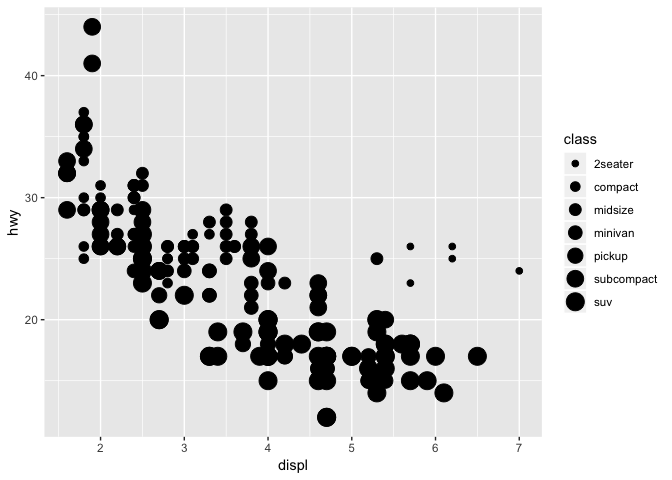

make all of the points in our plot blue:

``` r
ggplot(data = mpg) + 
  geom_point(mapping = aes(x = displ, y = hwy), color = "green")
```

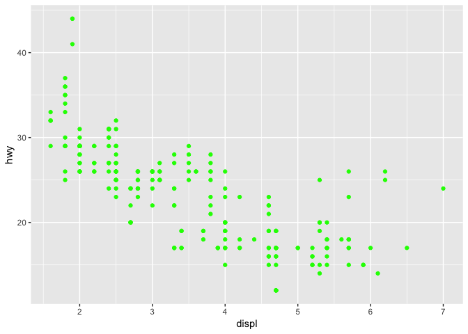 Second template

    ggplot(data = <DATA>) + 
      <GEOM_FUNCTION>(
         mapping = aes(<MAPPINGS>),
         stat = <STAT>, 
         position = <POSITION>
      ) +
      <COORDINATE_FUNCTION> +
      <SCALE_FUNCTION> +
      <AXIS_FUNCTION> +
      <FACET_FUNCTION>

add the smooth line

``` r
ggplot(data = mpg, 
       mapping = aes(x = displ, y = hwy)) +
  geom_point() +
  geom_smooth()
```

    ## `geom_smooth()` using method = 'loess' and formula 'y ~ x'

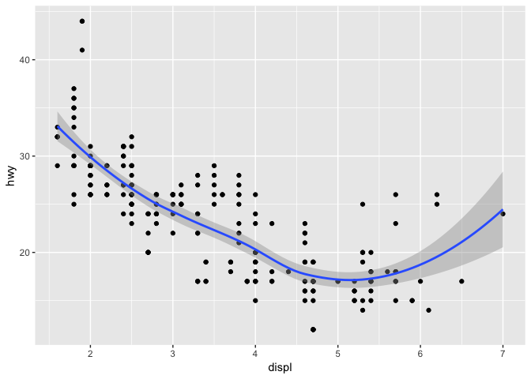

Bar chart
---------

the average fuel efficiency for each class

``` r
(averageEfficiency <- 
  mpg %>% group_by(class) %>% summarise(fuel_efficiency = mean(hwy)))
```

    ## # A tibble: 7 x 2
    ##   class      fuel_efficiency
    ##   <chr>                <dbl>
    ## 1 2seater               24.8
    ## 2 compact               28.3
    ## 3 midsize               27.3
    ## 4 minivan               22.4
    ## 5 pickup                16.9
    ## 6 subcompact            28.1
    ## 7 suv                   18.1

``` r
ggplot(averageEfficiency) + 
  geom_bar(aes(x = class, y = fuel_efficiency),stat = "identity")
```

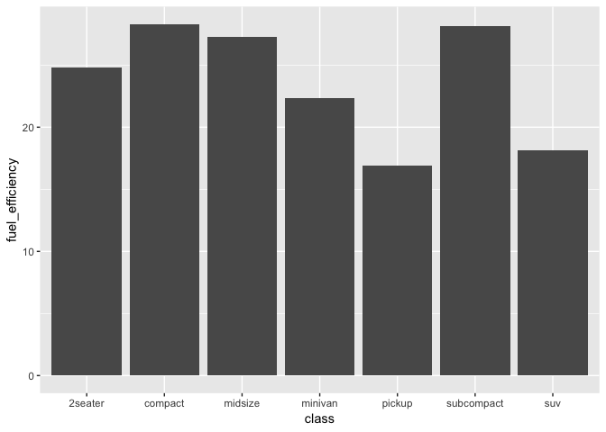 add some color to our bar chart

``` r
ggplot(averageEfficiency) + 
  geom_bar(aes(x = class, y = fuel_efficiency, fill = class),
           stat = "identity")
```

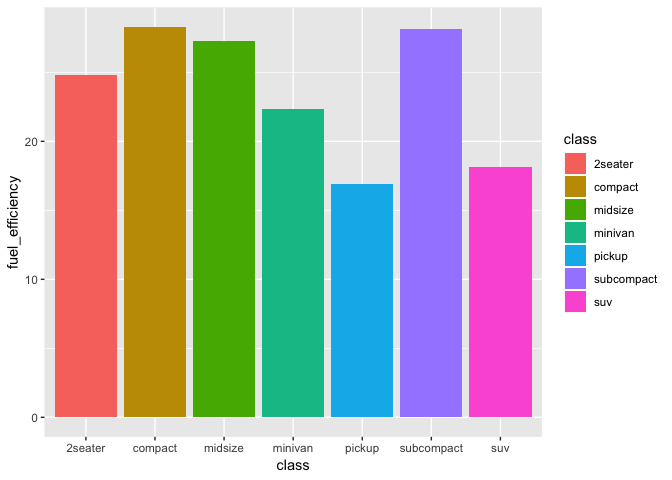 add axis

``` r
ggplot(averageEfficiency) + 
  geom_bar(aes(x = class, y = fuel_efficiency, fill = class),
           stat = "identity") +
  ylab("Fuel Efficiency (miles per gallon)") +
  xlab("Vehicle Type")
```

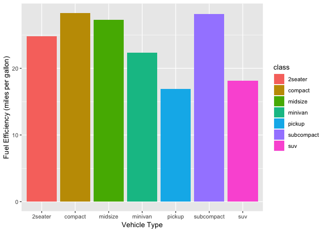 reverse the y-scale

``` r
ggplot(averageEfficiency) + 
  geom_bar(aes(x = class, y = fuel_efficiency, fill = class),
           stat = "identity") +
  ylab("Fuel Efficiency (miles per gallon)") +
  xlab("Vehicle Type") +
  scale_y_reverse()
```

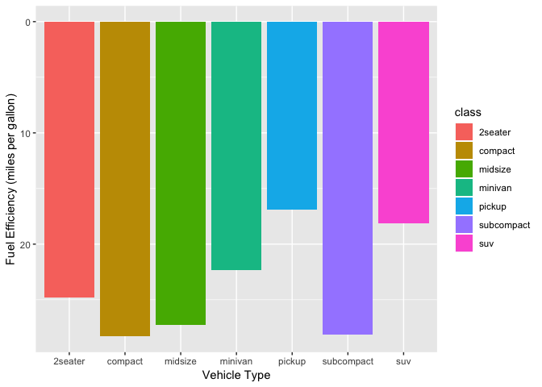 use `coord_flip`

``` r
ggplot(averageEfficiency) + 
  geom_bar(aes(x = class, y = fuel_efficiency, fill = class),
           stat = "identity") +
  coord_flip()
```

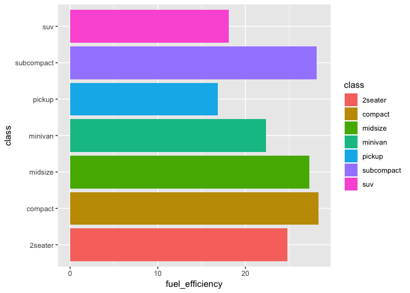 coord\_polar

``` r
ggplot(averageEfficiency) + 
  geom_bar(aes(x = class, y = fuel_efficiency, fill = class),
           stat = "identity") +
  coord_polar()
```

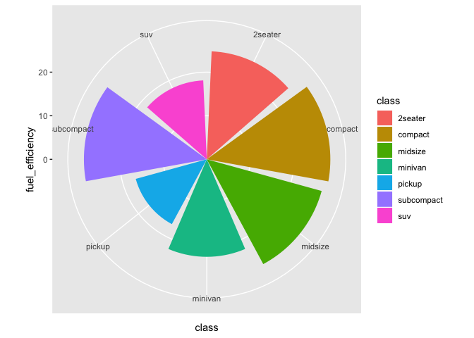 <FACET_FUNCTION>

``` r
ggplot(data = mpg, 
       mapping = aes(x = displ, y = hwy)) +
  geom_point()
```


`facet_wrap()`

``` r
ggplot(data = mpg, 
       mapping = aes(x = displ, y = hwy, color= class)) +
  geom_point() +
  facet_wrap(~class)
```

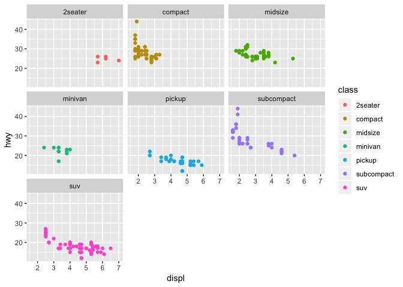

**Challenge**:

``` r
ggplot(data = mpg, 
       mapping = aes(x = displ, y = hwy, size=class, color= drv)) +
  geom_point()
```

    ## Warning: Using size for a discrete variable is not advised.

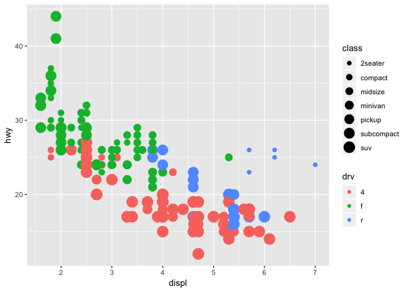
