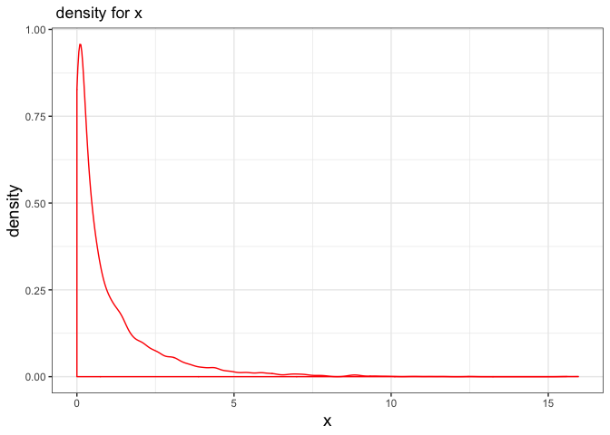
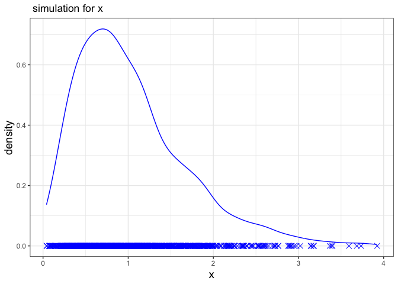
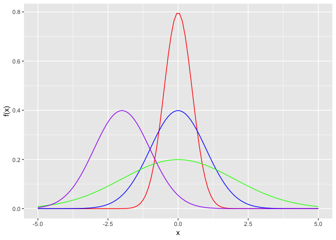

Seminar\_2c
================

``` r
library(tidyverse) # load the library
```

    ## ── Attaching packages ─────────────────────────── tidyverse 1.2.1 ──

    ## ✔ ggplot2 3.1.0     ✔ purrr   0.2.5
    ## ✔ tibble  1.4.2     ✔ dplyr   0.7.8
    ## ✔ tidyr   0.8.2     ✔ stringr 1.3.1
    ## ✔ readr   1.3.1     ✔ forcats 0.3.0

    ## ── Conflicts ────────────────────────────── tidyverse_conflicts() ──
    ## ✖ dplyr::filter() masks stats::filter()
    ## ✖ dplyr::lag()    masks stats::lag()

``` r
set.seed(1) # make the random values reproducible 

sampleSize <- 5
numSamples <- 1000

# Take samples from chisq distribution with 1 degree of freedom
degreeFreedom <- 1

randomChiSqValues <- rchisq(n = numSamples * sampleSize, df = degreeFreedom)
## plot the sample chisq data
tibble(x = randomChiSqValues) %>% 
  ggplot() + 
  geom_density(aes(x = x), color = "red")+
  theme_bw()+
  labs(title=" density for x")+
    theme(axis.title = element_text(size=14))
```



``` r
# organize the random values into 1000 sample rows of size n = 5 columns
samples <- matrix(randomChiSqValues, nrow = numSamples, ncol = sampleSize)
sampleMeans <- rowMeans(samples) # work out the sample means 

head(sampleMeans)# first six value for the sampleMeans
```

    ## [1] 0.9271741 1.3116297 0.5027606 0.3370594 2.0871492 0.3149406

``` r
## plot the sample mean
tibble(x = sampleMeans) %>% 
  ggplot() + 
  geom_line(aes(x = x), stat = "density", color = "blue") +
  geom_point(aes(x = x, y = 0), color = "blue", shape = 4, size = 3)+
  theme_bw()+
  labs(title=" simulation for x")+
  theme(axis.title = element_text(size=14))
```



The graph above is not normal, and we conclude that sample sizes (n= 5) are not large enough for us to use the CLT.

``` r
xValues <- seq(from = -5, to = 5, length = 100)
plotA <- dnorm(xValues, mean = 0, sd = 0.5) #
plotB <-  dnorm(xValues, mean = 0, sd = 1)
plotC <-  dnorm(xValues, mean = 0, sd = 2)
plotD <-  dnorm(xValues, mean = -2, sd = 1)

normalDistributionsTibble <- tibble(x_value = xValues, 
                                    red_value = plotA,
                                    blue_value = plotB,
                                    green_value = plotC,
                                    purple_value = plotD)

p <- normalDistributionsTibble %>% ggplot()
p + 
  geom_line(aes(x = xValues, y = red_value), color = "red") +
  geom_line(aes(x = xValues, y = blue_value), color = "blue") +
  geom_line(aes(x = xValues, y = green_value), color = "green") +
  geom_line(aes(x = xValues, y = purple_value), color = "purple") +
  xlab("x") +
  ylab("f(x)")
```



**Figure out which color corresponds to which set of paramters?**

From the graph above, `red_value` has mean 0 and standard deviation 0.5, `blue_value` has mean 0 and standard deviation 1, `green_value` has mean 0 and standard deviation 2 and `purple_value` has mean -2 and standard deviation 1.
