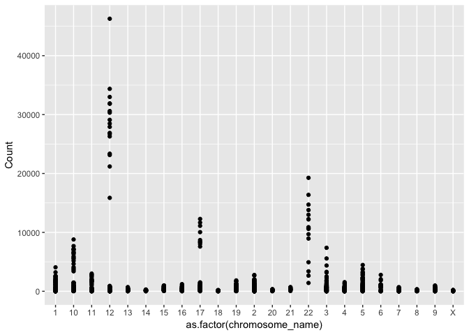
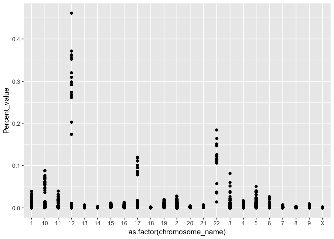
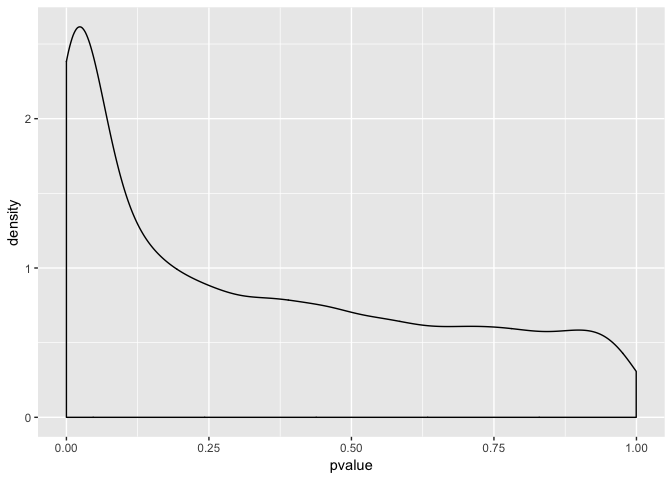

Seminar 3
================
Yanchao Luo

Part 1 - Accessing data using GEOquery
======================================

Load the library

    ## Warning: package 'tibble' was built under R version 3.5.2

    ## Warning: package 'data.table' was built under R version 3.5.2

Download the data

    ## File stored at:

    ## /var/folders/ym/nv8j72n54cqb51_bvr34n90m0000gn/T//RtmpFnSyDD/GDS507.soft.gz

    ## Parsed with column specification:
    ## cols(
    ##   ID_REF = col_character(),
    ##   IDENTIFIER = col_character(),
    ##   GSM11815 = col_double(),
    ##   GSM11832 = col_double(),
    ##   GSM12069 = col_double(),
    ##   GSM12083 = col_double(),
    ##   GSM12101 = col_double(),
    ##   GSM12106 = col_double(),
    ##   GSM12274 = col_double(),
    ##   GSM12299 = col_double(),
    ##   GSM12412 = col_double(),
    ##   GSM11810 = col_double(),
    ##   GSM11827 = col_double(),
    ##   GSM12078 = col_double(),
    ##   GSM12099 = col_double(),
    ##   GSM12269 = col_double(),
    ##   GSM12287 = col_double(),
    ##   GSM12301 = col_double(),
    ##   GSM12448 = col_double()
    ## )

    ## Formal class 'GDS' [package "GEOquery"] with 3 slots
    ##   ..@ gpl      :Formal class 'GPL' [package "GEOquery"] with 2 slots
    ##   .. .. ..@ dataTable:Formal class 'GEODataTable' [package "GEOquery"] with 2 slots
    ##   .. .. .. .. ..@ columns:'data.frame':  0 obs. of  0 variables
    ##   .. .. .. .. ..@ table  :'data.frame':  0 obs. of  0 variables
    ##   .. .. ..@ header   : list()
    ##   ..@ dataTable:Formal class 'GEODataTable' [package "GEOquery"] with 2 slots
    ##   .. .. ..@ columns:'data.frame':    17 obs. of  4 variables:
    ##   .. .. .. ..$ sample       : Factor w/ 17 levels "GSM11810","GSM11815",..: 2 4 5 7 9 10 12 14 16 1 ...
    ##   .. .. .. ..$ disease.state: Factor w/ 2 levels "normal","RCC": 2 2 2 2 2 2 2 2 2 1 ...
    ##   .. .. .. ..$ individual   : Factor w/ 10 levels "001","005","011",..: 6 4 1 2 3 5 8 9 10 6 ...
    ##   .. .. .. ..$ description  : chr [1:17] "Value for GSM11815: C035 Renal Clear Cell Carcinoma U133B; src: Trizol isolation of total RNA from Renal Clear "| __truncated__ "Value for GSM11832: C023 Renal Clear Cell Carcinoma U133B; src: Trizol isolation of total RNA from Renal Clear "| __truncated__ "Value for GSM12069: C001 Renal Clear Cell Carcinoma U133B; src: Trizol isolation of total RNA from Renal Clear "| __truncated__ "Value for GSM12083: C005 Renal Clear Cell Carcinoma U133B; src: Trizol isolation of total RNA from Renal Clear "| __truncated__ ...
    ##   .. .. ..@ table  :'data.frame':    22645 obs. of  19 variables:
    ##   .. .. .. ..$ ID_REF    : chr [1:22645] "200000_s_at" "200001_at" "200002_at" "200003_s_at" ...
    ##   .. .. .. ..$ IDENTIFIER: chr [1:22645] "PRPF8" "CAPNS1" "RPL35" "MIR6805" ...
    ##   .. .. .. ..$ GSM11815  : num [1:22645] 4254 17996 41679 65391 19030 ...
    ##   .. .. .. ..$ GSM11832  : num [1:22645] 5298 12011 39117 34806 15814 ...
    ##   .. .. .. ..$ GSM12069  : num [1:22645] 4026 10284 38759 31257 16356 ...
    ##   .. .. .. ..$ GSM12083  : num [1:22645] 3498 2535 32848 28308 9580 ...
    ##   .. .. .. ..$ GSM12101  : num [1:22645] 3566 11048 39634 67448 14274 ...
    ##   .. .. .. ..$ GSM12106  : num [1:22645] 4903 13354 43511 56990 17217 ...
    ##   .. .. .. ..$ GSM12274  : num [1:22645] 6373 8564 46857 57972 19117 ...
    ##   .. .. .. ..$ GSM12299  : num [1:22645] 4829 17248 47032 57570 17488 ...
    ##   .. .. .. ..$ GSM12412  : num [1:22645] 5206 16018 22152 29062 14672 ...
    ##   .. .. .. ..$ GSM11810  : num [1:22645] 2757 6077 26661 35141 17733 ...
    ##   .. .. .. ..$ GSM11827  : num [1:22645] 3932 15704 26374 23629 18022 ...
    ##   .. .. .. ..$ GSM12078  : num [1:22645] 3730 10138 23810 22100 17957 ...
    ##   .. .. .. ..$ GSM12099  : num [1:22645] 3223 11614 24749 21651 15958 ...
    ##   .. .. .. ..$ GSM12269  : num [1:22645] 3640 8460 21937 18551 15800 ...
    ##   .. .. .. ..$ GSM12287  : num [1:22645] 4886 10283 31463 23496 16686 ...
    ##   .. .. .. ..$ GSM12301  : num [1:22645] 4070 11844 22734 21315 18817 ...
    ##   .. .. .. ..$ GSM12448  : num [1:22645] 3482 9742 25396 28631 17421 ...
    ##   .. .. .. ..- attr(*, "spec")=
    ##   .. .. .. .. .. cols(
    ##   .. .. .. .. ..   ID_REF = col_character(),
    ##   .. .. .. .. ..   IDENTIFIER = col_character(),
    ##   .. .. .. .. ..   GSM11815 = col_double(),
    ##   .. .. .. .. ..   GSM11832 = col_double(),
    ##   .. .. .. .. ..   GSM12069 = col_double(),
    ##   .. .. .. .. ..   GSM12083 = col_double(),
    ##   .. .. .. .. ..   GSM12101 = col_double(),
    ##   .. .. .. .. ..   GSM12106 = col_double(),
    ##   .. .. .. .. ..   GSM12274 = col_double(),
    ##   .. .. .. .. ..   GSM12299 = col_double(),
    ##   .. .. .. .. ..   GSM12412 = col_double(),
    ##   .. .. .. .. ..   GSM11810 = col_double(),
    ##   .. .. .. .. ..   GSM11827 = col_double(),
    ##   .. .. .. .. ..   GSM12078 = col_double(),
    ##   .. .. .. .. ..   GSM12099 = col_double(),
    ##   .. .. .. .. ..   GSM12269 = col_double(),
    ##   .. .. .. .. ..   GSM12287 = col_double(),
    ##   .. .. .. .. ..   GSM12301 = col_double(),
    ##   .. .. .. .. ..   GSM12448 = col_double()
    ##   .. .. .. .. .. )
    ##   ..@ header   :List of 23
    ##   .. ..$ channel_count           : chr "1"
    ##   .. ..$ dataset_id              : chr [1:12] "GDS507" "GDS507" "GDS507" "GDS507" ...
    ##   .. ..$ description             : chr [1:13] "Investigation into mechanisms of renal clear cell carcinogenesis (RCC). Comparison of renal clear cell tumor ti"| __truncated__ "RCC" "normal" "035" ...
    ##   .. ..$ email                   : chr "geo@ncbi.nlm.nih.gov"
    ##   .. ..$ feature_count           : chr "22645"
    ##   .. ..$ institute               : chr "NCBI NLM NIH"
    ##   .. ..$ name                    : chr "Gene Expression Omnibus (GEO)"
    ##   .. ..$ order                   : chr "none"
    ##   .. ..$ platform                : chr "GPL97"
    ##   .. ..$ platform_organism       : chr "Homo sapiens"
    ##   .. ..$ platform_technology_type: chr "in situ oligonucleotide"
    ##   .. ..$ pubmed_id               : chr "14641932"
    ##   .. ..$ ref                     : chr "Nucleic Acids Res. 2005 Jan 1;33 Database Issue:D562-6"
    ##   .. ..$ reference_series        : chr "GSE781"
    ##   .. ..$ sample_count            : chr "17"
    ##   .. ..$ sample_id               : chr [1:12] "GSM11815,GSM11832,GSM12069,GSM12083,GSM12101,GSM12106,GSM12274,GSM12299,GSM12412" "GSM11810,GSM11827,GSM12078,GSM12099,GSM12269,GSM12287,GSM12301,GSM12448" "GSM11810,GSM11815" "GSM11827,GSM11832" ...
    ##   .. ..$ sample_organism         : chr "Homo sapiens"
    ##   .. ..$ sample_type             : chr "RNA"
    ##   .. ..$ title                   : chr "Renal clear cell carcinoma (HG-U133B)"
    ##   .. ..$ type                    : chr [1:13] "Expression profiling by array" "disease state" "disease state" "individual" ...
    ##   .. ..$ update_date             : chr "Mar 04 2004"
    ##   .. ..$ value_type              : chr "count"
    ##   .. ..$ web_link                : chr "http://www.ncbi.nlm.nih.gov/geo"

Extract a meta data table

``` r
meta_data <- data.frame(Sample = gds@dataTable@columns$sample, disease = gds@dataTable@columns$disease.state)
#we grab this info from the appropriate slots above. 
gds_data <- gds@dataTable@table
```

Part 2 - Exploring a gene expression dataset
============================================

``` r
head(gds_data)
```

    ##        ID_REF IDENTIFIER GSM11815 GSM11832 GSM12069 GSM12083 GSM12101
    ## 1 200000_s_at      PRPF8   4254.0   5298.2   4026.5   3498.4   3566.4
    ## 2   200001_at     CAPNS1  17996.2  12010.7  10283.5   2534.7  11048.4
    ## 3   200002_at      RPL35  41678.8  39116.9  38758.9  32847.7  39633.9
    ## 4 200003_s_at    MIR6805  65390.9  34806.2  31257.2  28308.5  67447.5
    ## 5   200004_at     EIF4G2  19030.1  15813.6  16355.7   9579.7  14273.5
    ## 6   200005_at      EIF3D   8824.5   9706.2  10590.0   6986.7   9400.4
    ##   GSM12106 GSM12274 GSM12299 GSM12412 GSM11810 GSM11827 GSM12078 GSM12099
    ## 1   4903.1   6372.6   4829.1   5205.8   2756.8   3932.0   3729.9   3223.4
    ## 2  13354.0   8563.8  17247.6  16018.5   6077.0  15703.8  10138.5  11614.4
    ## 3  43511.2  46856.7  47032.4  22152.2  26660.7  26373.6  23809.6  24749.3
    ## 4  56989.9  57972.5  57570.5  29062.2  35140.9  23629.3  22100.5  21651.0
    ## 5  17217.0  19116.9  17487.6  14671.6  17733.1  18022.4  17957.4  15958.0
    ## 6  12835.2  10299.0  12375.2   7645.4   8661.5   7355.7   6973.4   6855.9
    ##   GSM12269 GSM12287 GSM12301 GSM12448
    ## 1   3640.5   4886.3   4070.2   3482.1
    ## 2   8460.5  10282.6  11844.3   9741.6
    ## 3  21936.8  31462.8  22733.7  25395.5
    ## 4  18550.7  23496.5  21315.4  28631.4
    ## 5  15799.8  16685.8  18817.3  17421.1
    ## 6   7949.2   9486.5   7494.5   7252.1

``` r
nrow(gds_data)
```

    ## [1] 22645

``` r
ncol(gds_data)
```

    ## [1] 19

`apply()` in base R.

``` r
#We exclude the first and second columns because they hold the probe and gene names, respectively. 
apply(gds_data[,-c(1, 2)], 2, median)
```

    ## GSM11815 GSM11832 GSM12069 GSM12083 GSM12101 GSM12106 GSM12274 GSM12299 
    ##    265.6    250.3    218.5    309.7    281.9    240.1    280.2    217.0 
    ## GSM12412 GSM11810 GSM11827 GSM12078 GSM12099 GSM12269 GSM12287 GSM12301 
    ##    264.4    273.8    264.6    266.5    269.3    288.6    238.7    244.5 
    ## GSM12448 
    ##    264.3

``` r
melted_data <- melt(gds_data, id.vars = c("ID_REF", "IDENTIFIER"), var = "Sample")

head(melted_data)
```

    ##        ID_REF IDENTIFIER   Sample   value
    ## 1 200000_s_at      PRPF8 GSM11815  4254.0
    ## 2   200001_at     CAPNS1 GSM11815 17996.2
    ## 3   200002_at      RPL35 GSM11815 41678.8
    ## 4 200003_s_at    MIR6805 GSM11815 65390.9
    ## 5   200004_at     EIF4G2 GSM11815 19030.1
    ## 6   200005_at      EIF3D GSM11815  8824.5

Calculate the mean gene expression per sample.

``` r
melted_data %>% 
    group_by(Sample) %>% 
    summarize(mean = mean(value))
```

    ## # A tibble: 17 x 2
    ##    Sample    mean
    ##    <fct>    <dbl>
    ##  1 GSM11815  751.
    ##  2 GSM11832  742.
    ##  3 GSM12069  748.
    ##  4 GSM12083  735.
    ##  5 GSM12101  803.
    ##  6 GSM12106  744.
    ##  7 GSM12274  761.
    ##  8 GSM12299  802.
    ##  9 GSM12412  685.
    ## 10 GSM11810  765.
    ## 11 GSM11827  780.
    ## 12 GSM12078  774.
    ## 13 GSM12099  766.
    ## 14 GSM12269  710.
    ## 15 GSM12287  791.
    ## 16 GSM12301  770.
    ## 17 GSM12448  757.

``` r
(new_melted_data <- melted_data %>% 
    group_by(Sample, IDENTIFIER) %>% 
    summarize(Count = mean(value)))
```

    ## # A tibble: 279,905 x 3
    ## # Groups:   Sample [?]
    ##    Sample   IDENTIFIER   Count
    ##    <fct>    <chr>        <dbl>
    ##  1 GSM11815 --Control   8139. 
    ##  2 GSM11815 222968_at    102. 
    ##  3 GSM11815 223641_at    200. 
    ##  4 GSM11815 224429_x_at 2385. 
    ##  5 GSM11815 224438_at     32.1
    ##  6 GSM11815 225714_s_at  291. 
    ##  7 GSM11815 225934_at    284. 
    ##  8 GSM11815 226014_at     66.3
    ##  9 GSM11815 226061_s_at   45.1
    ## 10 GSM11815 226138_s_at   23.3
    ## # … with 279,895 more rows

``` r
#open connection between biomaRt and R. 
human = useMart("ensembl", dataset = "hsapiens_gene_ensembl")
#function that takes in data frame, and outputs same data frame with associated chromosome annotations.
identify_gene_names <- function(df){
    names(df) <- c("Sample", "hgnc_symbol", "Count")
    names <- getBM( attributes=c("hgnc_symbol", "chromosome_name") , filters= "hgnc_symbol", values = unique(df$hgnc_symbol), mart = human)
    left_join(df, names, by = "hgnc_symbol")
}

#There's a lot of variation in how the chromosomal location is annotated. To simplify things, let's filter out all genes with annotations that are not numeric numbers between 1 and 23, X or Y. 
data_with_chromosome <- identify_gene_names(new_melted_data) %>% 
    filter(chromosome_name %in% c(1:23, "X", "Y"))
```

**Part 2 Exercise**
-------------------

Let's say we're interested in how the average expression of genes on the X chromosome changes between RCC and normal cells.

The first thing we will do is combine information from the meta data file (meta\_data) with our expression table (data\_with\_chromosome). Then we will use dplyr verbs to first group all samples by disease status, filter out all non-X-chromosome genes, and then calcualte the mean using `summarize()`.

``` r
full_data <- left_join(data_with_chromosome, meta_data, by = "Sample")
```

    ## Warning: Column `Sample` joining factors with different levels, coercing to
    ## character vector

``` r
full_data %>% 
    group_by(disease) %>% 
    filter(chromosome_name == "X") %>% 
    summarize(mean = mean(Count))
```

    ## # A tibble: 2 x 2
    ##   disease  mean
    ##   <fct>   <dbl>
    ## 1 normal   684.
    ## 2 RCC      657.

Part 3 Graphing expression data
===============================

let's choose a random sampling of 100.

``` r
#choose random number between 1 and however many genes we have. 
set.seed(5747540)
sample_to_choose <- sample(1:length(unique(full_data$hgnc_symbol)), size = 100)
#choose genes that correspond to those numbers in a list of genes. 
names_to_choose <- as.character(unique(full_data$hgnc_symbol)[sample_to_choose])

full_data %>% 
    filter(hgnc_symbol %in% names_to_choose) %>% 
    group_by(Sample) %>% 
    ggplot(aes(x = as.factor(chromosome_name), y = Count)) + geom_point()
```



Part 3 Exercise
---------------

*By adding one additional function to the code above, calculate the sum of all counts in each sample and divide each expression value by that sum (hint: use mutate). Remember, you can add multiple new columns using mutate by separating each column with a comma (i.e mutate(x = c("a", "b"), y = c("d", "c"))). Plot this new transformed column.*

``` r
full_data %>% 
    filter(hgnc_symbol %in% names_to_choose) %>% 
    group_by(Sample) %>% 
  mutate(Sum_value=sum(Count),Percent_value=Count/Sum_value) %>% 
    ggplot(aes(x = as.factor(chromosome_name), y = Percent_value)) + geom_point()
```



Part 4 Analyzing the results of statistical tests
=================================================

Being able to graph these results is useful, but what we really want to do is run statistical tests on the data. There are a variety of ways to do that which will be explored in subsequent lectures. But in this seminar we will focus on doing this using dplyr.

In this case, we want to identify the genes that are differentially expressed between the normal and RCC samples. We will use summarize() to perform a t-test for each gene.

``` r
full_data %>% 
    group_by(hgnc_symbol) %>% 
    summarize( pvalue = t.test(Count ~ disease)$p.value)
```

    ## # A tibble: 9,359 x 2
    ##    hgnc_symbol pvalue
    ##    <chr>        <dbl>
    ##  1 A1BG        0.708 
    ##  2 A1BG-AS1    0.0366
    ##  3 A1CF        0.132 
    ##  4 A2MP1       0.0245
    ##  5 AADACL2     0.143 
    ##  6 AADAT       0.0304
    ##  7 AAGAB       0.469 
    ##  8 AAK1        0.0229
    ##  9 AARS2       0.0416
    ## 10 AASDH       0.0743
    ## # … with 9,349 more rows

Part 4 Exercise
---------------

*Make a density plot using geom\_density() graph of the p-value distributions of the above t-test. It should look like this:*

``` r
full_data %>% 
    group_by(hgnc_symbol) %>% 
    summarize( pvalue = t.test(Count ~ disease)$p.value) %>% 
  ggplot(aes(x = pvalue)) + geom_density()
```



*Modify the above code to also identify the length of each gene captured in the dataset we have been working with in the above exercises. This can be done by adding "transcript\_length" as attribute in getBM function. You should end up with an extra column for "transcript length". We will use this number later.*

``` r
human = useMart("ensembl", dataset = "hsapiens_gene_ensembl")
#function that takes in data frame, and outputs same data frame with associated chromosome annotations.
identify_gene_names <- function(df){
    names(df) <- c("Sample", "hgnc_symbol", "Count")
    names <- getBM( attributes=c("hgnc_symbol", "chromosome_name","transcript_length") , filters= "hgnc_symbol", values = unique(df$hgnc_symbol), mart = human)
    left_join(df, names, by = "hgnc_symbol")
}

#There's a lot of variation in how the chromosomal location is annotated. To simplify things, let's filter out all genes with annotations that are not numeric numbers between 1 and 23, X or Y. 
data_with_chromosome2 <- identify_gene_names(new_melted_data) %>% 
    filter(chromosome_name %in% c(1:23, "X", "Y"))
head(data_with_chromosome2)
```

    ## # A tibble: 6 x 5
    ## # Groups:   Sample [1]
    ##   Sample   hgnc_symbol Count chromosome_name transcript_length
    ##   <fct>    <chr>       <dbl> <chr>                       <int>
    ## 1 GSM11815 A1BG         191. 19                           2134
    ## 2 GSM11815 A1BG         191. 19                           1722
    ## 3 GSM11815 A1BG         191. 19                           2301
    ## 4 GSM11815 A1BG         191. 19                            475
    ## 5 GSM11815 A1BG         191. 19                            917
    ## 6 GSM11815 A1BG-AS1      53  19                           1718

``` r
## with transcript_length
full_data2<- left_join(data_with_chromosome2, meta_data, by = "Sample")
```

    ## Warning: Column `Sample` joining factors with different levels, coercing to
    ## character vector

*Note that if you acquired transcript lengths, you should NOT be using that data frame for this task. Can you see why?*

``` r
##Use "A1BG" as example
nrow(full_data %>% 
    filter(hgnc_symbol=="A1BG") )
```

    ## [1] 17

``` r
nrow(full_data2 %>% 
    filter(hgnc_symbol=="A1BG") )
```

    ## [1] 85

We should not use the data which includes the transcript lengths because each sample have many different transcript lengths with the same count. The p-value will decrease dramatically when we use this dataset.

*Also, extract a data frame of all genes with p-values lower than 0.05. Finally, extract the name of the gene with the lowest p-value.*

``` r
#Create a data frame with p values less than 0.05
data_pvalue<-full_data %>% 
    group_by(hgnc_symbol) %>% 
    summarize( pvalue = t.test(Count ~ disease)$p.value) %>% filter(pvalue < 0.05)

#Get name of gene with lowest pvalue
lowest_pvalue <- min(data_pvalue$pvalue)
lowest_pvalue
```

    ## [1] 5.911385e-09

``` r
gene_name <- filter(data_pvalue, pvalue == lowest_pvalue) %>% 
select(hgnc_symbol)
gene_name
```

    ## # A tibble: 1 x 1
    ##   hgnc_symbol
    ##   <chr>      
    ## 1 CLDN2

The name of gene with the lowest p-value is CLDN2 and p-value is 5.911385e-09.
