Seminar 4
================
Yanchao
2019-02-06

Part 2
======

Load the data
-------------

``` r
#source("https://bioconductor.org/biocLite.R")
#biocLite("limma")
library("tidyverse")
```

    ## ── Attaching packages ─────────────────────────────────────── tidyverse 1.2.1 ──

    ## ✔ ggplot2 3.1.0     ✔ purrr   0.3.0
    ## ✔ tibble  2.0.1     ✔ dplyr   0.7.8
    ## ✔ tidyr   0.8.2     ✔ stringr 1.3.1
    ## ✔ readr   1.3.1     ✔ forcats 0.3.0

    ## Warning: package 'tibble' was built under R version 3.5.2

    ## ── Conflicts ────────────────────────────────────────── tidyverse_conflicts() ──
    ## ✖ dplyr::filter() masks stats::filter()
    ## ✖ dplyr::lag()    masks stats::lag()

``` r
library("reshape2")
```

    ## 
    ## Attaching package: 'reshape2'

    ## The following object is masked from 'package:tidyr':
    ## 
    ##     smiths

``` r
library("limma")
library("knitr")
```

Import data
-----------

``` r
setwd("~/Desktop/stat 540/zz_Luo-Yanchao_STAT540_2019/Seminars/seminar 4")
expressionMatrix <- read.table("GSE4051_data.tsv", stringsAsFactors = FALSE, sep = "\t", 
                                                             quote = "")
expressionMatrix <- expressionMatrix %>% rownames_to_column("gene") # rownames deprecated in tibbles and are hard to work with in ggplot
expressionMatrix <- expressionMatrix %>% as_tibble() # turn into tibble for pretty printing
head(expressionMatrix)
```

    ## # A tibble: 6 x 40
    ##   gene  Sample_20 Sample_21 Sample_22 Sample_23 Sample_16 Sample_17
    ##   <chr>     <dbl>     <dbl>     <dbl>     <dbl>     <dbl>     <dbl>
    ## 1 1415…      7.24      7.41      7.17      7.07      7.38      7.34
    ## 2 1415…      9.48     10.0       9.85     10.1       7.64     10.0 
    ## 3 1415…     10.0      10.0       9.91      9.91      8.42     10.2 
    ## 4 1415…      8.36      8.37      8.40      8.49      8.36      8.37
    ## 5 1415…      8.59      8.62      8.52      8.64      8.51      8.89
    ## 6 1415…      9.59      9.72      9.71      9.7       9.66      9.61
    ## # … with 33 more variables: Sample_6 <dbl>, Sample_24 <dbl>,
    ## #   Sample_25 <dbl>, Sample_26 <dbl>, Sample_27 <dbl>, Sample_14 <dbl>,
    ## #   Sample_3 <dbl>, Sample_5 <dbl>, Sample_8 <dbl>, Sample_28 <dbl>,
    ## #   Sample_29 <dbl>, Sample_30 <dbl>, Sample_31 <dbl>, Sample_1 <dbl>,
    ## #   Sample_10 <dbl>, Sample_4 <dbl>, Sample_7 <dbl>, Sample_32 <dbl>,
    ## #   Sample_33 <dbl>, Sample_34 <dbl>, Sample_35 <dbl>, Sample_13 <dbl>,
    ## #   Sample_15 <dbl>, Sample_18 <dbl>, Sample_19 <dbl>, Sample_36 <dbl>,
    ## #   Sample_37 <dbl>, Sample_38 <dbl>, Sample_39 <dbl>, Sample_11 <dbl>,
    ## #   Sample_12 <dbl>, Sample_2 <dbl>, Sample_9 <dbl>

``` r
samplesMetadata <- read.table("GSE4051_design.tsv", 
                                                            sep = "\t",
                              header = TRUE, # set header = TRUE to use the first row of the data as column names
                              stringsAsFactors = FALSE) # set stringAsFactors to avoid setting everything as factors, we can control that ourselves

samplesMetadata <- samplesMetadata %>% as_tibble() # turn into tibble for pretty printing

# define our own column names for samples metadata for clarity
names(samplesMetadata) <- c("sample_id", "sample_number", "dev_stage", "genotype")
```

Now, let's turn devStage and gType into factors.

``` r
samplesMetadata$dev_stage <- samplesMetadata$dev_stage %>% factor(levels = c("E16", "P2", "P6", "P10", "4_weeks"))
samplesMetadata$dev_stage
```

    ##  [1] E16     E16     E16     E16     E16     E16     E16     P2     
    ##  [9] P2      P2      P2      P2      P2      P2      P2      P6     
    ## [17] P6      P6      P6      P6      P6      P6      P6      P10    
    ## [25] P10     P10     P10     P10     P10     P10     P10     4_weeks
    ## [33] 4_weeks 4_weeks 4_weeks 4_weeks 4_weeks 4_weeks 4_weeks
    ## Levels: E16 P2 P6 P10 4_weeks

``` r
samplesMetadata$genotype <- samplesMetadata$genotype %>% factor(levels = c("wt", "NrlKO"))
samplesMetadata$genotype # note that Levels contain all possible categories of the variable
```

    ##  [1] wt    wt    wt    wt    NrlKO NrlKO NrlKO wt    wt    wt    wt   
    ## [12] NrlKO NrlKO NrlKO NrlKO wt    wt    wt    wt    NrlKO NrlKO NrlKO
    ## [23] NrlKO wt    wt    wt    wt    NrlKO NrlKO NrlKO NrlKO wt    wt   
    ## [34] wt    wt    NrlKO NrlKO NrlKO NrlKO
    ## Levels: wt NrlKO

``` r
expressionMatrix %>% ncol() - 1# number of samples in the expression matrix (- column for genes)
```

    ## [1] 39

``` r
samplesMetadata %>% nrow() # number of samples in the samples metadata 
```

    ## [1] 39

``` r
# do these numbers match? Let's also print them out

expressionMatrix %>% names() %>% sort()
```

    ##  [1] "gene"      "Sample_1"  "Sample_10" "Sample_11" "Sample_12"
    ##  [6] "Sample_13" "Sample_14" "Sample_15" "Sample_16" "Sample_17"
    ## [11] "Sample_18" "Sample_19" "Sample_2"  "Sample_20" "Sample_21"
    ## [16] "Sample_22" "Sample_23" "Sample_24" "Sample_25" "Sample_26"
    ## [21] "Sample_27" "Sample_28" "Sample_29" "Sample_3"  "Sample_30"
    ## [26] "Sample_31" "Sample_32" "Sample_33" "Sample_34" "Sample_35"
    ## [31] "Sample_36" "Sample_37" "Sample_38" "Sample_39" "Sample_4" 
    ## [36] "Sample_5"  "Sample_6"  "Sample_7"  "Sample_8"  "Sample_9"

``` r
samplesMetadata$sample_id %>% sort()
```

    ##  [1] "Sample_1"  "Sample_10" "Sample_11" "Sample_12" "Sample_13"
    ##  [6] "Sample_14" "Sample_15" "Sample_16" "Sample_17" "Sample_18"
    ## [11] "Sample_19" "Sample_2"  "Sample_20" "Sample_21" "Sample_22"
    ## [16] "Sample_23" "Sample_24" "Sample_25" "Sample_26" "Sample_27"
    ## [21] "Sample_28" "Sample_29" "Sample_3"  "Sample_30" "Sample_31"
    ## [26] "Sample_32" "Sample_33" "Sample_34" "Sample_35" "Sample_36"
    ## [31] "Sample_37" "Sample_38" "Sample_39" "Sample_4"  "Sample_5" 
    ## [36] "Sample_6"  "Sample_7"  "Sample_8"  "Sample_9"

The samples in both data frames match!

Plotting gene expression
------------------------

``` r
# melt into a format ggplot can easily work with
meltedExpressionMatrix <- expressionMatrix %>% melt(id = "gene") 

meltedExpressionMatrix %>% 
  ggplot(aes(x = variable, y = value)) +
  geom_boxplot() +
  theme(axis.text.x = element_text(angle = 90, hjust = 1))
```

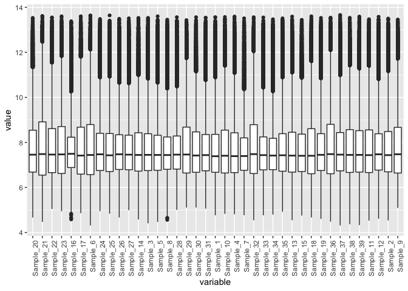

``` r
meltedExpressionMatrix %>% 
  ggplot(aes(x = value, color = variable)) +
  geom_density() +
  theme(axis.text.x = element_text(angle = 90, hjust = 1))
```

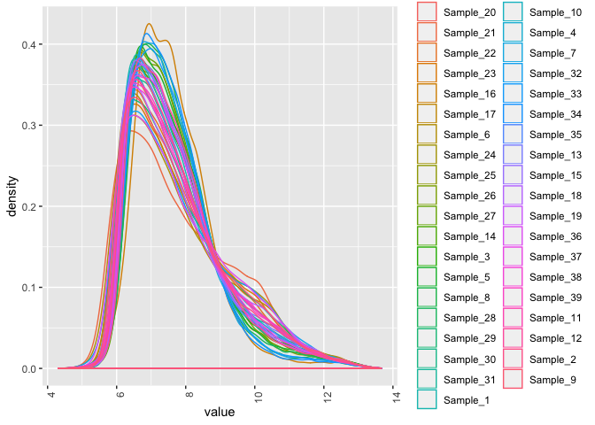

Part 3: Single gene analysis
============================

``` r
geneIds <- c("1416119_at", "1431708_a_at")

# use dplyr::filter() to get the expression data for the gene
expressionDataForGene <- expressionMatrix %>% filter(gene %in% geneIds)

# transform the data frame into the format that matches the sample metadata
expressionDataForGene <- expressionDataForGene %>%
  as.data.frame() %>% 
  column_to_rownames("gene") %>%
  t() %>% as.data.frame() %>% 
  rownames_to_column("sample_id") %>% 
  melt(id = "sample_id") %>% 
  as_tibble() %>% 
  select(sample_id,
         gene = variable, 
         expression = value)
```

Function for pulling expression data for given samples
------------------------------------------------------

``` r
transformGeneExpressionMatrix <- function(expressionMatrix) {
  expressionMatrix <- expressionMatrix %>%
    as.data.frame() %>% 
    column_to_rownames("gene") %>%
    t() %>% as.data.frame() %>% 
    rownames_to_column("sample_id") %>% 
    melt(id = "sample_id") %>% 
    as_tibble() %>% 
    select(sample_id,
           gene = variable, 
           expression = value)
  return(expressionMatrix)
}
```

Apply the function

``` r
# use dplyr::filter() to get the expression data for the gene
expressionDataForGene <- expressionMatrix %>% filter(gene %in% geneIds)
expressionDataForGene <- transformGeneExpressionMatrix(expressionDataForGene)
head(expressionDataForGene)
```

    ## # A tibble: 6 x 3
    ##   sample_id gene       expression
    ##   <chr>     <fct>           <dbl>
    ## 1 Sample_20 1416119_at      10.6 
    ## 2 Sample_21 1416119_at      11   
    ## 3 Sample_22 1416119_at      10.8 
    ## 4 Sample_23 1416119_at      10.9 
    ## 5 Sample_16 1416119_at       9.20
    ## 6 Sample_17 1416119_at      11.0

Now, we integrate the samples metadata by doing a join. The left\_join() function ensures that all rows in the first data frame are retained while unmatched rows in the second data frame are dropped. Feel free to run ?join() in the R-Studio console to learn more as well as other variations of the function such as right\_join(), inner\_join(), full\_join(), etc.

``` r
expressionDataForGene <- expressionDataForGene %>% left_join(samplesMetadata, by = "sample_id")

head(expressionDataForGene)
```

    ## # A tibble: 6 x 6
    ##   sample_id gene       expression sample_number dev_stage genotype
    ##   <chr>     <fct>           <dbl>         <int> <fct>     <fct>   
    ## 1 Sample_20 1416119_at      10.6             20 E16       wt      
    ## 2 Sample_21 1416119_at      11               21 E16       wt      
    ## 3 Sample_22 1416119_at      10.8             22 E16       wt      
    ## 4 Sample_23 1416119_at      10.9             23 E16       wt      
    ## 5 Sample_16 1416119_at       9.20            16 E16       NrlKO   
    ## 6 Sample_17 1416119_at      11.0             17 E16       NrlKO

Plot base on expressionDataForGene

``` r
expressionDataForGene %>% 
  ggplot(aes(x = expression, y = genotype, color = genotype)) + 
  geom_point(size = 3, shape = 1) +
  facet_wrap(~gene)
```

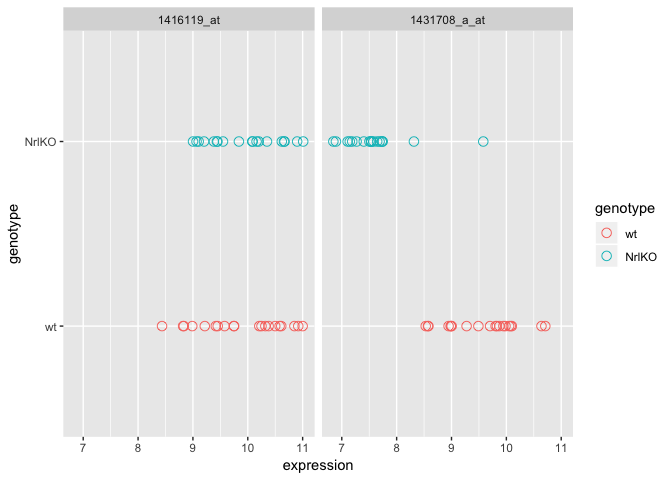 *If you think that 1431708\_a\_at on the right is a hit while 1416119\_at on the left is pretty boring, you'd be right. But why do you think that? Hint: mean and variance.*

The reason is the mean and variance are very different between NrlKo and wt for 1431708\_a\_at, but the mean and variance are similar between NrlKo and wt for 1416119\_at.

The two-group t-test
--------------------

``` r
boringGene <- expressionDataForGene %>% filter(gene == "1416119_at")
t.test(expression ~ genotype, boringGene)
```

    ## 
    ##  Welch Two Sample t-test
    ## 
    ## data:  expression by genotype
    ## t = -0.18395, df = 36.534, p-value = 0.8551
    ## alternative hypothesis: true difference in means is not equal to 0
    ## 95 percent confidence interval:
    ##  -0.5079125  0.4233967
    ## sample estimates:
    ##    mean in group wt mean in group NrlKO 
    ##            9.892900            9.935158

As expected, we obtain a p-value of &gt;0.8. Not so significant.

``` r
interestingGene <- expressionDataForGene %>% filter(gene == "1431708_a_at")
t.test(expression ~ genotype, interestingGene)
```

    ## 
    ##  Welch Two Sample t-test
    ## 
    ## data:  expression by genotype
    ## t = 9.838, df = 36.89, p-value = 7.381e-12
    ## alternative hypothesis: true difference in means is not equal to 0
    ## 95 percent confidence interval:
    ##  1.569556 2.383870
    ## sample estimates:
    ##    mean in group wt mean in group NrlKO 
    ##            9.554450            7.577737

And, we get a p-value &lt; 7.381e-12. An extremely tiny p-value! Suppose, we set the significance threshold at 0.001, this p-value is statistically significant.

linear regression
-----------------

For the boring Gene

``` r
boringGene <- expressionDataForGene %>% filter(gene == "1416119_at")
summary(lm(expression ~ genotype, boringGene))
```

    ## 
    ## Call:
    ## lm(formula = expression ~ genotype, data = boringGene)
    ## 
    ## Residuals:
    ##     Min      1Q  Median      3Q     Max 
    ## -1.4559 -0.5257  0.1448  0.6460  1.1071 
    ## 
    ## Coefficients:
    ##               Estimate Std. Error t value Pr(>|t|)    
    ## (Intercept)    9.89290    0.16104  61.432   <2e-16 ***
    ## genotypeNrlKO  0.04226    0.23072   0.183    0.856    
    ## ---
    ## Signif. codes:  0 '***' 0.001 '**' 0.01 '*' 0.05 '.' 0.1 ' ' 1
    ## 
    ## Residual standard error: 0.7202 on 37 degrees of freedom
    ## Multiple R-squared:  0.0009058,  Adjusted R-squared:  -0.0261 
    ## F-statistic: 0.03355 on 1 and 37 DF,  p-value: 0.8557

We get a p-value of &gt;0.85, which is what we got with the t-test. Let's try it with the interesting gene.

``` r
interestingGene <- expressionDataForGene %>% filter(gene == "1431708_a_at")
summary(lm(expression ~ genotype, interestingGene))
```

    ## 
    ## Call:
    ## lm(formula = expression ~ genotype, data = interestingGene)
    ## 
    ## Residuals:
    ##      Min       1Q   Median       3Q      Max 
    ## -1.02445 -0.45124 -0.03874  0.29605  2.00126 
    ## 
    ## Coefficients:
    ##               Estimate Std. Error t value Pr(>|t|)    
    ## (Intercept)     9.5545     0.1406   67.94  < 2e-16 ***
    ## genotypeNrlKO  -1.9767     0.2015   -9.81 7.71e-12 ***
    ## ---
    ## Signif. codes:  0 '***' 0.001 '**' 0.01 '*' 0.05 '.' 0.1 ' ' 1
    ## 
    ## Residual standard error: 0.629 on 37 degrees of freedom
    ## Multiple R-squared:  0.7223, Adjusted R-squared:  0.7148 
    ## F-statistic: 96.24 on 1 and 37 DF,  p-value: 7.713e-12

Again, as expected, we get a p-value of ~7.71e-12, similar to the t-test.

Anova
-----

We use it to test if at least one developmental stage is different among all developmental stages (multiple groups) for 1431708\_a\_at.

``` r
interestingGene <- expressionDataForGene %>% filter(gene == "1431708_a_at")
summary(aov(expression ~ dev_stage, interestingGene))
```

    ##             Df Sum Sq Mean Sq F value Pr(>F)
    ## dev_stage    4   2.75  0.6868   0.467  0.759
    ## Residuals   34  49.96  1.4695

We obtain a p-value that is qutie big. Let's see what we get with the linear model.

``` r
interestingGene <- expressionDataForGene %>% filter(gene == "1431708_a_at")
summary(lm(expression ~ dev_stage, interestingGene))
```

    ## 
    ## Call:
    ## lm(formula = expression ~ dev_stage, data = interestingGene)
    ## 
    ## Residuals:
    ##     Min      1Q  Median      3Q     Max 
    ## -1.9236 -0.8776  0.2208  0.9687  2.2898 
    ## 
    ## Coefficients:
    ##                  Estimate Std. Error t value Pr(>|t|)    
    ## (Intercept)        8.7613     0.4582  19.122   <2e-16 ***
    ## dev_stageP2       -0.4024     0.6274  -0.641    0.526    
    ## dev_stageP6       -0.4110     0.6274  -0.655    0.517    
    ## dev_stageP10      -0.2839     0.6274  -0.453    0.654    
    ## dev_stage4_weeks   0.2693     0.6274   0.429    0.670    
    ## ---
    ## Signif. codes:  0 '***' 0.001 '**' 0.01 '*' 0.05 '.' 0.1 ' ' 1
    ## 
    ## Residual standard error: 1.212 on 34 degrees of freedom
    ## Multiple R-squared:  0.05212,    Adjusted R-squared:  -0.0594 
    ## F-statistic: 0.4674 on 4 and 34 DF,  p-value: 0.7592

And we get exactly the same p-value for the F-statistics.

Part 4
======

Bad variance estimates
----------------------

``` r
numberOfGenes <- 1000
numberOfSamples <- 3

# each row is a gene, each column is a sample
simulatedGeneExpressionMatrix <- matrix(rnorm(numberOfGenes * numberOfSamples), nrow = numberOfGenes) 
simulatedGeneExpressionMatrix %>% head()
```

    ##            [,1]        [,2]       [,3]
    ## [1,] -0.7339379 -0.46959406 -0.4099160
    ## [2,] -0.6107676  0.74212661 -1.9603764
    ## [3,] -1.2114954 -1.51376789  0.1161242
    ## [4,]  0.6074497 -0.01412401 -0.2569656
    ## [5,]  0.5465728  0.32153895  0.9339241
    ## [6,]  1.5386062 -0.93759746 -2.0601934

``` r
geneVars <- simulatedGeneExpressionMatrix %>% apply(1, var) # work out the variance for each gene

tibble(variance = geneVars) %>% 
  ggplot(aes(x = variance)) + 
  geom_density() +
  geom_point(aes(y = 0), shape = 1, size = 3)
```

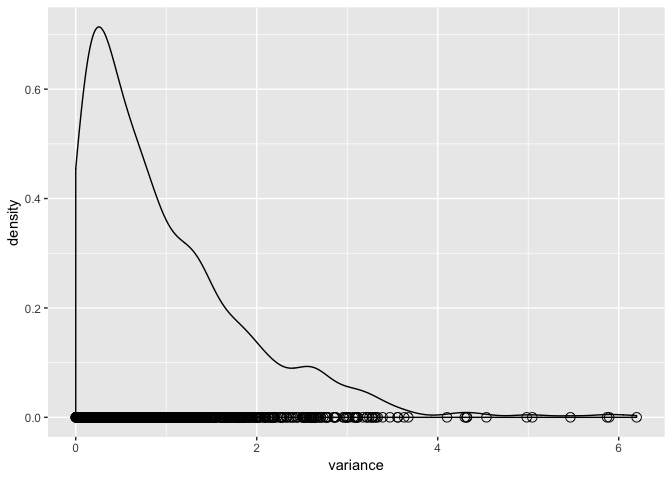

we see that at least a quarter of the genes appear to exhibit a sample variance that is less than one-third the true variance.

Multiple testing: Limma in action
---------------------------------

``` r
# filter for wildtype data
wildTypeSamples <- samplesMetadata %>% filter(genotype == "wt")

head(wildTypeSamples) # reminder of what the samples metadata data frame looks like
```

    ## # A tibble: 6 x 4
    ##   sample_id sample_number dev_stage genotype
    ##   <chr>             <int> <fct>     <fct>   
    ## 1 Sample_20            20 E16       wt      
    ## 2 Sample_21            21 E16       wt      
    ## 3 Sample_22            22 E16       wt      
    ## 4 Sample_23            23 E16       wt      
    ## 5 Sample_24            24 P2        wt      
    ## 6 Sample_25            25 P2        wt

Fuction for pilling expression data for given samples
-----------------------------------------------------

``` r
# reusable function for pulling expression data for given samples
getExpressionForSamples <- function(sampleIds, expressionMatrix) {
  # use gene column as row name
  dataFrame <- expressionMatrix %>% 
    as.data.frame() %>% 
    column_to_rownames("gene")
  # use give sampleIds to pull out the subset of interest (ORDERING OF SAMPLES IS VERY IMPORTANT)
  return(dataFrame[sampleIds])
}

# use the wildTypeSamples to pull out the wildtype expression data from the expression matrix
wildTypeExpressionMatrix <- getExpressionForSamples(wildTypeSamples$sample_id, expressionMatrix)

head(wildTypeExpressionMatrix %>% as_tibble()) # reminder of what the expression matrix looks like
```

    ## # A tibble: 6 x 20
    ##   Sample_20 Sample_21 Sample_22 Sample_23 Sample_24 Sample_25 Sample_26
    ##       <dbl>     <dbl>     <dbl>     <dbl>     <dbl>     <dbl>     <dbl>
    ## 1      7.24      7.41      7.17      7.07      7.11      7.19      7.18
    ## 2      9.48     10.0       9.85     10.1       9.75      9.16      9.49
    ## 3     10.0      10.0       9.91      9.91      9.39     10.1       9.41
    ## 4      8.36      8.37      8.40      8.49      8.37      8.20      8.73
    ## 5      8.59      8.62      8.52      8.64      8.36      8.50      8.39
    ## 6      9.59      9.72      9.71      9.7       9.64      9.65      9.87
    ## # … with 13 more variables: Sample_27 <dbl>, Sample_28 <dbl>,
    ## #   Sample_29 <dbl>, Sample_30 <dbl>, Sample_31 <dbl>, Sample_32 <dbl>,
    ## #   Sample_33 <dbl>, Sample_34 <dbl>, Sample_35 <dbl>, Sample_36 <dbl>,
    ## #   Sample_37 <dbl>, Sample_38 <dbl>, Sample_39 <dbl>

``` r
# Ordering of samples in the samples metadata
wildTypeSamples$sample_id
```

    ##  [1] "Sample_20" "Sample_21" "Sample_22" "Sample_23" "Sample_24"
    ##  [6] "Sample_25" "Sample_26" "Sample_27" "Sample_28" "Sample_29"
    ## [11] "Sample_30" "Sample_31" "Sample_32" "Sample_33" "Sample_34"
    ## [16] "Sample_35" "Sample_36" "Sample_37" "Sample_38" "Sample_39"

``` r
# Ordering of samples in the expression matrix
names(wildTypeExpressionMatrix)
```

    ##  [1] "Sample_20" "Sample_21" "Sample_22" "Sample_23" "Sample_24"
    ##  [6] "Sample_25" "Sample_26" "Sample_27" "Sample_28" "Sample_29"
    ## [11] "Sample_30" "Sample_31" "Sample_32" "Sample_33" "Sample_34"
    ## [16] "Sample_35" "Sample_36" "Sample_37" "Sample_38" "Sample_39"

``` r
# check equivalence
(wildTypeSamples$sample_id == names(wildTypeExpressionMatrix)) %>% all()
```

    ## [1] TRUE

we construct the design matrix.

``` r
designMatrix <- model.matrix(~dev_stage, wildTypeSamples)
head(designMatrix, 10) %>% kable()
```

|  (Intercept)|  dev\_stageP2|  dev\_stageP6|  dev\_stageP10|  dev\_stage4\_weeks|
|------------:|-------------:|-------------:|--------------:|-------------------:|
|            1|             0|             0|              0|                   0|
|            1|             0|             0|              0|                   0|
|            1|             0|             0|              0|                   0|
|            1|             0|             0|              0|                   0|
|            1|             1|             0|              0|                   0|
|            1|             1|             0|              0|                   0|
|            1|             1|             0|              0|                   0|
|            1|             1|             0|              0|                   0|
|            1|             0|             1|              0|                   0|
|            1|             0|             1|              0|                   0|

``` r
head(wildTypeSamples, 10) %>% kable()
```

| sample\_id |  sample\_number| dev\_stage | genotype |
|:-----------|---------------:|:-----------|:---------|
| Sample\_20 |              20| E16        | wt       |
| Sample\_21 |              21| E16        | wt       |
| Sample\_22 |              22| E16        | wt       |
| Sample\_23 |              23| E16        | wt       |
| Sample\_24 |              24| P2         | wt       |
| Sample\_25 |              25| P2         | wt       |
| Sample\_26 |              26| P2         | wt       |
| Sample\_27 |              27| P2         | wt       |
| Sample\_28 |              28| P6         | wt       |
| Sample\_29 |              29| P6         | wt       |

Notice that E16 is taken to be the baseline and everything else is defined relative to it.

``` r
# keep the fit around as we will need to it for looking at other contrasts later 
wildTypeDevStageFit <- lmFit(wildTypeExpressionMatrix, designMatrix)

# run ebayes to calculate moderated t-statistics
wildTypeDevStageFitEb <- eBayes(wildTypeDevStageFit)
```

topTable() is your best friend
------------------------------

``` r
topTenGenes <- topTable(wildTypeDevStageFitEb)
```

    ## Removing intercept from test coefficients

``` r
topTenGenes
```

    ##              dev_stageP2 dev_stageP6 dev_stageP10 dev_stage4_weeks AveExpr
    ## 1440645_at       0.39900     0.19525      0.92000          3.96125 6.52835
    ## 1416041_at       0.15800     0.47975      0.33275          5.11450 9.38250
    ## 1425222_x_at     0.88200     0.79950      1.54875          5.53175 7.02815
    ## 1451635_at       1.30250     1.19000      2.01600          6.18825 8.31860
    ## 1429028_at      -2.44325    -3.40725     -4.31050         -4.60175 8.04495
    ## 1422929_s_at    -2.91175    -3.61825     -3.54725         -3.66125 7.27830
    ## 1424852_at       0.45750     0.22975      0.57400          3.97900 7.45405
    ## 1425171_at       0.99800     3.05300      5.27875          6.07875 9.62045
    ## 1451617_at       0.72550     2.51275      4.98375          6.68475 8.81660
    ## 1451618_at       0.60275     2.89025      5.05075          6.28825 9.43065
    ##                     F      P.Value    adj.P.Val
    ## 1440645_at   425.4464 1.587779e-17 4.755241e-13
    ## 1416041_at   195.4574 1.522363e-14 2.279662e-10
    ## 1425222_x_at 173.3572 4.348283e-14 4.340891e-10
    ## 1451635_at   157.3341 1.013031e-13 7.584816e-10
    ## 1429028_at   148.7971 1.645967e-13 9.202951e-10
    ## 1422929_s_at 146.8672 1.843725e-13 9.202951e-10
    ## 1424852_at   143.2443 2.290408e-13 9.799345e-10
    ## 1425171_at   138.8483 3.001762e-13 1.123747e-09
    ## 1451617_at   136.4774 3.485203e-13 1.159759e-09
    ## 1451618_at   134.2025 4.031647e-13 1.207438e-09

``` r
topGenes <- rownames(topTenGenes)[1:6]
topGenesExpressionData <- wildTypeExpressionMatrix %>% 
  rownames_to_column("gene") %>% 
  filter(gene %in% topGenes) %>%
  transformGeneExpressionMatrix() %>% 
  left_join(wildTypeSamples, id = "sample_id")
```

    ## Joining, by = "sample_id"

``` r
topGenesExpressionData %>% 
  ggplot(aes(x = dev_stage, y = expression, color = genotype)) +
  geom_point() +
  geom_jitter() +
  stat_summary(aes(y = expression, group=1), fun.y = mean, geom="line") +
  facet_wrap(~gene)
```

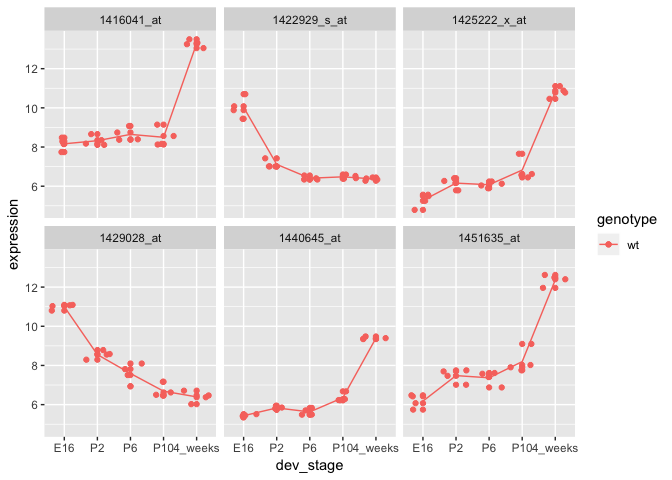

Function for plot
-----------------

``` r
plotGenes <- function(genes, expressionMatrix, samplesMetadata) {
  
  expressionDataForGenes <- expressionMatrix %>% 
    rownames_to_column("gene") %>% 
    filter(gene %in% genes) %>%
    transformGeneExpressionMatrix() %>% 
    left_join(samplesMetadata, id = "sample_id")
  
  expressionDataForGenes %>% 
    ggplot(aes(x = dev_stage, y = expression, color = genotype)) +
    geom_point() +
    geom_jitter() +
    stat_summary(aes(y = expression, group=1), fun.y = mean, geom="line") +
    facet_wrap(~gene)
}

# verify that the function works
plotGenes(topGenes, wildTypeExpressionMatrix, wildTypeSamples)
```

    ## Joining, by = "sample_id"

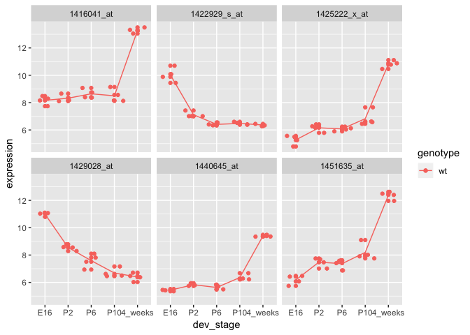

now let's use topTable() again to find some boring(insignificant) genes.

``` r
allGenes <- topTable(wildTypeDevStageFitEb, number = Inf) # show all genes in the list, rather than just the top 10
```

    ## Removing intercept from test coefficients

``` r
nrow(allGenes) # number of genes
```

    ## [1] 29949

``` r
# Let's look at the bottom 6 genes
boringGeneIndices <- seq(from = nrow(allGenes), to = nrow(allGenes) - 5)

boringGenes <- allGenes[boringGeneIndices,] 

# print out the boring genes and their p-values
boringGenes
```

    ##              dev_stageP2 dev_stageP6 dev_stageP10 dev_stage4_weeks AveExpr
    ## 1436053_at      -0.00175    -0.00850     -0.00925         -0.00500 7.61335
    ## 1441195_at       0.01450     0.01400     -0.01475         -0.00750 7.68300
    ## 1431188_a_at     0.00575     0.02725      0.00875          0.00125 6.94585
    ## 1418235_at       0.00075    -0.00700      0.03500         -0.01500 6.44150
    ## 1416378_at       0.03650    -0.00075      0.01500         -0.00825 6.71775
    ## 1452600_at      -0.02575    -0.01750     -0.00575         -0.03150 6.20265
    ##                        F   P.Value adj.P.Val
    ## 1436053_at   0.002772688 0.9999830 0.9999830
    ## 1441195_at   0.015007091 0.9995115 0.9995449
    ## 1431188_a_at 0.023344402 0.9988338 0.9989005
    ## 1418235_at   0.023367662 0.9988315 0.9989005
    ## 1416378_at   0.024051269 0.9987635 0.9988969
    ## 1452600_at   0.027650520 0.9983752 0.9985419

``` r
plotGenes(rownames(boringGenes), wildTypeExpressionMatrix, wildTypeSamples)
```

    ## Joining, by = "sample_id"

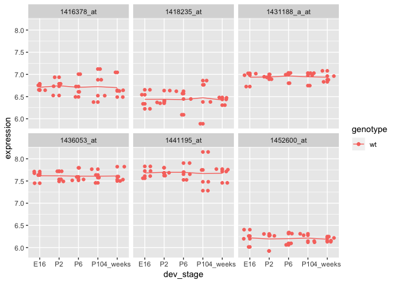

Constructing and using the contrast matrix
------------------------------------------

What if we're particularly interested in finding the genes that are differentially expressed from developmental stages P6 to P10? Or from P10 to 4\_weeks?

``` r
# construct the contrast matrix
contrastMatrix <- makeContrasts(
  p10vsp6 = dev_stageP10 - dev_stageP6,
  fourweeksVsP10 = dev_stage4_weeks - dev_stageP10,
  levels = designMatrix
)
```

    ## Warning in makeContrasts(p10vsp6 = dev_stageP10 - dev_stageP6,
    ## fourweeksVsP10 = dev_stage4_weeks - : Renaming (Intercept) to Intercept

``` r
# fit the contrast using the original fitted model
contrastFit <- contrasts.fit(wildTypeDevStageFit, contrastMatrix)
```

    ## Warning in contrasts.fit(wildTypeDevStageFit, contrastMatrix): row names of
    ## contrasts don't match col names of coefficients

``` r
# apply eBayes() for moderated statistics
contrastFitEb <- eBayes(contrastFit)
```

``` r
contrastGenes <- topTable(contrastFitEb)

contrastGenes
```

    ##               p10vsp6 fourweeksVsP10 AveExpr        F      P.Value
    ## 1440645_at    0.72475        3.04125 6.52835 632.7410 2.224325e-17
    ## 1416041_at   -0.14700        4.78175 9.38250 302.3940 1.472973e-14
    ## 1425222_x_at  0.74925        3.98300 7.02815 235.3682 1.299509e-13
    ## 1424852_at    0.34425        3.40500 7.45405 225.1087 1.910320e-13
    ## 1420726_x_at  0.17325        3.55125 7.19000 203.5215 4.555385e-13
    ## 1451635_at    0.82600        4.17225 8.31860 200.0177 5.289072e-13
    ## 1429394_at   -0.09800        2.40975 7.84825 167.4991 2.416043e-12
    ## 1455447_at   -0.97650       -1.79975 9.97295 153.5444 5.063369e-12
    ## 1429791_at    0.24800        1.65825 8.02555 145.7407 7.877494e-12
    ## 1422612_at    0.48375        3.42600 8.83255 142.2388 9.676005e-12
    ##                 adj.P.Val
    ## 1440645_at   6.661631e-13
    ## 1416041_at   2.205703e-10
    ## 1425222_x_at 1.297300e-09
    ## 1424852_at   1.430304e-09
    ## 1420726_x_at 2.640040e-09
    ## 1451635_at   2.640040e-09
    ## 1429394_at   1.033687e-08
    ## 1455447_at   1.895536e-08
    ## 1429791_at   2.621367e-08
    ## 1422612_at   2.840295e-08

``` r
plotGenes(rownames(contrastGenes)[1:6], wildTypeExpressionMatrix, wildTypeSamples)
```

    ## Joining, by = "sample_id"

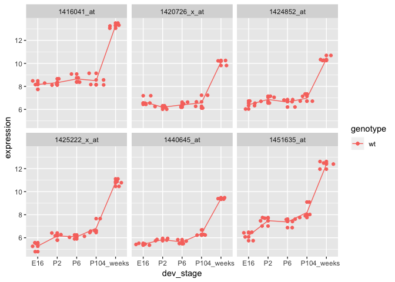

``` r
cutoff <- 1e-04
wtResCont <- decideTests(contrastFitEb, p.value = cutoff, method = "global")
summary(wtResCont)
```

    ##        p10vsp6 fourweeksVsP10
    ## Down         4              8
    ## NotSig   29945          29895
    ## Up           0             46

Here are the 4 that decline from P6 to P10.

``` r
hits1 <- wtResCont %>% 
  as.data.frame() %>% 
  rownames_to_column("gene") %>% 
  filter(p10vsp6 < 0)

# these are the genes that declined from P6 to P10
hits1
```

    ##         gene p10vsp6 fourweeksVsP10
    ## 1 1416635_at      -1              0
    ## 2 1437781_at      -1              0
    ## 3 1454752_at      -1              0
    ## 4 1455260_at      -1              0

``` r
# lets plot them
plotGenes(hits1$gene, wildTypeExpressionMatrix, wildTypeSamples)
```

    ## Joining, by = "sample_id"

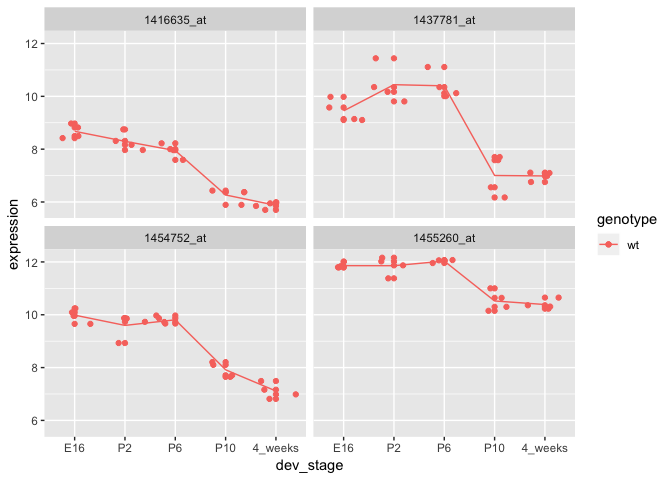

``` r
hits2 <- wtResCont %>% 
  as.data.frame() %>% 
  rownames_to_column("gene") %>% 
  filter(fourweeksVsP10 < 0)

# these are the genes that declined from P10 to 4_weeks
hits2
```

    ##           gene p10vsp6 fourweeksVsP10
    ## 1 1416021_a_at       0             -1
    ## 2 1423851_a_at       0             -1
    ## 3   1434500_at       0             -1
    ## 4 1435415_x_at       0             -1
    ## 5 1437502_x_at       0             -1
    ## 6 1448182_a_at       0             -1
    ## 7   1452679_at       0             -1
    ## 8   1455447_at       0             -1

Is there any overlap between these probes?

``` r
hits1$gene %>% intersect(hits2$gene)
```

    ## character(0)

Assessing interaction
---------------------

``` r
# for simplification, let's look at only a two-by-two design, we'll filter for developmental stages E16 and 4_weeks
interactionSamples <- samplesMetadata %>% filter(dev_stage %in% c("E16", "4_weeks"))

# IMPORTANT - you want to adjust factor levels here to eliminate stages P2, P6, and P10 from your design matrix
interactionSamples$dev_stage <- interactionSamples$dev_stage %>% 
  as.character() %>% 
  factor(levels = c("E16", "4_weeks"))

# reminder of what samples metadata look like - all samples
interactionSamples
```

    ## # A tibble: 15 x 4
    ##    sample_id sample_number dev_stage genotype
    ##    <chr>             <int> <fct>     <fct>   
    ##  1 Sample_20            20 E16       wt      
    ##  2 Sample_21            21 E16       wt      
    ##  3 Sample_22            22 E16       wt      
    ##  4 Sample_23            23 E16       wt      
    ##  5 Sample_16            16 E16       NrlKO   
    ##  6 Sample_17            17 E16       NrlKO   
    ##  7 Sample_6              6 E16       NrlKO   
    ##  8 Sample_36            36 4_weeks   wt      
    ##  9 Sample_37            37 4_weeks   wt      
    ## 10 Sample_38            38 4_weeks   wt      
    ## 11 Sample_39            39 4_weeks   wt      
    ## 12 Sample_11            11 4_weeks   NrlKO   
    ## 13 Sample_12            12 4_weeks   NrlKO   
    ## 14 Sample_2              2 4_weeks   NrlKO   
    ## 15 Sample_9              9 4_weeks   NrlKO

``` r
# reuse getExpressionForSamples() to get expression data for the samples that we want
expressionDataForInteractionSamples <- getExpressionForSamples(interactionSamples$sample_id, expressionMatrix)
head(expressionDataForInteractionSamples)
```

    ##              Sample_20 Sample_21 Sample_22 Sample_23 Sample_16 Sample_17
    ## 1415670_at       7.236     7.414     7.169     7.070     7.383     7.337
    ## 1415671_at       9.478    10.020     9.854    10.130     7.637    10.030
    ## 1415672_at      10.010    10.040     9.913     9.907     8.423    10.240
    ## 1415673_at       8.362     8.374     8.404     8.487     8.363     8.371
    ## 1415674_a_at     8.585     8.615     8.520     8.641     8.509     8.893
    ## 1415675_at       9.591     9.719     9.709     9.700     9.656     9.614
    ##              Sample_6 Sample_36 Sample_37 Sample_38 Sample_39 Sample_11
    ## 1415670_at      7.240     7.250     7.035     7.374     7.131     7.421
    ## 1415671_at      9.709     9.664     8.381     9.436     8.730     9.831
    ## 1415672_at     10.170     9.514     9.206     9.485     9.526    10.000
    ## 1415673_at      8.835     8.491     8.754     8.495     8.647     8.595
    ## 1415674_a_at    8.542     8.419     8.257     8.339     8.283     8.427
    ## 1415675_at      9.672     9.669     9.547     9.327     9.454     9.598
    ##              Sample_12 Sample_2 Sample_9
    ## 1415670_at       7.109    7.351    7.322
    ## 1415671_at       9.714    9.658    9.798
    ## 1415672_at       9.429    9.914    9.847
    ## 1415673_at       8.427    8.404    8.404
    ## 1415674_a_at     8.498    8.373    8.458
    ## 1415675_at       9.740    9.455    9.508

``` r
# construct the design matrix to include all groups for genotype and developmental stages plus the interaction terms
interactionDesign <- model.matrix(~genotype*dev_stage, interactionSamples)

interactionDesign
```

    ##    (Intercept) genotypeNrlKO dev_stage4_weeks
    ## 1            1             0                0
    ## 2            1             0                0
    ## 3            1             0                0
    ## 4            1             0                0
    ## 5            1             1                0
    ## 6            1             1                0
    ## 7            1             1                0
    ## 8            1             0                1
    ## 9            1             0                1
    ## 10           1             0                1
    ## 11           1             0                1
    ## 12           1             1                1
    ## 13           1             1                1
    ## 14           1             1                1
    ## 15           1             1                1
    ##    genotypeNrlKO:dev_stage4_weeks
    ## 1                               0
    ## 2                               0
    ## 3                               0
    ## 4                               0
    ## 5                               0
    ## 6                               0
    ## 7                               0
    ## 8                               0
    ## 9                               0
    ## 10                              0
    ## 11                              0
    ## 12                              1
    ## 13                              1
    ## 14                              1
    ## 15                              1
    ## attr(,"assign")
    ## [1] 0 1 2 3
    ## attr(,"contrasts")
    ## attr(,"contrasts")$genotype
    ## [1] "contr.treatment"
    ## 
    ## attr(,"contrasts")$dev_stage
    ## [1] "contr.treatment"

``` r
# first fit the model
interactionFit <- lmFit(expressionDataForInteractionSamples, interactionDesign) %>% eBayes()

cutoff <- 1e-06
changeDirections <- decideTests(interactionFit, p.value = cutoff, method = "global") %>% 
  as.data.frame() %>% 
  rownames_to_column("gene") %>% 
  as_tibble()

# look for down regulation across developmental stages in wt but up regulation in genotypeNrlKO 
hits <- changeDirections %>% filter(dev_stage4_weeks < 0, `genotypeNrlKO:dev_stage4_weeks` > 0)

# lets try plotting 5 on this list

expressionDataForHits <- expressionDataForInteractionSamples %>% 
  rownames_to_column("gene") %>% 
  filter(gene %in% hits$gene[1:4]) %>%
  transformGeneExpressionMatrix() %>% 
  left_join(samplesMetadata, id = "sample_id")
```

    ## Joining, by = "sample_id"

``` r
expressionDataForHits$dev_stage <- expressionDataForHits$dev_stage %>% as.numeric()

expressionDataForHits %>%
  ggplot(aes(x = dev_stage, y = expression, color = genotype)) +
  geom_point() +
  geom_jitter() +
  geom_smooth(method = "lm", se = FALSE) +
  facet_wrap(~gene)
```

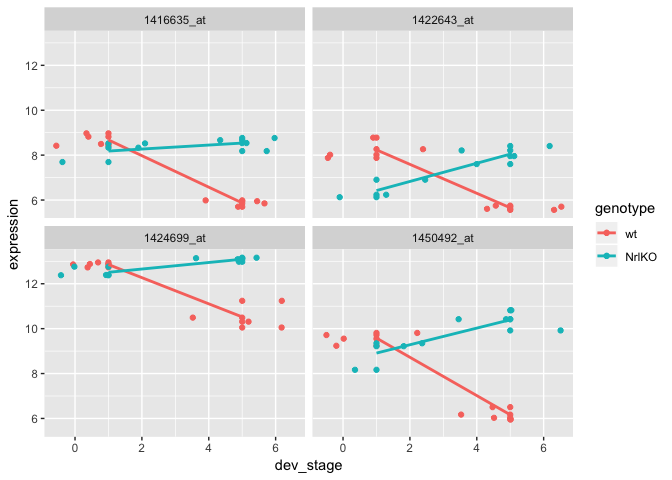

Part 5 Deliverables
===================

**Make a similar plot but this time for 4 genes where there are no interaction between genotype and developmental stages.**

``` r
# first fit the model
interactionFit <- lmFit(expressionDataForInteractionSamples, interactionDesign) %>% eBayes()

cutoff <- 0.99
sameDirections <- decideTests(interactionFit, p.value = cutoff, method = "global") %>% 
  as.data.frame() %>% 
  rownames_to_column("gene") %>% 
  as_tibble()

# look for down regulation across developmental stages in wt but up regulation in genotypeNrlKO 
hits <- sameDirections %>% filter(dev_stage4_weeks > 0, `genotypeNrlKO:dev_stage4_weeks` ==0)

# lets try plotting 5 on this list

expressionDataForHits <- expressionDataForInteractionSamples %>% 
  rownames_to_column("gene") %>% 
  filter(gene %in% hits$gene[1:4]) %>%
  transformGeneExpressionMatrix() %>% 
  left_join(samplesMetadata, id = "sample_id")
```

    ## Joining, by = "sample_id"

``` r
expressionDataForHits$dev_stage <- expressionDataForHits$dev_stage %>% as.numeric()

expressionDataForHits %>%
  ggplot(aes(x = dev_stage, y = expression, color = genotype)) +
  geom_point() +
  geom_jitter() +
  geom_smooth(method = "lm", se = FALSE) +
  facet_wrap(~gene)
```

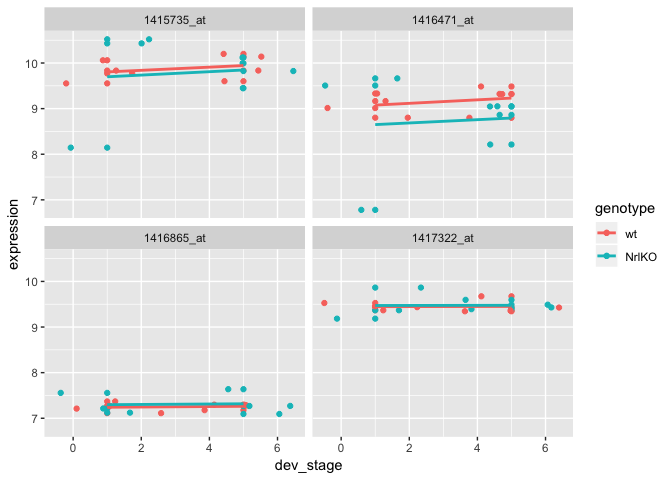
