Seminar 6
================
Yanchao
2019-02-25

Install required libraries
--------------------------

R Markdown
----------

Load packages
-------------

``` r
library(RColorBrewer)
library(cluster)
library(pvclust)
library(xtable)
library(limma)
library(plyr)
library(lattice)
library(RCurl)
```

    ## Loading required package: bitops

``` r
options(download.file.method = "curl")
library(GEOquery)
```

    ## Loading required package: Biobase

    ## Loading required package: BiocGenerics

    ## Loading required package: parallel

    ## 
    ## Attaching package: 'BiocGenerics'

    ## The following objects are masked from 'package:parallel':
    ## 
    ##     clusterApply, clusterApplyLB, clusterCall, clusterEvalQ,
    ##     clusterExport, clusterMap, parApply, parCapply, parLapply,
    ##     parLapplyLB, parRapply, parSapply, parSapplyLB

    ## The following object is masked from 'package:limma':
    ## 
    ##     plotMA

    ## The following objects are masked from 'package:stats':
    ## 
    ##     IQR, mad, sd, var, xtabs

    ## The following objects are masked from 'package:base':
    ## 
    ##     anyDuplicated, append, as.data.frame, basename, cbind,
    ##     colMeans, colnames, colSums, dirname, do.call, duplicated,
    ##     eval, evalq, Filter, Find, get, grep, grepl, intersect,
    ##     is.unsorted, lapply, lengths, Map, mapply, match, mget, order,
    ##     paste, pmax, pmax.int, pmin, pmin.int, Position, rank, rbind,
    ##     Reduce, rowMeans, rownames, rowSums, sapply, setdiff, sort,
    ##     table, tapply, union, unique, unsplit, which, which.max,
    ##     which.min

    ## Welcome to Bioconductor
    ## 
    ##     Vignettes contain introductory material; view with
    ##     'browseVignettes()'. To cite Bioconductor, see
    ##     'citation("Biobase")', and for packages 'citation("pkgname")'.

    ## Setting options('download.file.method.GEOquery'='auto')

    ## Setting options('GEOquery.inmemory.gpl'=FALSE)

``` r
library(knitr)
library(pheatmap)
```

    ## Warning: package 'pheatmap' was built under R version 3.5.2

Read the data into R
--------------------

``` r
options('download.file.method'='curl')
if(file.exists("GSE70213.Rdata")){ # if previously downloaded
  load("GSE70213.Rdata")
} else { 
#Get geo object that contains our data and phenotype information  
geo_obj <- getGEO("GSE70213", GSEMatrix = TRUE)
geo_obj <- geo_obj[[1]]
save(geo_obj, file = "GSE70213.Rdata")
}
#Get expression data  
data <- exprs(geo_obj)
#Get covariate data  
prDes <- pData(geo_obj)[,c("organism_ch1","title",colnames(pData(geo_obj))[grep("characteristics", colnames(pData(geo_obj)))])]
##Clean up covariate data  
colnames(prDes) = c("organism","sample_name","tissue","genotype","sex","age")
prDes$tissue = as.factor(gsub("tissue: ","", prDes$tissue))
prDes$genotype = as.factor(gsub("genotype: ","", prDes$genotype))
prDes$sex = as.factor(gsub("Sex: ","", prDes$sex))
prDes$age = gsub("age: ","", prDes$age)
```

Exploratory analysis
--------------------

``` r
kable(head(data[, 1:5]))
```

|          |   GSM1720833|   GSM1720834|   GSM1720835|   GSM1720836|   GSM1720837|
|----------|------------:|------------:|------------:|------------:|------------:|
| 10338001 |  2041.408000|  2200.861000|  2323.760000|  3216.263000|  2362.775000|
| 10338002 |    63.780590|    65.084380|    58.308200|    75.861450|    66.956050|
| 10338003 |   635.390400|   687.393600|   756.004000|  1181.929000|   759.099800|
| 10338004 |   251.566800|   316.997300|   320.513200|   592.806000|   359.152500|
| 10338005 |     2.808835|     2.966376|     2.985357|     3.352954|     3.155735|
| 10338006 |     3.573085|     3.816430|     3.815323|     4.690040|     3.862684|

``` r
dim(data)
```

    ## [1] 35557    24

``` r
kable(head(prDes))
```

|            | organism     | sample\_name   | tissue     | genotype | sex  | age         |
|------------|:-------------|:---------------|:-----------|:---------|:-----|:------------|
| GSM1720833 | Mus musculus | quad-control-1 | quadriceps | control  | male | 41 days old |
| GSM1720834 | Mus musculus | quad-control-2 | quadriceps | control  | male | 41 days old |
| GSM1720835 | Mus musculus | quad-control-3 | quadriceps | control  | male | 41 days old |
| GSM1720836 | Mus musculus | quad-control-4 | quadriceps | control  | male | 41 days old |
| GSM1720837 | Mus musculus | quad-control-5 | quadriceps | control  | male | 42 days old |
| GSM1720838 | Mus musculus | quad-control-6 | quadriceps | control  | male | 40 days old |

``` r
dim(prDes)
```

    ## [1] 24  6

Now let us see how the gene values are spread across our dataset, with a frequency histogram (using base R).

``` r
hist(data, col = "gray", main = "GSE70213 - Histogram")
```

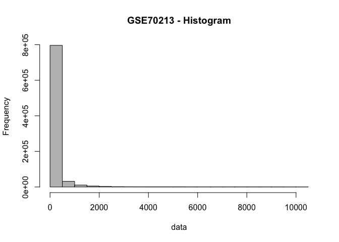

It appears a lot of genes have values &lt; 1000. What happens if we plot the frequency distribution after Log2 transformation?

`Why might it be useful to log transform the data, prior to making any comparisons?`

``` r
hist(log2(data + 1), col = "gray", main = "GSE70213 log transformed - Histogram")
```

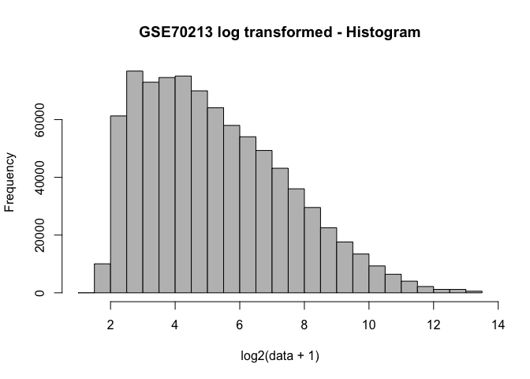

Finally, as an additional step to make visualization easier later, we'll rescale the rows in our data object, since we're not interested in absolute differences in expression between genes at the moment. Note that although one can do this step within the pheatmap() function, it will not be available for other functions we will use. We can always go back to the original data if we need to.

``` r
sprDat <- t(scale(t(data)))
str(sprDat, max.level = 0, give.attr = FALSE)
```

    ##  num [1:35557, 1:24] -0.2042 0.9693 -0.0693 -0.3329 -0.7671 ...

``` r
round(data.frame(avgBefore = rowMeans(head(data)), avgAfter = rowMeans(head(sprDat)), 
    varBefore = apply(head(data), 1, var), varAfter = apply(head(sprDat), 1, var)), 
    2)
```

    ##          avgBefore avgAfter varBefore varAfter
    ## 10338001   2109.42        0 110944.28        1
    ## 10338002     55.62        0     70.82        1
    ## 10338003    645.76        0  22386.92        1
    ## 10338004    280.43        0   7513.48        1
    ## 10338005      2.92        0      0.02        1
    ## 10338006      3.64        0      0.07        1

The data for each row -- which is for one probeset -- now has mean 0 and variance 1.

Now, let us try and consider how the various samples cluster across all our genes. We will then try and do some feature selection, and see the effect it has on the clustering of the samples. We will use the covars object to annotate our clusters and identify interesting clusters. The second part of our analysis will focus on clustering the genes across all our samples.

Sample Clustering
-----------------

In this part, we will use samples as objects to be clustered using gene attributes (i.e., vector variables of dimension ~35K). First we will cluster the data using agglomerative hierarchical clustering. Here, the partitions can be visualized using a dendrogram at various levels of granularity. We do not need to input the number of clusters, in this approach. Then, we will find various clustering solutions using partitional clustering methods, specifically K-means and partition around medoids (PAM). Here, the partitions are independent of each other, and the number of clusters is given as an input. As part of your take-home exercise, you will pick a specific number of clusters, and compare the sample memberships in these clusters across the various clustering methods.

Part I: Hierarchical Clustering
-------------------------------

### Hierarchical clustering for mice knockout data

In this section we will illustrate different hierarchical clustering methods. These plots were included in Lecture 16.

However, for most expression data applications, we suggest you should standardize the data; use Euclidean as the "distance" (so it's just like Pearson correlation) and use "average linkage".

``` r
data_to_plot = sprDat
# compute pairwise distances
pr.dis <- dist(t(data_to_plot), method = "euclidean")

# create a new factor representing the interaction of tissue type and genotype
prDes$grp <- with(prDes, interaction(tissue, genotype))
summary(prDes$grp)
```

    ##    quadriceps.control        soleus.control quadriceps.nebulin KO 
    ##                     6                     6                     6 
    ##     soleus.nebulin KO 
    ##                     6

``` r
# compute hierarchical clustering using different linkage types
pr.hc.s <- hclust(pr.dis, method = "single")
pr.hc.c <- hclust(pr.dis, method = "complete")
pr.hc.a <- hclust(pr.dis, method = "average")
pr.hc.w <- hclust(pr.dis, method = "ward.D")

# plot them
op <- par(mar = c(0, 4, 4, 2), mfrow = c(2, 2))

plot(pr.hc.s, labels = FALSE, main = "Single", xlab = "")
plot(pr.hc.c, labels = FALSE, main = "Complete", xlab = "")
plot(pr.hc.a, labels = FALSE, main = "Average", xlab = "")
plot(pr.hc.w, labels = FALSE, main = "Ward", xlab = "")
```

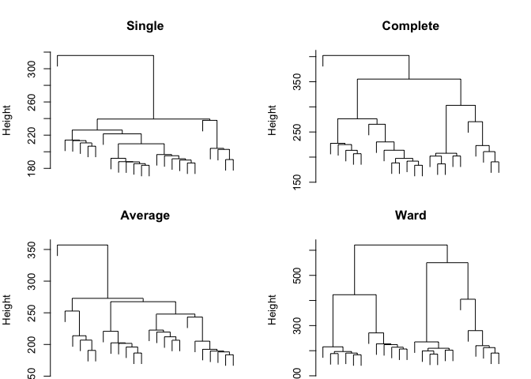

``` r
par(op)
```

We can look at the trees that are output from different clustering algorithms. However, it can also be visually helpful to identify what sorts of trends in the data are associated with these clusters. We can look at this output using heatmaps. We will be using the pheatmap package for is purpose.

When you call pheatmap(), it automatically performs hierarchical clustering for you and it reorders the rows and/or columns of the data accordingly. Both the reordering and the dendrograms can be suppressed with cluster\_rows = FALSE and/or cluster\_cols = FALSE.

`Note that when you have a lot of genes, the tree is pretty ugly. Thus, the row clustering was suppressed for now.` By default, pheatmap() uses the hclust() function, which takes a distance matrix, calculated by the dist() function (with default = 'euclidean'). However, you can also write your own clustering and distance functions. In the examples below, I used hclust() with ward linkage method and the euclidean distance.

`Note that the dendrogram in the top margin of the heatmap is the same as that of the hclust() function.`

``` r
# set pheatmap clustering parameters
clust_dist_col = "euclidean"  #‘'correlation'’ for Pearson correlation, ‘'euclidean'’, ‘'maximum'’, ‘'manhattan'’, ‘'canberra'’, ‘'binary'’ or ‘'minkowski'’
clust_method = "ward.D2"  #‘'ward.D'’, ‘'ward.D2'’,‘'single'’, ‘'complete'’, ‘'average'’ (= UPGMA), ‘'mcquitty'’ (= WPGMA), ‘'median'’ (= WPGMC) or ‘'centroid'’ (= UPGMC)
clust_scale = "none"  #'column', 'none', 'row'

## the annotation option uses the covariate object (prDes) we defined. It should
## have the same rownames, as the colnames in our data object (data_to_plot).

pheatmap(data_to_plot, cluster_rows = FALSE, scale = clust_scale, clustering_method = clust_method, 
    clustering_distance_cols = clust_dist_col , show_colnames = T, show_rownames = FALSE, 
    main = "Clustering heatmap for GSE70213", annotation = prDes[, c("tissue", "genotype", 
        "grp")])
```

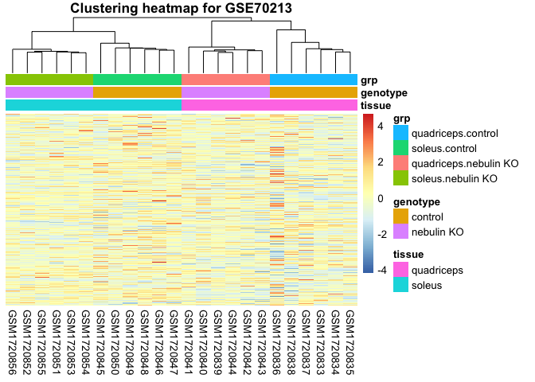

Exercise: Play with the options of the pheatmap function and compare the different heatmaps. Note that one can also use the original data data and set the option scale = "row". You will get the same heatmaps although the columns may be ordered differently (use cluster\_cols = FALSE to suppress reordering).

``` r
# set pheatmap clustering parameters
clust_dist_col = "euclidean"  #‘'correlation'’ for Pearson correlation, ‘'euclidean'’, ‘'maximum'’, ‘'manhattan'’, ‘'canberra'’, ‘'binary'’ or ‘'minkowski'’
clust_method = "ward.D2"  #‘'ward.D'’, ‘'ward.D2'’,‘'single'’, ‘'complete'’, ‘'average'’ (= UPGMA), ‘'mcquitty'’ (= WPGMA), ‘'median'’ (= WPGMC) or ‘'centroid'’ (= UPGMC)
clust_scale = "row"  #'column', 'none', 'row'

## the annotation option uses the covariate object (prDes) we defined. It should
## have the same rownames, as the colnames in our data object (data_to_plot).

pheatmap(data, cluster_rows = FALSE, scale = clust_scale, clustering_method = clust_method, 
    clustering_distance_cols = clust_dist_col , show_colnames = T, show_rownames = FALSE, 
    main = "Clustering heatmap for GSE70213", annotation = prDes[, c("tissue", "genotype", 
        "grp")])
```

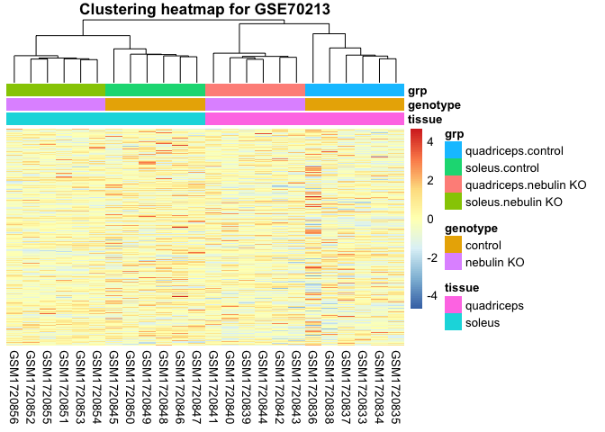

We can also change the colours of the different covariates. As you see, this can help differentiate important variables and the clustering trends.

``` r
## We can change the colours of the covariates
var1 = c("orange1", "darkred")
names(var1) = levels(prDes$tissue)
var2 = c("grey", "black")
names(var2) = levels(prDes$genotype)
var3 = c("pink1", "pink3", "lightblue1", "blue3")
names(var3) = levels(as.factor(prDes$grp))
covar_color = list(tissue = var1, genotype = var2, grp = var3)

my_heatmap_obj = pheatmap(data_to_plot, cluster_rows = FALSE, scale = clust_scale, 
    clustering_method = clust_method, clustering_distance_cols = clust_dist_col, 
    show_rownames = FALSE, main = "Clustering heatmap for GSE70213", annotation = prDes[, 
        c("tissue", "genotype", "grp")], annotation_colors = covar_color)
```

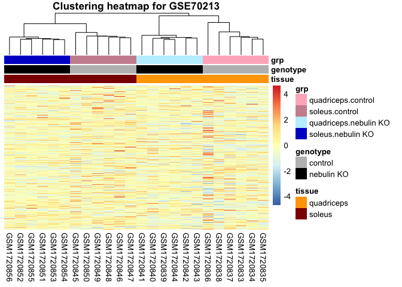

We can also get clusters from our pheatmap object. We will use the cutree function to extract the clusters. Note that we can do this for samples (look at the tree\_col) or for genes (look at the tree\_row).

``` r
cluster_samples = cutree(my_heatmap_obj$tree_col, k = 10)
# cluster_genes = cutree(my_heatmap_obj$tree_row, k=100)
kable(cluster_samples)
```

|            |    x|
|------------|----:|
| GSM1720833 |    1|
| GSM1720834 |    1|
| GSM1720835 |    1|
| GSM1720836 |    2|
| GSM1720837 |    1|
| GSM1720838 |    3|
| GSM1720839 |    4|
| GSM1720840 |    4|
| GSM1720841 |    5|
| GSM1720842 |    4|
| GSM1720843 |    4|
| GSM1720844 |    4|
| GSM1720845 |    6|
| GSM1720846 |    7|
| GSM1720847 |    7|
| GSM1720848 |    7|
| GSM1720849 |    8|
| GSM1720850 |    9|
| GSM1720851 |   10|
| GSM1720852 |   10|
| GSM1720853 |   10|
| GSM1720854 |   10|
| GSM1720855 |   10|
| GSM1720856 |   10|

Note you can do this with the base hclust method too, as shown here. We are using one of the hclust objects we defined earlier in this document.

``` r
# identify 10 clusters
op <- par(mar = c(1, 4, 4, 1))
plot(pr.hc.w, labels = prDes$grp, cex = 0.6, main = "Ward showing 10 clusters")
rect.hclust(pr.hc.w, k = 10)
```

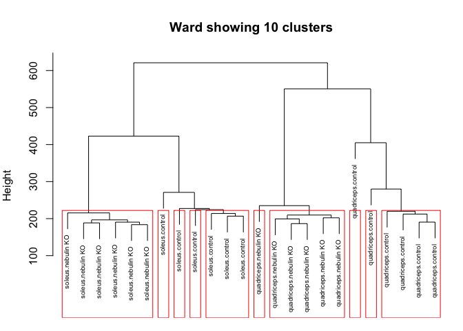

``` r
par(op)
```

We can save the heatmap we made, to a PDF file for reference. Remember to define the filename properly as the file will be saved relative to where you are running the script in your directory structure.

``` r
# Save the heatmap to a PDF file
pdf("GSE70213_Heatmap.pdf")
pheatmap(data_to_plot, cluster_rows = F, scale = clust_scale, clustering_method = clust_method, 
    clustering_distance_cols = clust_dist_col, annotation = prDes[, c("tissue", "genotype", 
        "grp")], annotation_colors = covar_color)
dev.off()
```

    ## pdf 
    ##   3

Part II: Parametric and Alternative Non-Parametric Clustering with PCA and t-SNE
--------------------------------------------------------------------------------

### Partitioning methods for mice knockout data

We can build clusters bottom-up from our data, via agglomerative hierarchical clustering. This method produces a dendrogram. As a different algorithmic approach, we can pre-determine the number of clusters (k), iteratively pick different 'cluster representatives', called centroids, and assign the closest remaining samples to it, until the solution converges to stable clusters. This way, we can find the best way to divide the data into the k clusters in this top-down clustering approach.

The centroids can be determined by different means, as covered in lecture already. We will be covering two approaches, k-means (implemented in kmeans function), and k-medoids (implemented in the pam function).

`Note that the results depend on the initial values (randomly generated) to create the first k clusters. In order to get the same results, you need to set many initial points (see the parameter nstart).`

**K-means clustering**

Keep in mind that k-means makes certain assumptions about the data that may not always hold:

-   Variance of distribution of each variable (in our case, genes) is spherical
-   All variables have the same variance
-   A prior probability that all k clusters have the same number of members

Often, we have to try different 'k' values before we identify the most suitable k-means decomposition. We can look at the mutual information loss as clusters increase in count, to determine the number of clusters to use.

Here we'll just do a k-means clustering of samples using all genes (~35K).

``` r
# Objects in columns
set.seed(31)
k <- 5
pr.km <- kmeans(t(data_to_plot), centers = k, nstart = 50)

# We can look at the within sum of squares of each cluster
pr.km$withinss
```

    ## [1] 131484.25  95226.22 107233.61 103083.34      0.00

``` r
# We can look at the composition of each cluster
pr.kmTable <- data.frame(exptStage = prDes$grp, cluster = pr.km$cluster)
kable(pr.kmTable)
```

|            | exptStage             |  cluster|
|------------|:----------------------|--------:|
| GSM1720833 | quadriceps.control    |        4|
| GSM1720834 | quadriceps.control    |        4|
| GSM1720835 | quadriceps.control    |        4|
| GSM1720836 | quadriceps.control    |        5|
| GSM1720837 | quadriceps.control    |        4|
| GSM1720838 | quadriceps.control    |        4|
| GSM1720839 | quadriceps.nebulin KO |        3|
| GSM1720840 | quadriceps.nebulin KO |        3|
| GSM1720841 | quadriceps.nebulin KO |        3|
| GSM1720842 | quadriceps.nebulin KO |        3|
| GSM1720843 | quadriceps.nebulin KO |        3|
| GSM1720844 | quadriceps.nebulin KO |        3|
| GSM1720845 | soleus.control        |        1|
| GSM1720846 | soleus.control        |        1|
| GSM1720847 | soleus.control        |        1|
| GSM1720848 | soleus.control        |        1|
| GSM1720849 | soleus.control        |        1|
| GSM1720850 | soleus.control        |        1|
| GSM1720851 | soleus.nebulin KO     |        2|
| GSM1720852 | soleus.nebulin KO     |        2|
| GSM1720853 | soleus.nebulin KO     |        2|
| GSM1720854 | soleus.nebulin KO     |        2|
| GSM1720855 | soleus.nebulin KO     |        2|
| GSM1720856 | soleus.nebulin KO     |        2|

`Repeat the analysis using a different seed and check if you get the same clusters.` Helpful info and tips:

-   An aside on set.seed(): Normally you might not need to set this; R will pick one. But if you are doing a "real" experiment and using methods that require random number generation, you should consider it when finalizing an analysis. The reason is that your results might come out slightly different each time you run it. To ensure that you can exactly reproduce the results later, you should set the seed (and record what you set it to). Of course if your results are highly sensitive to the choice of seed, that indicates a problem. In the case above, we're just choosing genes for an exercise so it doesn't matter, but setting the seed makes sure all students are looking at the same genes.

**PAM algorithm**

In K-medoids clustering, K representative objects (= medoids) are chosen as cluster centers and objects are assigned to the center (= medoid = cluster) with which they have minimum dissimilarity (Kaufman and Rousseeuw, 1990). Nice features of partitioning around medoids (PAM) are: (a) it accepts a dissimilarity matrix (use diss = TRUE). (b) it is more robust to outliers as the centroids of the clusters are data objects, unlike k-means.

We will determine the optimal number of clusters in this experiment, by looking at the average silhouette value. This is a stastistic introduced in the PAM algorithm, which lets us identify a suitable k.

``` r
pr.pam <- pam(pr.dis, k = k)
pr.pamTable <- data.frame(exptStage = prDes$grp, cluster = pr.pam$clustering)
kable(pr.pamTable)
```

|            | exptStage             |  cluster|
|------------|:----------------------|--------:|
| GSM1720833 | quadriceps.control    |        1|
| GSM1720834 | quadriceps.control    |        1|
| GSM1720835 | quadriceps.control    |        1|
| GSM1720836 | quadriceps.control    |        2|
| GSM1720837 | quadriceps.control    |        1|
| GSM1720838 | quadriceps.control    |        3|
| GSM1720839 | quadriceps.nebulin KO |        3|
| GSM1720840 | quadriceps.nebulin KO |        3|
| GSM1720841 | quadriceps.nebulin KO |        3|
| GSM1720842 | quadriceps.nebulin KO |        3|
| GSM1720843 | quadriceps.nebulin KO |        3|
| GSM1720844 | quadriceps.nebulin KO |        3|
| GSM1720845 | soleus.control        |        4|
| GSM1720846 | soleus.control        |        5|
| GSM1720847 | soleus.control        |        5|
| GSM1720848 | soleus.control        |        5|
| GSM1720849 | soleus.control        |        5|
| GSM1720850 | soleus.control        |        4|
| GSM1720851 | soleus.nebulin KO     |        4|
| GSM1720852 | soleus.nebulin KO     |        4|
| GSM1720853 | soleus.nebulin KO     |        4|
| GSM1720854 | soleus.nebulin KO     |        4|
| GSM1720855 | soleus.nebulin KO     |        4|
| GSM1720856 | soleus.nebulin KO     |        4|

`Additional information on the PAM result is available through summary(pr.pam)`

**The silhouette plot** The cluster package contains the function silhouette() that compares the minimum average dissimilarity of each object to other clusters with the average dissimilarity to objects in its own cluster. The resulting measure is called the "width of each object's silhouette". A value close to 1 indicates that the object is similar to objects in its cluster compared to those in other clusters. Thus, the average of all objects silhouette widths gives an indication of how well the clusters are defined.

``` r
op <- par(mar = c(5, 1, 4, 4))
plot(pr.pam, main = "Silhouette Plot for 5 clusters")
```

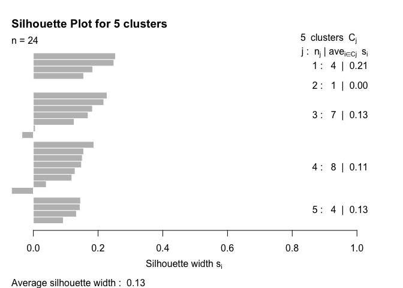

``` r
par(op)
```

**Take-home problem** (1)draw a plot with number of clusters in the x-axis and the average silhouette widths in the y-axis. Use the information obtained to determine if 5 was the best choice for the number of clusters.

``` r
  plot(c(1:5), pr.pam$silinfo$clus.avg.widths)
```

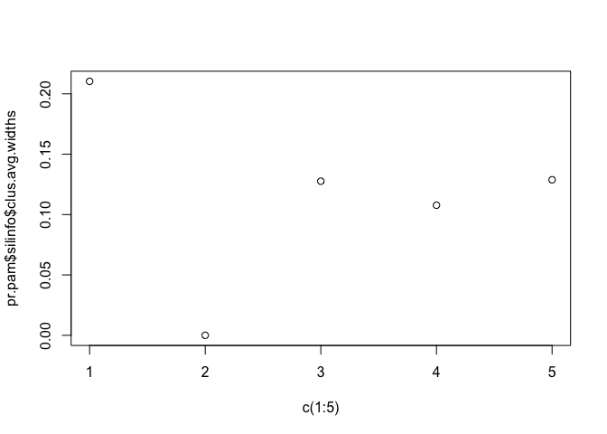

I think that we could choose 3 clusters because the average silhouette widths are similar after choosing 3 clusters. 5 maynot be a good choice because the the value of average silhouette is too small.

(2)For a common choice of k, compare the clustering across different methods, e.g. hierarchical (pruned to specific k, obviously), k-means, PAM. You will re-discover the "label switching problem" for yourself. How does that manifest itself? How concordant are the clusterings for different methods?

``` r
## hierachical data
cluster_samples = cutree(my_heatmap_obj$tree_col, k = 5)
# cluster_genes = cutree(my_heatmap_obj$tree_row, k=100)

kable(cluster_samples)
```

|            |    x|
|------------|----:|
| GSM1720833 |    1|
| GSM1720834 |    1|
| GSM1720835 |    1|
| GSM1720836 |    2|
| GSM1720837 |    1|
| GSM1720838 |    1|
| GSM1720839 |    3|
| GSM1720840 |    3|
| GSM1720841 |    3|
| GSM1720842 |    3|
| GSM1720843 |    3|
| GSM1720844 |    3|
| GSM1720845 |    4|
| GSM1720846 |    4|
| GSM1720847 |    4|
| GSM1720848 |    4|
| GSM1720849 |    4|
| GSM1720850 |    4|
| GSM1720851 |    5|
| GSM1720852 |    5|
| GSM1720853 |    5|
| GSM1720854 |    5|
| GSM1720855 |    5|
| GSM1720856 |    5|

``` r
## We can look at the composition of each cluster
kable(pr.kmTable)
```

|            | exptStage             |  cluster|
|------------|:----------------------|--------:|
| GSM1720833 | quadriceps.control    |        4|
| GSM1720834 | quadriceps.control    |        4|
| GSM1720835 | quadriceps.control    |        4|
| GSM1720836 | quadriceps.control    |        5|
| GSM1720837 | quadriceps.control    |        4|
| GSM1720838 | quadriceps.control    |        4|
| GSM1720839 | quadriceps.nebulin KO |        3|
| GSM1720840 | quadriceps.nebulin KO |        3|
| GSM1720841 | quadriceps.nebulin KO |        3|
| GSM1720842 | quadriceps.nebulin KO |        3|
| GSM1720843 | quadriceps.nebulin KO |        3|
| GSM1720844 | quadriceps.nebulin KO |        3|
| GSM1720845 | soleus.control        |        1|
| GSM1720846 | soleus.control        |        1|
| GSM1720847 | soleus.control        |        1|
| GSM1720848 | soleus.control        |        1|
| GSM1720849 | soleus.control        |        1|
| GSM1720850 | soleus.control        |        1|
| GSM1720851 | soleus.nebulin KO     |        2|
| GSM1720852 | soleus.nebulin KO     |        2|
| GSM1720853 | soleus.nebulin KO     |        2|
| GSM1720854 | soleus.nebulin KO     |        2|
| GSM1720855 | soleus.nebulin KO     |        2|
| GSM1720856 | soleus.nebulin KO     |        2|

``` r
## Pam
kable(pr.pamTable)
```

|            | exptStage             |  cluster|
|------------|:----------------------|--------:|
| GSM1720833 | quadriceps.control    |        1|
| GSM1720834 | quadriceps.control    |        1|
| GSM1720835 | quadriceps.control    |        1|
| GSM1720836 | quadriceps.control    |        2|
| GSM1720837 | quadriceps.control    |        1|
| GSM1720838 | quadriceps.control    |        3|
| GSM1720839 | quadriceps.nebulin KO |        3|
| GSM1720840 | quadriceps.nebulin KO |        3|
| GSM1720841 | quadriceps.nebulin KO |        3|
| GSM1720842 | quadriceps.nebulin KO |        3|
| GSM1720843 | quadriceps.nebulin KO |        3|
| GSM1720844 | quadriceps.nebulin KO |        3|
| GSM1720845 | soleus.control        |        4|
| GSM1720846 | soleus.control        |        5|
| GSM1720847 | soleus.control        |        5|
| GSM1720848 | soleus.control        |        5|
| GSM1720849 | soleus.control        |        5|
| GSM1720850 | soleus.control        |        4|
| GSM1720851 | soleus.nebulin KO     |        4|
| GSM1720852 | soleus.nebulin KO     |        4|
| GSM1720853 | soleus.nebulin KO     |        4|
| GSM1720854 | soleus.nebulin KO     |        4|
| GSM1720855 | soleus.nebulin KO     |        4|
| GSM1720856 | soleus.nebulin KO     |        4|

The result of hierachical and K-means are similar, only a few sample is different.

Gene clustering
---------------

A different view at the data can be obtained from clustering genes instead of samples. Since clustering genes is slow when you have a lot of genes, for the sake of time we will work with a smaller subset of genes.

In many cases, analysts use cluster analysis to illustrate the results of a differential expression analysis. Sample clustering following a differential expression (DE) analysis will probably show the separation of the groups identified by the DE analysis. Thus, as it was mentioned in lectures, we need to be careful in over-interpreting these kind of results. However, note that it is valid to perform a gene clustering to see if differential expressed genes cluster according to their function, subcellular localizations, pathways, etc.

``` r
cutoff <- 1e-05
DesMat <- model.matrix(~grp, prDes)
dsFit <- lmFit(sprDat, DesMat)
dsEbFit <- eBayes(dsFit)
dsHits <- topTable(dsEbFit, coef = grep("grp", colnames(coef(dsEbFit))), p.value = cutoff, 
    n = Inf)
numBHhits <- nrow(dsHits)

topGenes <- rownames(dsHits)

# Scaled data of topGenes
topDat <- sprDat[topGenes, ]
```

We start by using different clustering algorithms to cluster the top 897 genes that showed differential expression across the different developmental stage (BH adjusted p value &lt; 10^{-5}).

**Agglomerative Hierarchical Clustering**

We can plot the heatmap using the pheatmap function....

``` r
pheatmap(topDat, cluster_rows = TRUE, scale = "none", clustering_method = "average", 
    clustering_distance_cols = "euclidean", clustering_distance_rows = "euclidean", 
    annotation = prDes[, c("tissue", "genotype", "grp")], show_rownames = FALSE, 
    annotation_colors = covar_color)
```

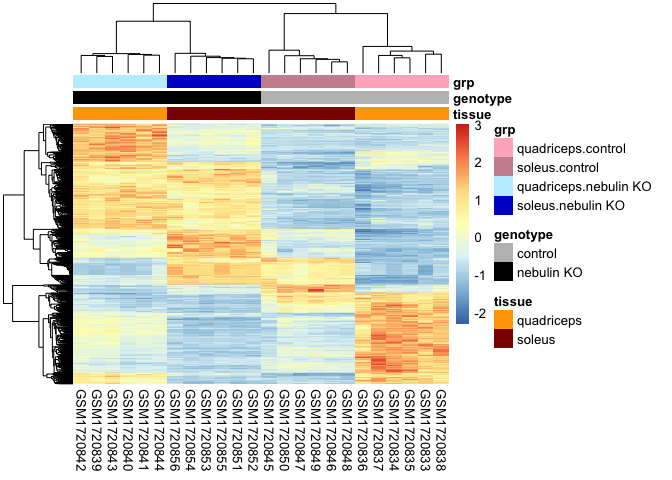 Or we can plot the heatmap using the plot function, after we have made the hclust object....

``` r
geneC.dis <- dist(topDat, method = "euclidean")

geneC.hc.a <- hclust(geneC.dis, method = "average")

plot(geneC.hc.a, labels = FALSE, main = "Hierarchical with Average Linkage", xlab = "")
```

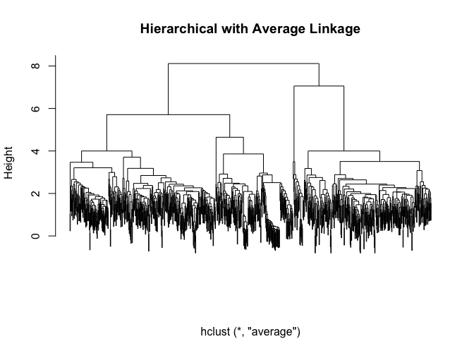

As you can see, when there are lots of objects to cluster, the dendrograms are in general not very informative as it is difficult to identify any interesting pattern in the data.

**Partitioning Methods**

The most interesting thing to look at is the cluster centers (basically the "prototype" for the cluster) and membership sizes. Then we can try to visualize the genes that are in each cluster.

Let's visualize a cluster (remember the data were rescaled) using line plots. This makes sense since we also want to be able to see the cluster center.

``` r
set.seed(1234)
k <- 5
kmeans.genes <- kmeans(topDat, centers = k)

# choose which cluster we want
clusterNum <- 2

# Set up the axes without plotting; ylim set based on trial run.
plot(kmeans.genes$centers[clusterNum, ], ylim = c(0, 10), type = "n", xlab = "Samples", 
    ylab = "Relative expression")

# Plot the expression of all the genes in the selected cluster in grey.
matlines(y = t(topDat[kmeans.genes$cluster == clusterNum, ]), col = "grey")

# Add the cluster center. This is last so it isn't underneath the members
points(kmeans.genes$centers[clusterNum, ], type = "l")

# Optional: colored points to show which stage the samples are from.
points(kmeans.genes$centers[clusterNum, ], col = prDes$grp, pch = 20)

axis(1, at=1:length(kmeans.genes$centers[clusterNum, ]), labels=prDes$sample_name) 
```

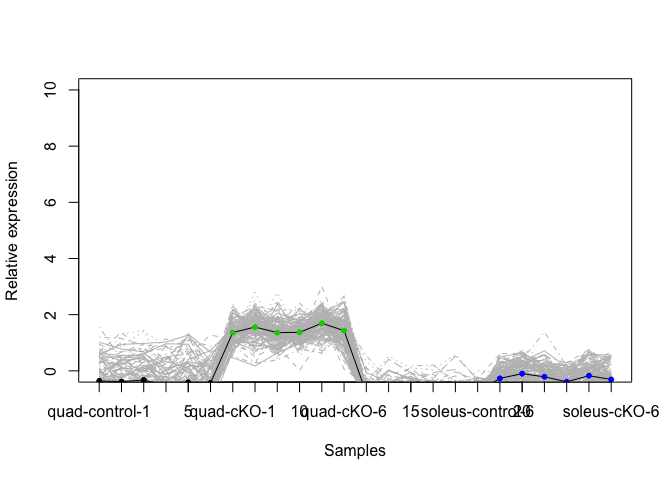

Evaluating clusters
-------------------

### Choosing the right k

As mentioned in Lecture 12, we need to find a balance between accurately grouping similar data into one representative cluster and the “cost” of adding additional clusters. Sometimes we don't have any prior knowledge to tell us how many clusters there are supposed to be in our data. In this case, we can use Akaike information criterion (AIC) and Bayesian information criterion (BIC) to help us to choose a proper k.

First, we calculate the AIC for each choice of k. We are clustering the samples in this example:

``` r
set.seed(31)

k_max <- 10  # the max number of clusters to explore clustering with 
km_fit <- list()  # create empty list to store the kmeans object

for (i in 1:k_max) {
    k_cluster <- kmeans(t(sprDat), centers = i, nstart = 50)
    km_fit[[i]] <- k_cluster
}


# calculate AIC
km_AIC <- function(km_cluster) {
    m <- ncol(km_cluster$centers)
    n <- length(km_cluster$cluster)
    k <- nrow(km_cluster$centers)
    D <- km_cluster$tot.withinss
    return(D + 2 * m * k)
}
```

Then, we plot the AIC vs. the number of clusters. We want to choose the k value that corresponds to the elbow point on the AIC/BIC curve.

``` r
aic <- sapply(km_fit, km_AIC)
plot(seq(1, k_max), aic, xlab = "Number of clusters", ylab = "AIC", pch = 20, cex = 2, 
    main = "Clustering Samples")
```

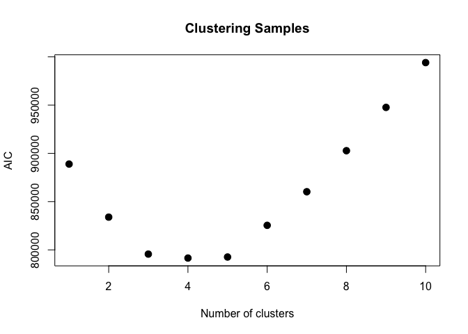

``` r
# calculate BIC
km_BIC <- function(km_cluster) {
    m <- ncol(km_cluster$centers)
    n <- length(km_cluster$cluster)
    k <- nrow(km_cluster$centers)
    D <- km_cluster$tot.withinss
    return(D + log(n) * m * k)
}

bic <- sapply(km_fit, km_BIC)
plot(seq(1, k_max), bic, xlab = "Number of clusters", ylab = "BIC", pch = 20, cex = 2, 
    main = "Clustering Samples")
```

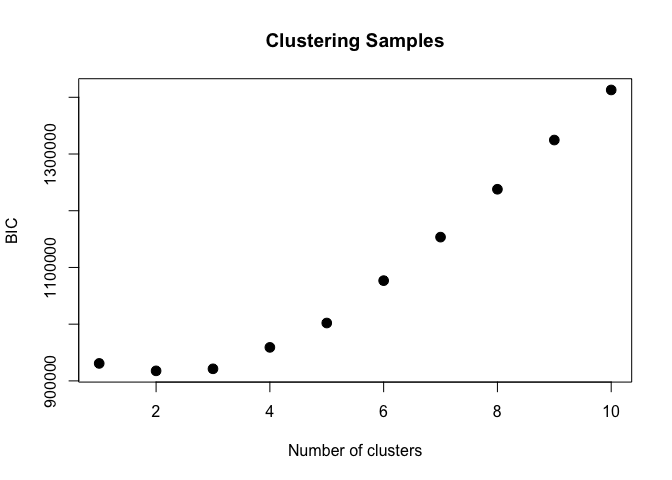

### Statistical methods

An important issue for clustering is the question of certainty of the cluster membership. Clustering always gives you an answer, even if there aren't really any underlying clusters. There are many ways to address this. Here we introduce an approachable one offered in R, pvclust, which you can read about at (<http://www.sigmath.es.osaka-u.ac.jp/shimo-lab/prog/pvclust/>).

`Important: pvclust clusters the columns. I don't recommend doing this for genes! The computation will take a very long time. Even the following example with all 30K genes will take some time to run.` `You control how many bootstrap iterations pvclust does with the nboot parameter. We've also noted that pvclust causes problems on some machines, so if you have trouble with it, it's not critical.`

Unlike picking the right clusters in the partition based methods (like k-means and PAM), here we are identifying the most stable clustering arising from hierarchichal clustering.

``` r
pvc <- pvclust(topDat, nboot = 100)
```

    ## Bootstrap (r = 0.5)... Done.
    ## Bootstrap (r = 0.6)... Done.
    ## Bootstrap (r = 0.7)... Done.
    ## Bootstrap (r = 0.8)... Done.
    ## Bootstrap (r = 0.9)... Done.
    ## Bootstrap (r = 1.0)... Done.
    ## Bootstrap (r = 1.1)... Done.
    ## Bootstrap (r = 1.2)... Done.
    ## Bootstrap (r = 1.3)... Done.
    ## Bootstrap (r = 1.4)... Done.

``` r
plot(pvc, labels = prDes$grp, cex = 0.6)
pvrect(pvc, alpha = 0.95)
```

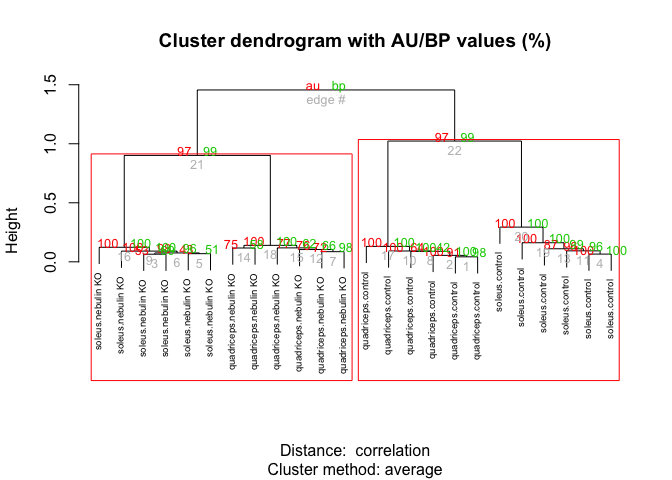

Feature reduction
-----------------

There are various ways to reduce the number of features (variables) being used in our clustering analyses. We have already shown how to subset the number of variables (genes) based on variance, calculated using the limma package.

### PCA plots

The other way we can do this is using PCA (principal components analysis). PCA assumes that the most important characteristics of our data are the ones with the largest variance. Furthermore, it takes our data and organizes it in such a way that redundancy is removed as the most important variables are listed first. The new variables will be linear combinations of the original variables, with different weights.

In R, we can use prcomp() to do PCA. You can also use svd(). `Scaling is suppressed because we already scaled the rows. You can experiment with this to see what happens.`

``` r
pcs <- prcomp(sprDat, center = FALSE, scale = FALSE)

# scree plot
plot(pcs)
```

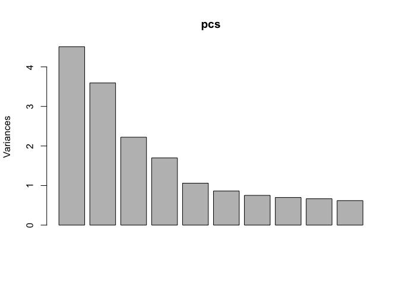

``` r
# append the rotations for the first 10 PCs to the phenodata
prinComp <- cbind(prDes, pcs$rotation[rownames(prDes), 1:10])

# scatter plot showing us how the first few PCs relate to covariates
plot(prinComp[, c("genotype", "tissue", "PC1", "PC2", "PC3")], pch = 19, cex = 0.8)
```

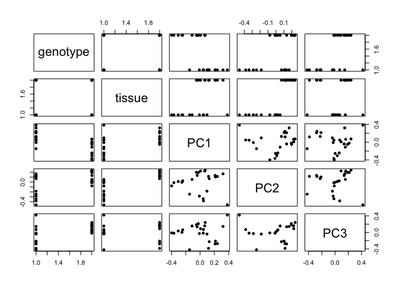

What does the samples spread look like, as explained by their first 2 principal components?

``` r
plot(prinComp[, c("PC1", "PC2")], pch = 21, cex = 1.5)
```

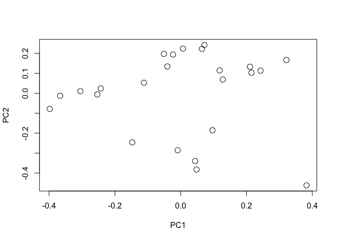

Is the covariate tissue localized in the different clusters we see?

``` r
plot(prinComp[, c("PC1", "PC2")], bg = prDes$tissue, pch = 21, cex = 1.5)
legend(list(x = 0.2, y = 0.3), as.character(levels(prDes$tissue)), pch = 21, pt.bg = c(1, 
    2, 3, 4, 5))
```

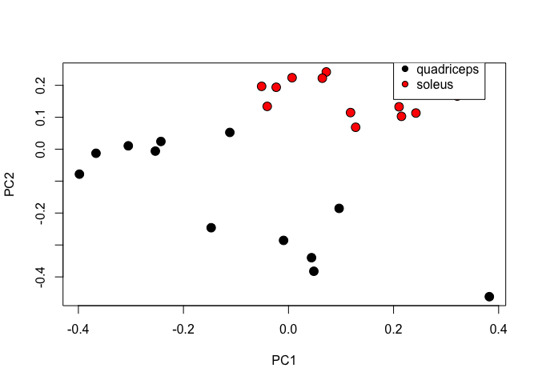 Is the covariate genotype localized in the different clusters we see?

``` r
plot(prinComp[, c("PC1", "PC2")], bg = prDes$genotype, pch = 21, cex = 1.5)
legend(list(x = 0.2, y = 0.3), as.character(levels(prDes$genotype)), pch = 21, pt.bg = c(1, 
    2, 3, 4, 5))
```

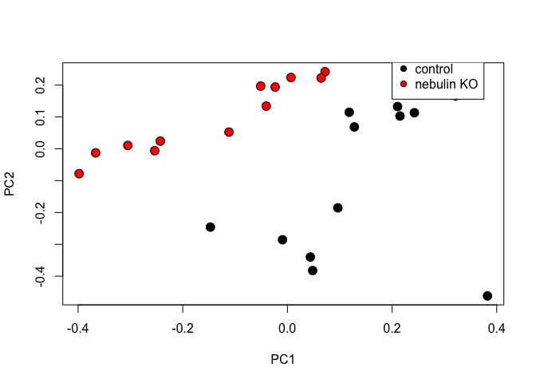

PCA is a useful initial means of analysing any hidden structures in your data. We can also use it to determine how many sources of variance are important, and how the different features interact to produce these sources.

First, let us first assess how much of the total variance is captured by each principal component.

``` r
# Get the subset of PCs that capture the most variance in your predictors
summary(pcs)
```

    ## Importance of components:
    ##                           PC1    PC2     PC3     PC4     PC5     PC6
    ## Standard deviation     2.1235 1.8957 1.49067 1.30336 1.02878 0.92795
    ## Proportion of Variance 0.1961 0.1562 0.09661 0.07386 0.04602 0.03744
    ## Cumulative Proportion  0.1961 0.3523 0.44890 0.52276 0.56877 0.60621
    ##                            PC7     PC8     PC9    PC10    PC11    PC12
    ## Standard deviation     0.86674 0.83534 0.81621 0.78678 0.77243 0.76143
    ## Proportion of Variance 0.03266 0.03034 0.02896 0.02691 0.02594 0.02521
    ## Cumulative Proportion  0.63887 0.66921 0.69817 0.72509 0.75103 0.77623
    ##                          PC13    PC14    PC15    PC16    PC17    PC18
    ## Standard deviation     0.7477 0.73139 0.72127 0.70872 0.69406 0.67519
    ## Proportion of Variance 0.0243 0.02326 0.02262 0.02184 0.02094 0.01982
    ## Cumulative Proportion  0.8005 0.82379 0.84641 0.86825 0.88919 0.90901
    ##                           PC19    PC20    PC21    PC22    PC23      PC24
    ## Standard deviation     0.67423 0.65740 0.64933 0.62812 0.62433 6.079e-15
    ## Proportion of Variance 0.01976 0.01879 0.01833 0.01715 0.01695 0.000e+00
    ## Cumulative Proportion  0.92878 0.94757 0.96590 0.98305 1.00000 1.000e+00

We see that the first two principal components capture 35% of the total variance. If we include the first 11 principal components, we capture 75% of the total variance. Depending on which of these subsets you want to keep, we will select the rotated data from the first n components. We can use the tol parameter in prcomp to remove trailing PCs.

``` r
pcs_2dim = prcomp(sprDat, center = FALSE, scale = FALSE, tol = 0.8)
```

It is commonly seen a cluster analysis on the first 3 principal components to illustrate and explore the data.

t-SNE plots
-----------

When we are dealing with datasets that have thousands of variables, and we want to have an initial pass at identifying hidden patterns in the data, another method we can use as an alterative to PCA is t-SNE. This method allows for non-linear interactions between our features.

Importantly, there are certain caveats with using t-SNE.

1.  Solutions are not deterministic: While in PCA the correct solution to a question is guaranteed, t-SNE can have many multiple minima, and might give many different optimal solutions. It is hence non-deterministic. This may make it challenging to generate reproducible results.
2.  Clusters are not intuitive: t-SNE collapses similar points in high dimensional space, on top of each other in lower dimensions. This means it maps features that are proximal to each other in a way that global trends may be warped. On the other hand, PCA always rotates our features in specific ways that can be extracted by considering the covariance matrix of our initial dataset and the eigenvectors in the new coordinate space.
3.  Applying our fit to new data: t-SNE embedding is generated by moving all our data to a lower dimensional state. It does not give us eigenvectors (like PCA does) that can map new/unseen data to this lower dimensional state. The computational costs of t-SNE are also quite expensive, and finding an embedding in lower space that makes sense may often require extensive fientuning of several hyperparameters.

We will be using the Rtsne package to visualize our data using t-SNE. In this plot we are changing the perplexity parameter for the two different plots. As you see, the outputs are remarkably different.

``` r
# install.packages('Rtsne')
library(Rtsne)
colors = rainbow(length(unique(prDes$grp)))
names(colors) = unique(prDes$grp)
tsne <- Rtsne(unique(t(sprDat)), dims = 2, perplexity = 0.1, verbose = TRUE, max_iter = 100)
```

    ## Performing PCA
    ## Read the 24 x 24 data matrix successfully!
    ## OpenMP is working. 1 threads.
    ## Using no_dims = 2, perplexity = 0.100000, and theta = 0.500000
    ## Computing input similarities...
    ## Perplexity should be lower than K!
    ## Building tree...
    ## Done in 0.00 seconds (sparsity = 0.000000)!
    ## Learning embedding...
    ## Iteration 50: error is 0.000000 (50 iterations in 0.00 seconds)
    ## Iteration 100: error is 0.000000 (50 iterations in 0.00 seconds)
    ## Fitting performed in 0.00 seconds.

``` r
plot(tsne$Y, main = "tsne")
text(tsne$Y, labels = prDes$grp, col = colors[prDes$grp])
```

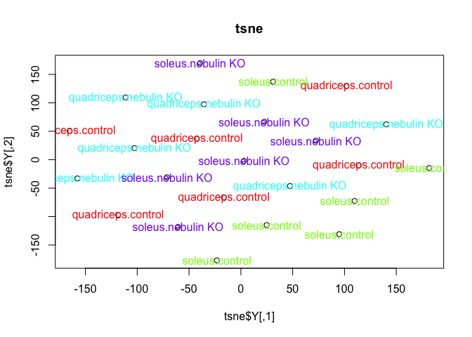

``` r
tsne_p1 <- Rtsne(unique(t(sprDat)), dims = 2, perplexity = 1, verbose = TRUE, max_iter = 100)
```

    ## Performing PCA
    ## Read the 24 x 24 data matrix successfully!
    ## OpenMP is working. 1 threads.
    ## Using no_dims = 2, perplexity = 1.000000, and theta = 0.500000
    ## Computing input similarities...
    ## Building tree...
    ## Done in 0.00 seconds (sparsity = 0.163194)!
    ## Learning embedding...
    ## Iteration 50: error is 62.489392 (50 iterations in 0.00 seconds)
    ## Iteration 100: error is 58.480260 (50 iterations in 0.00 seconds)
    ## Fitting performed in 0.00 seconds.

``` r
plot(tsne_p1$Y, main = "tsne")
text(tsne_p1$Y, labels = prDes$grp, col = colors[prDes$grp])
```

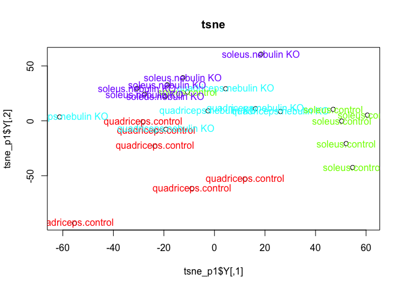

Deliverables
------------

-   Regenerate the pheatmap clustering plot for the top genes, selected from limma, using clustering distance: correlation, and clustering method: mcquitty.

``` r
#Heatmap
pheatmap(topDat, cluster_rows = TRUE, scale = "none", clustering_method = "mcquitty", 
    clustering_distance_cols = "correlation", clustering_distance_rows = "correlation", 
    annotation = prDes[, c("tissue", "genotype", "grp")], show_rownames = FALSE, 
    annotation_colors = covar_color)
```

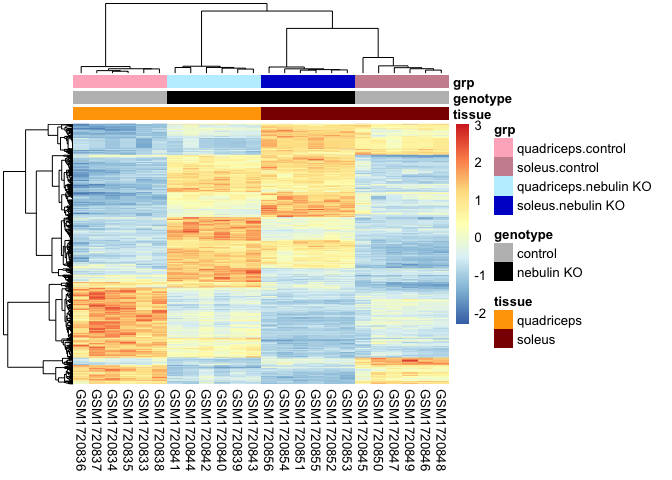

-   Regenerate the dendrogram on the samples of this heatmap using the hclust and dist functions.

``` r
cormat<- cor(topDat, method = "pearson")
cor_dist<-(2*(1-cormat))^(0.5)
cor_dist<-as.dist(cor_dist)

geneC.hc.a <- hclust(cor_dist, method = "mcquitty")

plot(geneC.hc.a, labels = FALSE, main = "Hierarchical with mcquitty Linkage", xlab = "")
```

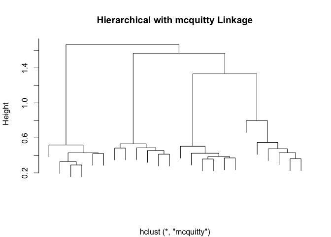

-   Plot the data for this analyses along PCs 1 and 2 using ggplot instead base plotting. Color the points by tissue

``` r
library(ggplot2)
library(tidyverse)
```

    ## ── Attaching packages ─────────────────────────────────────────────── tidyverse 1.2.1 ──

    ## ✔ tibble  2.0.1       ✔ purrr   0.3.0  
    ## ✔ tidyr   0.8.2       ✔ dplyr   0.8.0.1
    ## ✔ readr   1.3.1       ✔ stringr 1.4.0  
    ## ✔ tibble  2.0.1       ✔ forcats 0.4.0

    ## Warning: package 'tibble' was built under R version 3.5.2

    ## Warning: package 'dplyr' was built under R version 3.5.2

    ## Warning: package 'stringr' was built under R version 3.5.2

    ## Warning: package 'forcats' was built under R version 3.5.2

    ## ── Conflicts ────────────────────────────────────────────────── tidyverse_conflicts() ──
    ## ✖ dplyr::arrange()    masks plyr::arrange()
    ## ✖ dplyr::combine()    masks Biobase::combine(), BiocGenerics::combine()
    ## ✖ purrr::compact()    masks plyr::compact()
    ## ✖ tidyr::complete()   masks RCurl::complete()
    ## ✖ dplyr::count()      masks plyr::count()
    ## ✖ dplyr::failwith()   masks plyr::failwith()
    ## ✖ dplyr::filter()     masks stats::filter()
    ## ✖ dplyr::id()         masks plyr::id()
    ## ✖ dplyr::lag()        masks stats::lag()
    ## ✖ dplyr::mutate()     masks plyr::mutate()
    ## ✖ ggplot2::Position() masks BiocGenerics::Position(), base::Position()
    ## ✖ dplyr::rename()     masks plyr::rename()
    ## ✖ dplyr::summarise()  masks plyr::summarise()
    ## ✖ dplyr::summarize()  masks plyr::summarize()

``` r
prinComp %>% ggplot(aes( PC1,PC2, color=tissue))+
  geom_point()
```

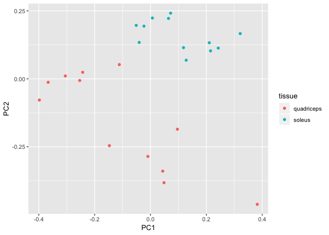
