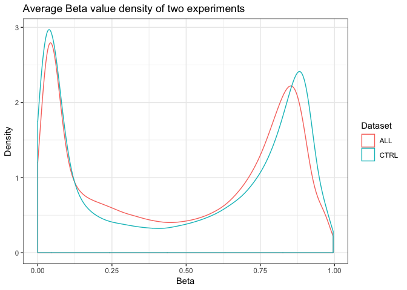
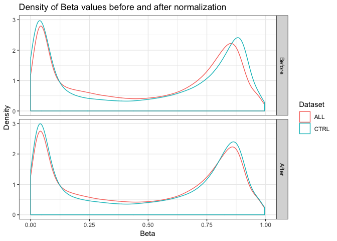
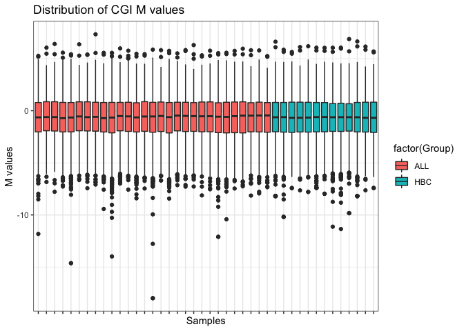
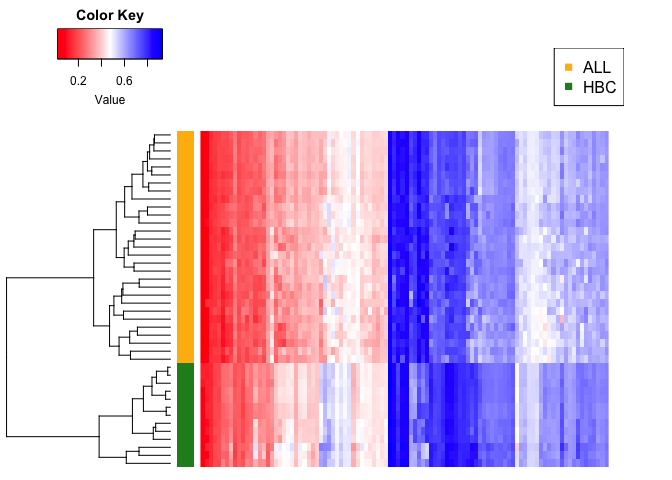
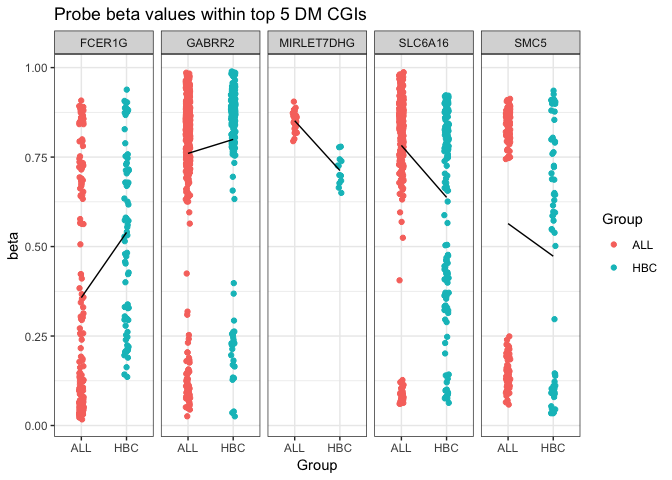
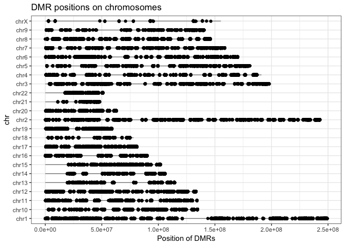

seminar 7
================
Yanchao
2019-03-04

Learning objectives
===================

By the end of this tutorial, you should be able to

-   Identify the basic steps in a methylation analysis pipeline.
-   Appreciate the role of normalization prior to analysis in methylation datasets, and know what M values are.
-   Undertake exploratory visual analysis of methylation data (ploting Beta value densities).
-   Undertake differential methylation analysis and annotate CpG island probes for interpretation.
-   Plot results from differential analysis (differentially methylated probes) across all chromosomes, to highlight areas under regulatory influence as per the methylation profiles.

Introduction
============

The Illumina Infiniumn Array is a microarray based high throughput platform for methylation profiling on 487,173 pre-selected probes for CpGs across the human genome. A great number of datasets have been made publicly available through Gene Expression Omnibus (GEO). Each dataset in GEO has a unique GSE ID that we can use to retrieve it from GEO. There are several Bioconductor packages that are very useful for obtaining data from GEO and microarray analysis. If you haven't done so yet, install and load these packages. The Illumina Infinium Methylation is an aggregation of the HumanMethylation27 and HumanMethylation450 annotations.

``` r
#install.packages("tidyverse")
#install.packages("gplots")
#source('http://bioconductor.org/biocLite.R')
#biocLite('GEOquery')
#biocLite('lumi')
#biocLite('limma')
#biocLite('FDb.InfiniumMethylation.hg19')
```

``` r
library(ggplot2)
library(GEOquery)
```

    ## Loading required package: Biobase

    ## Loading required package: BiocGenerics

    ## Loading required package: parallel

    ## 
    ## Attaching package: 'BiocGenerics'

    ## The following objects are masked from 'package:parallel':
    ## 
    ##     clusterApply, clusterApplyLB, clusterCall, clusterEvalQ,
    ##     clusterExport, clusterMap, parApply, parCapply, parLapply,
    ##     parLapplyLB, parRapply, parSapply, parSapplyLB

    ## The following objects are masked from 'package:stats':
    ## 
    ##     IQR, mad, sd, var, xtabs

    ## The following objects are masked from 'package:base':
    ## 
    ##     anyDuplicated, append, as.data.frame, basename, cbind,
    ##     colMeans, colnames, colSums, dirname, do.call, duplicated,
    ##     eval, evalq, Filter, Find, get, grep, grepl, intersect,
    ##     is.unsorted, lapply, lengths, Map, mapply, match, mget, order,
    ##     paste, pmax, pmax.int, pmin, pmin.int, Position, rank, rbind,
    ##     Reduce, rowMeans, rownames, rowSums, sapply, setdiff, sort,
    ##     table, tapply, union, unique, unsplit, which, which.max,
    ##     which.min

    ## Welcome to Bioconductor
    ## 
    ##     Vignettes contain introductory material; view with
    ##     'browseVignettes()'. To cite Bioconductor, see
    ##     'citation("Biobase")', and for packages 'citation("pkgname")'.

    ## Setting options('download.file.method.GEOquery'='auto')

    ## Setting options('GEOquery.inmemory.gpl'=FALSE)

``` r
library(limma)
```

    ## 
    ## Attaching package: 'limma'

    ## The following object is masked from 'package:BiocGenerics':
    ## 
    ##     plotMA

``` r
library(lumi)
library(FDb.InfiniumMethylation.hg19)
```

    ## Loading required package: GenomicFeatures

    ## Loading required package: S4Vectors

    ## Loading required package: stats4

    ## 
    ## Attaching package: 'S4Vectors'

    ## The following object is masked from 'package:base':
    ## 
    ##     expand.grid

    ## Loading required package: IRanges

    ## Loading required package: GenomeInfoDb

    ## Loading required package: GenomicRanges

    ## Loading required package: AnnotationDbi

    ## Loading required package: TxDb.Hsapiens.UCSC.hg19.knownGene

    ## Loading required package: org.Hs.eg.db

    ## 

Explore 450k methylation array data
===================================

In this seminar, we are going to perform differential methylation analysis for Acute lymphoblastic leukemia (ALL) cases and healthy B cells as control group. The datasets we are going to use are: GSE39141 which contains 29 ALL bone marrow samples and 4 healthy B cell samples, and to make up for the small sample size for healthy cells, we will also use GSE42865 which contains 9 healthy B cell samples and 7 samples with other conditions.

First, let's retrieve our datasets from GEO with getGEO from GEOquery package. Warning: this may take several minutes! So to avoid re-downloading in the future, save the data once you get it into a good shape.

As you can see, the datasets we got are large lists including Beta values as well as metadata. We can extract this information separately. Then we can isolate a subset of GSE42865 containing only the healthy cells.

IMPORTANT NOTE: Due to many factors (like server load, your internet connection, and more) downloading the following large dataset from GEO may take a considerable amount of time. To make your life easier a pre-formatted version of the data has been made available at this link. Just download it and place it next to your rmd file to be able to finish the assignment without waiting to download data from GEO.

``` r
load('~/Desktop/stat 540/methyl_ALL.RData')
```

Now, we can do some exploratory analysis of the data, for examples, looking at distribution of Beta values in each sample or each probe. Here is a density plot of average Beta values for probes in the two datasets. See if you get similar results. &gt; Hint: you can use rowMeans function to calculate the average Beta value for each probe. Don't forget to use na.rm = T to exclude NAs.

``` r
# density plot
library(ggplot2)
dat.probeMeans <- c(rowMeans(ALL.dat, na.rm = T), rowMeans(CTRL.dat, na.rm = T)) 
plotDat <- data.frame(Beta = dat.probeMeans,
                      Dataset = rep(c('ALL', 'CTRL'), each = nrow(ALL.dat)))
(probeAvg <- ggplot(data = plotDat, aes(x = Beta, col = Dataset)) +
   geom_density() + 
   ggtitle("Average Beta value density of two experiments") + 
   xlab("Beta") + 
   ylab("Density") + 
   theme_bw()
)
```



Data Normalization
==================

You can see the distribution of Beta values are not the same between different experiments. That is why it is important to normalize the data before proceeding. The Bioconductor package wateRmelon, for example, offers 15 methods for 450K methylation array normalization. If you are interested in comparing these methods, check out this paper. For the sake of convenience, we will just use the normalizeBetweenArrays method from our trusted friend limma which performs quantile normalization on the beta values.

``` r
# combine data from two experiments into one matrix, each column represents beta
# values of one sample
beta.matrix <- as.matrix(cbind(ALL.dat, CTRL.dat))
str(beta.matrix, max.level = 0)
```

    ##  num [1:485577, 1:42] 0.512 0.911 0.857 0.149 0.729 ...
    ##  - attr(*, "dimnames")=List of 2

``` r
# quantile normalization
system.time(beta.norm <- normalizeBetweenArrays(beta.matrix))
```

    ##    user  system elapsed 
    ##  19.391   2.509  22.065

``` r
##    user  system elapsed 
##  19.651   0.240  19.906
dat.probeMeans <- c(rowMeans(beta.norm[, 1:ncol(ALL.dat)], na.rm = TRUE),
                    rowMeans(beta.norm[, ncol(ALL.dat):ncol(beta.norm)], na.rm = TRUE)) 
plotNorm <-
  rbind(data.frame(plotDat, Norm = "Before"),
        data.frame(Beta = dat.probeMeans,
                   Dataset = rep(c('ALL', 'CTRL'), each = nrow(ALL.dat)),
                   Norm = "After"))
plotNorm$Norm <- factor(plotNorm$Norm, levels = c("Before", "After"))
(probeAvgNorm <- ggplot(data = plotNorm, aes(x = Beta, col = Dataset)) +
   geom_density() + 
   facet_grid(Norm ~ .) + 
   ggtitle("Density of Beta values before and after normalization") + 
   xlab("Beta") + 
   ylab("Density") + 
   theme_bw()
)
```



M values
========

As you can see, after normalization, beta values from the different experiments have more similar distributions. However, this distribution is on the interval \[0, 1\], with two modes near the two extremes. This type of distribution is not very compatible with the typical assumptions of linear models. A common solution is to apply a logit transformation on the data to convert it to a continuous variable that spans , i.e. compute the M value. The beta2m() function in the lumi package does this conversion.
$$M = log({Beta\\over 1-Beta})$$

``` r
M.norm <- beta2m(beta.norm)
```

CpG Islands
===========

Now we can go ahead with differential methylation analysis -- cases vs. controls or leukemia vs. healthy. You can perform this analysis on each probe, but in this seminar, we will aggregate the probes into CpG Islands (CGIs), i.e. the CpG dense regions of the genome, and then detect differentially methylated CGIs. The biological function of CGIs is better studied, so the interpretation of our results will be easier if we focus on CGIs. Conveniently, the Bioconductor package FDb.InfiniumMethylation.hg19 provides all sorts of annotation information for the 450K methylation array including the association of probes to CGIs. We will extract this information and use the mean of M values for all probes in a specific CGI to represent its methylation level. Check if you get the same boxplot for CGI M values.

``` r
#First get annotation data from FDb database  
InfiniumMethylation <- features(FDb.InfiniumMethylation.hg19)

## We only want annotations for the hg19 genome  
met <- metadata(FDb.InfiniumMethylation.hg19) ## need to fetch genome
genome(InfiniumMethylation) <- met[which(met[,'name']=='Genome'),'value']

InfiniumMethylation <- sort(InfiniumMethylation)
show(InfiniumMethylation)
```

    ## GRanges object with 487173 ranges and 14 metadata columns:
    ##              seqnames            ranges strand | addressA_450 addressB_450
    ##                 <Rle>         <IRanges>  <Rle> |  <character>  <character>
    ##   cg01686861    chr16       60748-60749      + |     36644319     45624454
    ##   cg05558259    chr16       61085-61086      + |     65765435             
    ##   cg26978960    chr16       62460-62461      + |     28717484             
    ##   cg03792876    chr16       73243-73244      + |     42725455             
    ##   cg09699726    chr16       91602-91603      + |     34629364             
    ##          ...      ...               ...    ... .          ...          ...
    ##   cg13808036     chrY 24453658-24453659      - |     47649309             
    ##   cg26983430     chrY 24549675-24549676      - |     24631411     26605360
    ##   cg17939569     chrY 27009430-27009431      - |     73757458             
    ##   cg13365400     chrY 27210334-27210335      - |     61745505             
    ##   cg14273923     chrY 28555912-28555913      - |     16749405             
    ##              addressA_27 addressB_27  channel450   channel27   probeType
    ##              <character> <character> <character> <character> <character>
    ##   cg01686861        <NA>        <NA>         Red        <NA>          cg
    ##   cg05558259        <NA>        <NA>        Both        <NA>          cg
    ##   cg26978960        <NA>        <NA>        Both        <NA>          cg
    ##   cg03792876        <NA>        <NA>        Both        <NA>          cg
    ##   cg09699726        <NA>        <NA>        Both        <NA>          cg
    ##          ...         ...         ...         ...         ...         ...
    ##   cg13808036        <NA>        <NA>        Both        <NA>          cg
    ##   cg26983430        <NA>        <NA>         Red        <NA>          cg
    ##   cg17939569        <NA>        <NA>        Both        <NA>          cg
    ##   cg13365400        <NA>        <NA>        Both        <NA>          cg
    ##   cg14273923        <NA>        <NA>        Both        <NA>          cg
    ##                percentGC    platform
    ##              <character> <character>
    ##   cg01686861        0.76       HM450
    ##   cg05558259        0.56       HM450
    ##   cg26978960        0.66       HM450
    ##   cg03792876        0.64       HM450
    ##   cg09699726        0.68       HM450
    ##          ...         ...         ...
    ##   cg13808036        0.64       HM450
    ##   cg26983430        0.56       HM450
    ##   cg17939569        0.42       HM450
    ##   cg13365400        0.44       HM450
    ##   cg14273923        0.48       HM450
    ##                                                       sourceSeq
    ##                                                     <character>
    ##   cg01686861 CGCCCCCAGGCCGGCGCCGTGCGACTTTGCTCCTGCAACACACGCCCCCC
    ##   cg05558259 CAGCTAGGGACATTGCAGGCTCCTCTTGCTCAAAGTGTAGTGGCAGCACG
    ##   cg26978960 CGGCCCAGTAGAGCCCTAGGGGTGACGCCACTCCCACTCACTGTCGACTC
    ##   cg03792876 ATGGAGGCTTGGGCGGGTCACCCCCAGTGCAGGCCAAGATGCAGGTTACG
    ##   cg09699726 GCACTAGAGCCCCAGGGCCAGGGGAGACCCAGCATCCAAGGTGCACCACG
    ##          ...                                                ...
    ##   cg13808036 CGGCGCCCACCCACTGCTGCCAGCCATCCCGAATTGACAGCTGCAAGGAT
    ##   cg26983430 CGTACGCCTGAGGGCCAGGCGAACCTCAGGCTCTTTGTCCTACTAAAAAG
    ##   cg17939569 CGCCTAAATAAGAATAGGAGTAAAGGAGAGTATTACCTCCAAATCACCGG
    ##   cg13365400 CGTCACCTGGATGCTGGTTTAAGTGATATATGAAAATCCACCCTAAGGAC
    ##   cg14273923 TGGTATTGGTGAAGTCTACCACTCCAGCTCGTAGACTTCCATAATCGTCG
    ##               probeStart    probeEnd probeTarget probeExtension
    ##              <character> <character> <character>    <character>
    ##   cg01686861       60700       60749       60748        60749.0
    ##   cg05558259       61037       61086       61085        61086.0
    ##   cg26978960       62412       62461       62460        62461.0
    ##   cg03792876       73195       73244       73243        73244.0
    ##   cg09699726       91554       91603       91602        91603.0
    ##          ...         ...         ...         ...            ...
    ##   cg13808036    24453658    24453707    24453658           <NA>
    ##   cg26983430    24549675    24549724    24549675           <NA>
    ##   cg17939569    27009430    27009479    27009430           <NA>
    ##   cg13365400    27210334    27210383    27210334           <NA>
    ##   cg14273923    28555912    28555961    28555912           <NA>
    ##   -------
    ##   seqinfo: 24 sequences from hg19 genome; no seqlengths

``` r
## Subset to probes that are present in 450k assay  
probes_450k = as.data.frame(InfiniumMethylation[InfiniumMethylation$platform %in% c("BOTH","HM450"),])
probes_450k$Probe_ID = rownames(probes_450k)
cginame_onlycg = probes_450k[probes_450k$probeType == "cg", ]
hm450 <-  getPlatform(platform='HM450', genome='hg19')
```

    ## Fetching coordinates for hg19...

``` r
probe_UCSC_name = getNearestGene(hm450)

#Restrict our own dataset to probes within CGIs  
beta.inCGI <- beta.norm[rownames(beta.norm) %in% rownames(probe_UCSC_name),]
M.inCGI <- M.norm[rownames(M.norm) %in% rownames(probe_UCSC_name),]
cginame = probe_UCSC_name[rownames(M.inCGI),]
cginame$cginame = cginame$nearestGeneSymbol
cginame$Probe_ID = rownames(cginame)
nrow(M.inCGI)
```

    ## [1] 485577

``` r
## What is the cginame characteristic in the updated data source?? 
# aggregate probes to CGIs
beta.CGI <- aggregate(beta.inCGI, by = list(cginame$nearestGeneSymbol), mean, na.rm = T)
rownames(beta.CGI) <- beta.CGI[, "Group.1"]
beta.CGI <- subset(beta.CGI, select = - Group.1)
str(beta.CGI, max.level = 0)
```

    ## 'data.frame':    20408 obs. of  42 variables:

``` r
M.CGI <- aggregate(M.inCGI, by = list(cginame$nearestGeneSymbol), mean, na.rm = T)
rownames(M.CGI) <- M.CGI[, "Group.1"]
M.CGI <- subset(M.CGI, select = - Group.1)
str(M.CGI, max.level = 0)
```

    ## 'data.frame':    20408 obs. of  42 variables:

``` r
# check the distribution of CGI M values with boxplot
library(reshape2)
M.CGI.tall <- melt(t(M.CGI), value.name = 'M', varnames = c('Sample', 'CGI'))
M.CGI.tall$Group <- gsub("_[0-9]+", "", M.CGI.tall$Sample)
(M.boxplot <- ggplot(data = M.CGI.tall, aes(Sample, M, fill = factor(Group))) + 
   geom_boxplot() + 
   ggtitle("Distribution of CGI M values") + 
   xlab("Samples") + 
   ylab("M values") + 
   theme_bw() + 
   scale_x_discrete(labels = NULL))
```

    ## Warning: Removed 17443 rows containing non-finite values (stat_boxplot).



Differential methylation analysis with limma
============================================

Next, we can use a linear model to identify differentially methylated CGIs with limma. You are already familiar with this part.

``` r
library(limma)
design <-
  data.frame(Group = relevel(factor(gsub("_[0-9]+", "", colnames(M.CGI))),
                             ref = "HBC"), row.names = colnames(M.CGI))
str(design)
```

    ## 'data.frame':    42 obs. of  1 variable:
    ##  $ Group: Factor w/ 2 levels "HBC","ALL": 2 2 2 2 2 2 2 2 2 2 ...

``` r
(DesMat <- model.matrix(~ Group, design))
```

    ##             (Intercept) GroupALL
    ## ALL_956761            1        1
    ## ALL_956762            1        1
    ## ALL_956763            1        1
    ## ALL_956764            1        1
    ## ALL_956765            1        1
    ## ALL_956766            1        1
    ## ALL_956767            1        1
    ## ALL_956768            1        1
    ## ALL_956769            1        1
    ## ALL_956770            1        1
    ## ALL_956771            1        1
    ## ALL_956772            1        1
    ## ALL_956773            1        1
    ## ALL_956774            1        1
    ## ALL_956775            1        1
    ## ALL_956776            1        1
    ## ALL_956777            1        1
    ## ALL_956778            1        1
    ## ALL_956779            1        1
    ## ALL_956780            1        1
    ## ALL_956781            1        1
    ## ALL_956782            1        1
    ## ALL_956783            1        1
    ## ALL_956784            1        1
    ## ALL_956785            1        1
    ## ALL_956786            1        1
    ## ALL_956787            1        1
    ## ALL_956788            1        1
    ## ALL_956789            1        1
    ## HBC_956790            1        0
    ## HBC_956791            1        0
    ## HBC_956792            1        0
    ## HBC_956793            1        0
    ## HBC_1052420           1        0
    ## HBC_1052421           1        0
    ## HBC_1052422           1        0
    ## HBC_1052423           1        0
    ## HBC_1052424           1        0
    ## HBC_1052425           1        0
    ## HBC_1052426           1        0
    ## HBC_1052427           1        0
    ## HBC_1052428           1        0
    ## attr(,"assign")
    ## [1] 0 1
    ## attr(,"contrasts")
    ## attr(,"contrasts")$Group
    ## [1] "contr.treatment"

``` r
DMRfit <- lmFit(M.CGI, DesMat)
DMRfitEb <- eBayes(DMRfit)
cutoff <- 0.01
DMR <- topTable(DMRfitEb, coef = 'GroupALL', number = Inf, p.value = cutoff)
head(DMR)   # top hits 
```

    ##                 logFC    AveExpr         t      P.Value    adj.P.Val
    ## MIRLET7DHG  1.2189997  2.1623616  12.65480 4.803508e-16 9.802998e-12
    ## SLC6A16     1.1853858  1.8099160  11.56508 9.612030e-15 9.808115e-11
    ## SMC5        0.8456980  0.1723806  11.14709 3.158695e-14 2.148755e-10
    ## GABRR2     -0.4506881  2.1276014 -10.90990 6.267511e-14 3.197684e-10
    ## FCER1G     -1.7373139 -0.8682490 -10.55357 1.778657e-13 7.259765e-10
    ## ODAPH       1.0424391  1.8333076  10.44993 2.416533e-13 8.219435e-10
    ##                   B
    ## MIRLET7DHG 25.99186
    ## SLC6A16    23.18162
    ## SMC5       22.05858
    ## GABRR2     21.41008
    ## FCER1G     20.42068
    ## ODAPH      20.12949

So using a cutoff of FDR = 0.01, we identified 3489 CGIs that are differentially methylated between ALL and control group. Now we can make some plots to check these hits.

First, let us plot a heatmap of beta values of top 100 hits.

``` r
library(gplots)
```

    ## Warning: package 'gplots' was built under R version 3.5.2

    ## 
    ## Attaching package: 'gplots'

    ## The following object is masked from 'package:IRanges':
    ## 
    ##     space

    ## The following object is masked from 'package:S4Vectors':
    ## 
    ##     space

    ## The following object is masked from 'package:stats':
    ## 
    ##     lowess

``` r
DMR100 <- topTable(DMRfitEb, coef = 'GroupALL', number = 100)
DMR.CGI <- t(as.matrix(subset(beta.CGI,
                              rownames(beta.CGI) %in% rownames(DMR100))))
str(DMR.CGI, max.level = 0)
```

    ##  num [1:42, 1:100] 0.706 0.712 0.677 0.673 0.673 ...
    ##  - attr(*, "dimnames")=List of 2

``` r
col <- c(rep("darkgoldenrod1", times = nrow(DMR.CGI)))
col[grepl("HBC", rownames(DMR.CGI))] <- "forestgreen"
op <- par(mai = rep(0.5, 4))
heatmap.2(DMR.CGI, col = redblue(256), RowSideColors = col,
          density.info = "none", trace = "none", Rowv = TRUE, Colv = TRUE,
          labCol = FALSE, labRow = FALSE, dendrogram="row",
          margins = c(1, 5))
legend("topright", c("ALL", "HBC"),
       col = c("darkgoldenrod1", "forestgreen"), pch = 15)
```



``` r
par(op)
```

Next, stripplot of beta values of probes within top 5 CGI hits.

``` r
DMR5 <- topTable(DMRfitEb, coef = 'GroupALL', number = 5)
beta.DMR5probe <-
  beta.inCGI[cginame[rownames(beta.inCGI),]$cginame %in% rownames(DMR5),]
beta.DMR5probe.tall <-
  melt(beta.DMR5probe, value.name = 'M', varnames = c('Probe_ID', 'Sample'))
beta.DMR5probe.tall$Group <-
  factor(gsub("_[0-9]+", "", beta.DMR5probe.tall$Sample))
beta.DMR5probe.tall$CGI <-
  factor(cginame[as.character(beta.DMR5probe.tall$Probe_ID),]$cginame)
(beta.DMR5.stripplot <-
   ggplot(data = beta.DMR5probe.tall, aes(x = Group, y = M, color = Group)) + 
   geom_point(position = position_jitter(width = 0.05), na.rm = T) + 
   stat_summary(fun.y = mean, aes(group = 1), geom = "line", color = "black") + 
   facet_grid(. ~ CGI) + 
   ggtitle("Probe beta values within top 5 DM CGIs") + 
   xlab("Group") + 
   ylab("beta") + 
   theme_bw())
```

    ## Warning: Removed 1 rows containing non-finite values (stat_summary).



Finally, plot location of differentially methylated probes along each chromosome.

``` r
chrlen = as.data.frame(seqinfo.hg19)
chrlen$chr = as.character(rownames(chrlen))
chrlen = chrlen[chrlen$chr %in% c("chrX",paste("chr",1:22,sep="")),]
chr <- probes_450k[,c("seqnames","start","Probe_ID")]; colnames(chr) = c("chr","coord","Probe_ID")
coord_big = merge(chr, chrlen, by="chr"); rownames(coord_big) = coord_big$Probe_ID
coord = coord_big[,c("chr","coord")]
# coordinates of probes in DM CGIs
coordDMRprobe <- droplevels(na.omit(coord[cginame[cginame$cginame %in% rownames(DMR),]$Probe_ID,])) 
coordDMRprobe$chr <- as.character(coordDMRprobe$chr)
(coord.plot <- ggplot(data = coordDMRprobe) + 
   geom_linerange(aes(x=chr, ymin = 0, ymax = seqlengths), data = chrlen, alpha = 0.5) + 
   geom_point(aes(x = chr, y = coord),
              position = position_jitter(width = 0.03), na.rm = T) + 
   ggtitle("DMR positions on chromosomes") + 
   ylab("Position of DMRs") +
   xlab("chr") +
   coord_flip() + 
   theme_bw())
```



Interpretation and functional enrichment analysis
=================================================

The next step in the analysis pipeline would be to interpret our result by associating these differentially methylated regions (DMRs) with biological features. DNA methylation in different genomic regions, i.e. promoter regions, enhancers, gene body etc., has different impact on gene transcription. A common practice in DMR analysis is to separate DMRs associated with different types of genomic regions and study them separately. Our key interest is to see how these DMRs affect gene expression level and consequently biological function. For that purpose, after we separate DMRs into different genomic regions, we will associate them with genes and then biological functions. There are many ways to do this. The FDb.InfiniumMethylation.hg19 package itself contains some annotation information, including associating probes with different types of genomic regions and gene IDs. You can obtain this information similarly to how we extracted chromosome coordinates above. Here is a full list of all objects available in this package. Their names are self-explanatory, but if want more detailed description, check the package manual document.

``` r
ls("package:FDb.InfiniumMethylation.hg19")
```

    ##  [1] "FDb.InfiniumMethylation.hg19" "get27k"                      
    ##  [3] "get450k"                      "getNearest"                  
    ##  [5] "getNearestGene"               "getNearestTranscript"        
    ##  [7] "getNearestTSS"                "getPlatform"                 
    ##  [9] "hm27ToHg19"                   "lift27kToHg19"

There are a lot of resources that provide association between genes and biological function. Gene Ontology (GO) is a popular database that provides a controlled vocabulary of terms for describing gene product characteristics and functions including molecular function, biological process and cellular component. Also, there are databases like KEGG and PANTHER that provide association of genes with pathways for pathway analysis, and InterPro and Pfam etc. that provide protein domain analysis. You might have noticed from the list above that FDb.InfiniumMethylation.hg19 also provides some of these association analyses like GO, but you would have more control and flexibility if you use other tools more specialized for functional enrichment analysis. There are two online tools that I found very helpful, both extremely easy to use. DAVID takes a list of genes and outputs annotation and enrichment analysis from all sorts of databases including all the ones we discussed above. The results are available for downloading in tab delimited text format. Another more recent tool is GREAT. It was originally developed to associate regulatory regions with genes and biological functions and the required input is a list of coordinates. It also performs functional enrichment analysis from different databases and it can make some fancy plots for output.

The interpretation of differential methylation analysis results is a very flexible and most often context-specific process. Functional enrichment analysis is just one popular way to approach this but there is really no gold-standard pipeline we can follow. Although we won't be able to go into it in this seminar, you should understand that identifying DMRs is really the easy part and digging up the biology behind it and make a story of it would be something you need to spend a lot of time considering.

Takehome assignment
===================

Using plots generated above (or via) the above analysis, describe how and which linear modelling assumptions are imperfectly satisfied. If assumptions are violated, how does this affect the usage of Limma?

There are two peaks in the density plot of Beta values representing methylation sites. This is contradiction with the assumption of normaly distributed errors in a linear model.
