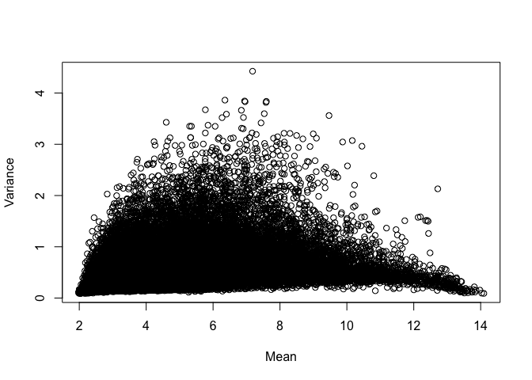
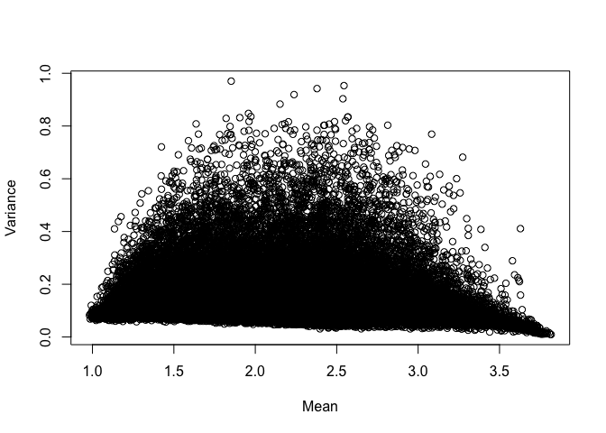
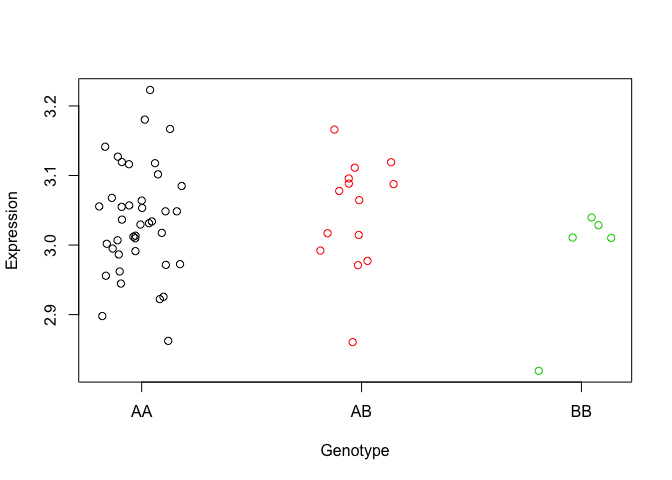

Seminar 8
================
Yanchao

Learning objectives
-------------------

By the end of this tutorial, you should be able to

-   Identify the goal of an eQTL analysis
-   Explain the importance of log transforming the expression data in an eQTL analysis
-   List the basic steps of an eQTL analysis - Undertake a linear regression analysis for an eQTL study

Dependencies
------------

``` r
library(GEOquery)
```

    ## Loading required package: Biobase

    ## Loading required package: BiocGenerics

    ## Loading required package: parallel

    ## 
    ## Attaching package: 'BiocGenerics'

    ## The following objects are masked from 'package:parallel':
    ## 
    ##     clusterApply, clusterApplyLB, clusterCall, clusterEvalQ,
    ##     clusterExport, clusterMap, parApply, parCapply, parLapply,
    ##     parLapplyLB, parRapply, parSapply, parSapplyLB

    ## The following objects are masked from 'package:stats':
    ## 
    ##     IQR, mad, sd, var, xtabs

    ## The following objects are masked from 'package:base':
    ## 
    ##     anyDuplicated, append, as.data.frame, basename, cbind,
    ##     colMeans, colnames, colSums, dirname, do.call, duplicated,
    ##     eval, evalq, Filter, Find, get, grep, grepl, intersect,
    ##     is.unsorted, lapply, lengths, Map, mapply, match, mget, order,
    ##     paste, pmax, pmax.int, pmin, pmin.int, Position, rank, rbind,
    ##     Reduce, rowMeans, rownames, rowSums, sapply, setdiff, sort,
    ##     table, tapply, union, unique, unsplit, which, which.max,
    ##     which.min

    ## Welcome to Bioconductor
    ## 
    ##     Vignettes contain introductory material; view with
    ##     'browseVignettes()'. To cite Bioconductor, see
    ##     'citation("Biobase")', and for packages 'citation("pkgname")'.

    ## Setting options('download.file.method.GEOquery'='auto')

    ## Setting options('GEOquery.inmemory.gpl'=FALSE)

``` r
library(devtools)
library(Biobase)
```

Introduction
------------

eQTL analysis aims to identify associations between the phenotype (measured as the expression of genes) and genetic variation. Some eQTL analysis is equivalent to a linear regression problem where we are fitting our covariates (genetic variation data) to explain our outcome, the observed changes in genes (i.e. gene expression data).

Today, we will be working with genotype data (SNPs) and gene expression values (counts) from a recently released dataset of melanoma cell lines. In this study, authors were interested in identifying genes whose expression levels are correlated with common variants in melanomas.

Explore GSE99221
----------------

In this seminar, we are going to perform cis- eQTL analysis for 59 melanoma cell line samples. The gene expression data we will be using is GSE78995, and the genotype data will be from GSE99193. These two datasets are from the same study, and can also be jointly downloaded from the accession GSE99221.

The datasets we are going to use are:

GSE78995, which contains expression data (54675 features, i.e. rows), for 59 melanoma cell line samples. Note that the expression data has already been quantile normalized. GSE99193, which contains genotype data (733202 SNPs, i.e. rows) for 67 melanoma cell lines. First, let's retrieve our datasets from GEO with getGEO from GEOquery package. Warning: this may take several minutes! So to avoid re-downloading in the future, save the data once you get it into a good shape.

We will extract our data and metadata from the objects we get from GEO. We will also subset our genotype data to only include cell lines for which we have expression data.

``` r
if(file.exists("eQTL_melanoma.Rdata")){ # if previously downloaded
  load("eQTL_melanoma.Rdata")
} else { # if downloading for the first time
  exprs_dat <- getGEO('GSE78995')
  show(exprs_dat) ## 59 samples
  genotype_dat <- getGEO('GSE99193') # took ~2 mins for JG
  show(genotype_dat) ## 67 samples
  
  # Extract expression matrices (turn into data frames at once) 
  exprsdat <- as.data.frame(exprs(exprs_dat[[1]]))
  genodat <- as.data.frame(exprs(genotype_dat[[1]]))
  
  # Obtain the meta-data for the samples and rename them perhaps?
  exprs.meta <- pData(phenoData(exprs_dat[[1]]))
  geno.meta <- pData(phenoData(genotype_dat[[1]]))
  
  # Get the cell line labels for both types of data
  exprs.meta$cell_line = gsub(".*UACC) melanoma ", "", exprs.meta$title)
  geno.meta$cell_line = gsub(".*UACC ", "", geno.meta$title)
  
  # Subset genotype data to keep cases overlapping with expression data  
  geno.meta.clean = geno.meta[geno.meta$cell_line %in% exprs.meta$cell_line,]
  genodat.clean = genodat[,geno.meta.clean$geo_accession]
  
  # save the data to avoid future re-downloading
  save(exprsdat, genodat.clean, exprs.meta, geno.meta.clean, file = "eQTL_melanoma.Rdata")
}
```

Let us update the column names so that the samples are defined by the cell line, and not by the GSM IDs (the latter are specific to the submission sample and data type, so will not overlap between the SNP and expression data).

``` r
colnames(exprsdat) = exprs.meta[exprs.meta$geo_accession == colnames(exprsdat), c("cell_line")]
colnames(genodat.clean) = geno.meta.clean[geno.meta.clean$geo_accession == colnames(genodat.clean), c("cell_line")]
```

Preprocess Data
---------------

### Check for missing values

As a first step, we will check for any missing values in the data.

``` r
# For our expression data
# Are the number of rows without any NA value, the same as total number of rows?  
dim(exprsdat) == dim(exprsdat[complete.cases(exprsdat),])
```

    ## [1] TRUE TRUE

``` r
# For our genotype data
# Are the number of rows without any NA value, the same as total number of rows?  
dim(genodat.clean) == dim(genodat.clean[complete.cases(genodat.clean),])
```

    ## [1] TRUE TRUE

Map SNP data to numeric
-----------------------

Secondly, we will convert our SNP data to numeric. We will do so by 'converting' our genotype levels to numeric. The genotypes in our dataset are defined as 'AA', 'BB', 'AB', 'NC'. (NC = No Call).

Which of these pairs is/are homozygous? Which of these is/are heterozygous? We will be setting the 'NC' values to NA, and AA, AB, and BB to 0, 1, and 2 respectively (representing the average count of the alternative allele, B, in the allele pair).

``` r
# AA = 0, AB = 1, BB = 2
genodat.numeric = genodat.clean
genodat.numeric[genodat.numeric == "NC"] = NA
genodat.numeric = data.frame(sapply(genodat.numeric, function(x) as.numeric(x) - 1))
rownames(genodat.numeric) = rownames(genodat.clean)
```

Normalize expression data
-------------------------

Before we go ahead and attempt to fit a linear model to our samples, let us review the assumptions of a linear model. A linear model assumes that the samples being fit are independent and with a multivariate normal distribution.

-   Are our samples independent?
-   Do our samples have a continous response (response = expression data).

Count data from RNA-seq experiments generally does not meet the assumption of variance-mean independence. If you are interested in evaluating whether your data follows a normal distribution, you can use tests like the Shapiro-Wilk test, or evaluate whether the kurtosis and skew of your data distribution is significantly different from zero. We can evaluate the kurtosis and skew our our data by plotting the mean vs variance of every gene in the dataset, as follows:

``` r
probe_means = rowMeans(exprsdat)
probe_vars = apply(exprsdat, 1 , sd)
plot(probe_vars~probe_means, xlab="Mean", ylab="Variance")
```

 Hmmm, do you think this looks symmetrical? Now let us log2 transform the data. This helps stabilize the variance of the data by reducing the 'range' of variability in cases where the gene expression can range from very high to very low.

``` r
exprsdat_log = log2(exprsdat)
probe_means = rowMeans(exprsdat_log)
probe_vars = apply(exprsdat_log, 1 , sd)
plot(probe_vars~probe_means, xlab="Mean", ylab="Variance")
```

 Compare this to our previous plot. Is it a bit more 'normal'? For the subsequent analysis, we will be using the log transformed expression data to fit our linear models.

NOTE: You can also use the 'rlog' transformation using the rlog function in DESeq2, which you use for differential expression analysis. How might this transformation be better than the log transformation (what factors does it account for that log2 transform might not?).

Fitting a single linear model
-----------------------------

In a simple test for linear association between a SNP and a particular gene's expression, we can compute linear regression model for a given gene/SNP pair. s- Pick a random gene probe from the exprsdat dataframe (HINT: Are the rows genes? Or are the columns genes?)

-   Pick a random SNP from the genodat.numeric dataframe
-   Fit a linear model for the gene/SNP data

``` r
set.seed(10)

random_gene_ix = sample(nrow(exprsdat_log), 1)
random_snp_ix = sample(nrow(genodat.numeric), 1)

#What random gene and SNP did we pick?  
print(paste("My random gene probe from the expression data is", rownames(exprsdat_log)[random_gene_ix]))
```

    ## [1] "My random gene probe from the expression data is 218461_at"

``` r
print(paste("My random SNP from the genotype data is", rownames(genodat.numeric)[random_snp_ix]))
```

    ## [1] "My random SNP from the genotype data is rs1565481"

``` r
exprs_random = as.numeric(exprsdat_log[random_gene_ix,])
snp_random = as.numeric(genodat.numeric[random_snp_ix,])
lm_random = lm(exprs_random ~ snp_random)

summary(lm_random)
```

    ## 
    ## Call:
    ## lm(formula = exprs_random ~ snp_random)
    ## 
    ## Residuals:
    ##       Min        1Q    Median        3Q       Max 
    ## -0.191900 -0.045764 -0.000698  0.057782  0.184129 
    ## 
    ## Coefficients:
    ##             Estimate Std. Error t value Pr(>|t|)    
    ## (Intercept)  3.03887    0.01228 247.510   <2e-16 ***
    ## snp_random  -0.01393    0.01617  -0.861    0.393    
    ## ---
    ## Signif. codes:  0 '***' 0.001 '**' 0.01 '*' 0.05 '.' 0.1 ' ' 1
    ## 
    ## Residual standard error: 0.07962 on 57 degrees of freedom
    ## Multiple R-squared:  0.01284,    Adjusted R-squared:  -0.00448 
    ## F-statistic: 0.7413 on 1 and 57 DF,  p-value: 0.3929

Let us try to visualize the expression values (across our 59 cell lines), for our random probe. We will colour the data points by the genotype of the SNP (across our 59 cell lines) that we are testing for association with our probe.

``` r
plot(exprs_random ~ jitter(snp_random), col=(snp_random + 1), xaxt="n", xlab="Genotype", ylab="Expression") ; axis(1, at=c(0:2), labels=c("AA", "AB","BB"))
```



Now let us overlay this plot with the model we have fit.

``` r
plot(exprs_random ~ jitter(snp_random), col=(snp_random + 1), xaxt="n", xlab="Genotype", ylab="Expression") ; axis(1, at=c(0:2), labels=c("AA", "AB","BB")); lines(lm_random$fitted ~ snp_random, type="b", pch=15, col="black")
```


